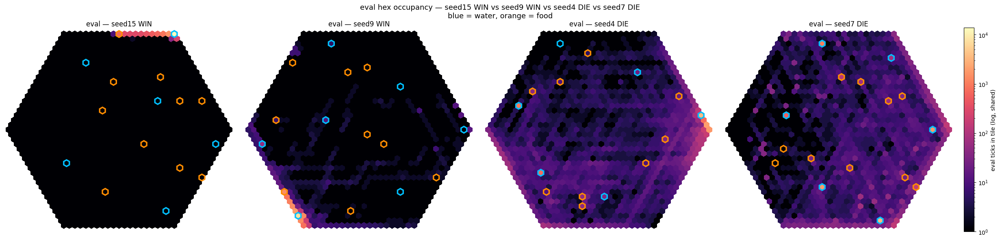

# Build Notes

## What is this?

BUILDNOTES.md serves as a compressed project arc with hypothesis ledgers where relevant.

The front page states the current result, while this file records the build path: what each prototype changed, what broke, what got superseded, and why the next prototype existed.

## Prototype 00 — tabular hydration

### Why it existed

The first version used tabular Q-learning because the state space was tiny: hydration bucket, incoming drink bucket, and action.

This made it easy to test whether delayed drink effects were learnable before adding neural networks.

### Why it was superseded

The state space needed to grow beyond one hydration axis. Later prototypes needed satiation, brightness, delayed action memory, and eventually physical position.

In a tabular Q-table, each extra discretised state axis multiplies the number of values that must be stored and explored.

If each state axis has $b$ bins and there are $d$ state dimensions, then the table grows exponentially:

$$
N_Q = |\mathcal{A}| b^d
$$

where $N_Q$ is the number of stored Q-values, $|\mathcal{A}|$ is the number of actions, $b$ is the number of bins per state axis, and $d$ is the number of state dimensions.

This becomes impractical quickly. It also means neighbouring states do not naturally share information: the agent has to separately explore similar bins instead of learning a smoother relationship across the state space.

That motivated moving to a neural Q-function.

Full folder: [`00_tabular_hydration`](prototypes/00_tabular_hydration)

## Prototype 01 — NumPy DQN

### Why the next prototype used a DQN

Moving from tabular Q-learning to a neural Q-function allowed the model to take continuous state variables directly, instead of forcing every variable into coarse bins.

This made it much easier to add extra state axes such as hydration, satiation, brightness, delayed action effects, and eventually spatial observations.

The output was still a discrete set of action values, but the action set could now be expanded more realistically. Later versions could include finer choices such as full, half, and quarter drinking/eating, plus combined drink/eat actions. In the tabular version, every new action would multiply the Q-table and require more exploration in every discretised state. In the DQN version, the model can share learned state features across all action outputs.

### Why it was written in NumPy first

The NumPy DQN had a learning purpose.

I wanted to understand the matrix shapes, dot products, manual backpropagation, replay sampling, target networks, terminal states, state representation, and reward surface design before relying on a library.

That made the fundamentals much clearer, but the implementation became too slow and awkward for the next stage. Physical embedding adds larger state vectors, action masking, local observations, and eventually multiple agents. For that, a tighter debugging and testing loop matters more than hand-written backpropagation.

So the next prototype moved to PyTorch.

Full folder: [`01_numpy_dqn_homeostasis`](prototypes/01_numpy_dqn_homeostasis)

## Prototype 01b — PyTorch port

### Why it existed

The PyTorch port was not meant to make the agent more advanced immediately.

The goal was to check whether the original NumPy DQN behaviour could be reproduced in a cleaner learning framework before using that framework for larger spatial experiments.

### What it showed

The port broadly mirrored Prototype 1’s learning pattern and final hydration/satiation control. It also preserved the same short-gap death-clustering failure mode.

That suggested the weakness belonged to the learned DQN policy rather than the hand-written NumPy implementation.

### Why it mattered

PyTorch became the better base for the next stage. Larger state vectors, action masking, local observations, memory modules, and eventually multiple agents would make hand-written NumPy backpropagation tedious and fragile.

PyTorch kept the learning code flexible while still allowing the simulation logic itself to remain explicit and inspectable.

Full folder: [`01b_pytorch_dqn_port`](prototypes/01b_pytorch_dqn_port)

## Prototype 02 — physical embedding

### Why it existed

Prototype 2 moved the agent into an actual hex world.

The agent no longer chooses drink/eat/wait directly from internal state. It has to physically move between resources while managing hydration and satiation.

Before this, the main difficulty was delayed body effects: drinking changes hydration over the next few ticks, and eating changes satiation over the next few ticks. In the physical version, the agent also has to learn timing and movement. It has to know when to leave water for food, and when to leave food for water.

The state now includes physical position, hydration, satiation, brightness, and short delayed-action memory. The action set includes drinking, eating, waiting, and movement actions.

So the task is no longer just homeostatic correction.

It is spatial homeostatic control.

### What physical space exposed

Once resources exist as locations, distance becomes part of the body-control problem.

Even before the map becomes large, the agent has to survive the gap between needing a resource and reaching it. A food -> water -> food cycle is no longer an instant correction loop. It contains travel time, failed movement, bad choices, waiting, drinking, eating, and exploration.

That means body decay and map distance are coupled. If decay is too fast relative to the travel cycle, the task stops testing control and starts testing whether the agent can survive an unfair commute.

Prototype 2 exposed this relationship, but did not fully solve it. The later radius-5 work in Prototype 3 made the decay-scaling problem unavoidable.

### What Prototype 2 revealed

Prototype 2 showed that the DQN was not completely useless in the physical world. It began to learn visible paths/corridors between the water and food locations.

But it still struggled to maintain the full food -> water -> food cycle. More training time did not automatically fix it. Different epsilon values also did not fully solve it.

The likely problems were:

* long-horizon credit assignment
* fixed exploration randomly damaging learned paths
* vanilla DQN value instability
* limited short-term memory
* no real map memory
* no proper generalisation test yet

The agent could begin to learn a route, but it did not yet reliably learn the full control loop.

Full folder: [`02_spatial_dqn`](prototypes/02_spatial_dqn)

## Prototype 03 — radius-5 world and reward geometry

### Environment change

Prototype 3 pushed the spatial task from the smaller radius-3 world into a radius-5 world.

Water moved to $(-5,0)$ and food moved to $(0,5)$. The trip between them was now long enough that any surviving policy had to overfill before travelling: top up hydration before walking to food, and top up satiation before walking back.

Travel buffers became part of the task.

### Decay normalised based on world size

When the world radius increased, the original decay rates became too harsh because the agent had to survive longer food -> water -> food cycles.

The scaling function was chosen to roughly match:

* radius 1 -> 1.5
* radius 3 -> 0.7
* radius 5 -> 0.5

with a floor so decay never disappears completely:

$$
g(R) = 0.05 + \frac{1.45}{(1 + 1.0426(R - 1))^{0.7122}}
$$

Implemented as:

```python
hydration_decay_scaling = 0.05 + 1.45 / ((1 + 1.0426 * (world_size - 1)) ** 0.7122)
satiation_decay_scaling = 0.9 * hydration_decay_scaling
```

### Comfort surface repair

The old comfort surface was isotropic around the ideal point:

$$
d^2 = (h - h^\star)^2 + (s - s^\star)^2,
\qquad
C(h,s) = 2e^{-kd^2} - 1
$$

That became wrong in the radius-5 world.

A useful buffer cost the same as a dangerous deficit. On the bigger map, that taxes exactly what the agent needs to survive the trip. The old-surface sweep showed the damage: vanilla and Double DQN collapsed the same way, one need pinned while the other fell toward death.

That shared failure was a reward problem, not a model problem.

So I split the squared distance and discounted only the over-fill component:

$$
\begin{aligned}
d^2 &=
h_{\text{under}}^2

* \lambda h_{\text{over}}^2
* s_{\text{under}}^2
* \lambda s_{\text{over}}^2, \
  \lambda &= 0.3
  \end{aligned}
  $$

keeping the same exponential mapping.

Underfill keeps full curvature, moderate overfill is cheap, and extreme overfill still decays. A travel buffer becomes affordable, but hoarding cannot be optimal. The internal-state cap widened from 2 to 3 so over-buffered states get charged by the surface instead of hiding at the clip boundary.

### Oracle check

`oracle.py` — a hand-coded controller that overfills to 1.7 and services the weaker need — confirmed the world was physically survivable:

* 0 deaths over 500k ticks
* comfort −0.608
* the surface correctly charged it for living in the over-buffer band

Under the new surface, vanilla reached comfort 0.501 where the old medians sat near zero. So the geometry fix recovered real capability.

But it stayed high-variance across seeds: median −0.03, spanning −0.69 to 0.57.

So this was a capability demonstration, not a solved benchmark.

> Open question: does the new geometry remove the one-variable collapse across all seeds without making the task trivial?

Full folder: [`03_spatial_robust`](prototypes/03_spatial_robust)

## Prototype 03b — consistency and the water-cult attractor

Full detailed record: [`03b_nstep_robust`](prototypes/03b_nstep_robust)

Prototype 3b turns the best-seed radius-5 result into a consistency question.

The problem is not:

> can one lucky seed learn the commute?

The problem is:

> how often does the training process actually find the water->food control cycle?

### Failure mode

The radius-5 vanilla agent is bimodal.

Some seeds discover the water->food limit cycle. Others fall into the water-cult attractor: camp near water, protect hydration, and never cross the comfort valley to food.

Mean comfort hides this failure. A clean cycler and a confident water-camper can look too similar in aggregate comfort, because the water-camper controls one variable well while the other drifts toward death.

That pushed the evaluation away from mean comfort alone and toward per-seed solve-rate, food-reaching gates, death counts, and path diagnostics.

### Hypothesis 1 — comfort metric

**Bet:** comfort is the objective, so optimise and read mean comfort directly.

**What happened:** the bimodal gap between cyclers and campers swamped the meaning of the mean. Mean comfort was not false, but it was too blunt. It could not reliably distinguish behavioural competence from one-variable collapse.

**Verdict:** dissolved into a measurement fix.

Use solve-rate, food-reaching gates, death counts, and path diagnostics. Mean comfort is still useful, but it cannot be the whole story.

### Hypothesis 2 — credit assignment

**Bet:** the food reward is too far away, so better credit assignment should help the agent understand the value of the full water->food cycle.

The first 3b attempt tried to reduce learning noise directly:

* Double DQN for value stability
* n-step returns for long-horizon credit assignment
* tuned death penalties
* larger $\gamma$

This did help in one sense. Some settings reduced seed spread dramatically. For example, vanilla 1-step varied from −0.69 to 0.57 comfort, while Double DQN with 10-step returns compressed into a much tighter band: 0.22 to 0.25 comfort.

So n-step and DDQN were changing the training dynamics. They made the agent less seed-chaotic.

But the thing they stabilised was not always the full control loop.

A lot of the stable runs were stable because they found a degenerate local maximum: camp at water, manage hydration perfectly, and eventually die just to repeat. They never really solved the food -> water -> food loop.

So the result was not:

> credit assignment is useless.

It was:

> credit assignment helps once useful trajectories exist, but it cannot manufacture trajectories that never enter replay.

The key issue became:

> a value function can only assign credit to trajectories that enter the training distribution.

**Verdict:** partly right, incomplete. Better value propagation was not the bottleneck by itself.

### Hypothesis 3 — exploration

**Bet:** the policy needs to experience the useful loop often enough for the value function to learn it.

So the next knob to turn was exploration.

Cranking epsilon higher was too atomic. It may make the agent discover the good loop, but it also fills the replay buffer with garbage random transitions. The training distribution changes, but not in a controlled way.

So Prototype 3b moved toward exploration mechanisms that could change the replay distribution more usefully:

* NoisyNets for state-dependent exploration
* count-based novelty for pressure away from overused regions

NoisyNets and count-based novelty worked only together.

NoisyNets gave state-dependent exploration. Novelty created pressure away from overused regions. Alone, neither was enough. On vanilla DQN, novelty was spent reinforcing the comfortable water region. With NoisyNets, the same bonus helped move the replay distribution into the food corridor.

So the mechanism was *not*:

> curiosity solves the task.

It was:

> induced exploration changes the replay distribution enough for the useful trajectory to become learnable.

**Verdict:** confirmed in combination.

### Hypothesis 4 — NoisyNet sigma collapse

**Bet:** novelty might help because NoisyNet $\sigma$ collapses toward zero, stopping discovery.

**What happened:** logged $\sigma$ rose rather than collapsed.

The likely reason is that the target remained non-stationary under drive cycles, local reward changes, and changing replay distribution. The agent was not becoming calmly certain and then freezing exploration. The instability was more complicated than that.

**Verdict:** dissolved. The premise was wrong, even if NoisyNets still helped.

### Hypothesis 5 — curriculum

**Bet:** make the good trajectory reachable often enough that the buffer contains useful examples, then slowly push the task back toward the real radius-5 problem.

This was the natural next idea after epsilon exploration looked too noisy.

But coordinate curriculum backfired. It made early resource habits easier, but those habits did not necessarily become the final radius-5 loop. In practice, curriculum often entrenched camping rather than breaking it.

Targeted respawn was more useful because it injected informative internal states without changing the final evaluation task.

**Verdict:** curriculum abandoned; targeted starts partially salvaged.

### Hypothesis 6 — replay buffer

**Bet:** food transitions are rare, so perhaps a small FIFO buffer evicts them before the agent can learn from them. A larger buffer should retain useful journeys and improve solve-rate.

The small-to-medium buffer results supported the retention hypothesis at first.

Increasing the buffer from 5k to 50k–100k improved solve-rate and reduced deaths. But a near-non-evicting 520k buffer collapsed to 0/10.

That ruled out simple FIFO eviction as the whole explanation.

If the mechanism were only eviction, more retention should keep helping. It did not.

The issue is not only that useful transitions disappear. Old transitions can become stale under a changing policy and reward distribution. The replay buffer is therefore not just memory; it is a sampling distribution, and its optimal size is a tradeoff.

**Verdict:** falsified and reframed.

50k is chosen as a survival-useful point in the tradeoff, not as a pure retention fix.

### Headline result

The best current configuration uses:

* Noisy DQN
* count-based novelty, $\beta = 0.1$
* 50k replay buffer
* 10-step returns
* comfort-v3 surface
* $\gamma = 0.99$
* 100 seeds

Headline:

* **52%** learn a clean water->food limit cycle.
* **38%** also survive that cycle under the stricter survival-aware gate.
* Median comfort among solved seeds is about **0.93**.
* 49/100 seeds finish greedy evaluation with zero deaths.

The gap between 52% and 38% separates route discovery from reliable survival: some agents learn the water->food cycle, but still execute it with enough instability to die during evaluation.

### Stopping point

At this point, more tuning on the fixed radius-5 commute has diminishing returns. It *could* improve the benchmark, but it risks turning the project into narrow, map-specific fitting.

That is where Prototype 3b stops: the fixed commute is no longer the highest-value test of the idea.

## Prototype 04 — generalisation

### Question

Can the agent learn a survival rule across layouts?

### Planned build

Prototype 4 should separate generalisation from regime shift.

The next environment is a procedurally generated static radius-20 map with different bush and lake layouts. Training and evaluation should be split across map seeds, so success cannot come from memorising one route.

### Why this comes before regime shift

The fixed radius-5 benchmark asks:

> can the agent learn this commute?

Prototype 4 asks:

> can the agent learn a survival rule across layouts?

Only after that should the project move to true regime shift: seasonal brightness, scarce food, moving resources, and reward distributions that change under the value function.

## Prototype 04 — hypothesis ledger

### Hypothesis 1 — can the 03b config learn on a procedural map?

**Bet:** oracle survives every seed, therefore the world is fair. Can the 03b headliner (noisy + novelty β=0.1, 50k buf, n10) learn here? Commute held at 9–11 (same as 03b); only change is procedural scatter + radius 20.

**Prediction:** none solve — deaths reset into fresh regions, buffer fills with uncorrelated fragments, no commute sampled densely enough. Buffer-staleness → nonzero food% + instability.

**Result:** **8% solve** [4.1–15.0% Wilson]. Falsified on count. Failure structure isn't the predicted one:

| finding | number |
|---|---|
| survival bimodal | 8 survive (≤5 deaths), 88 die (~125 med), gap empty |
| no safe camp | non-commuters die ~113× (as much as commuters) |
| cause = thirst↔hunger | corr(hyd_frac, deaths)=0.71, corr(hyd_frac, food%)=0.58 |
| death timing | short-gap cluster + long-survival tail; spiral-consistent, median (38) hides it |

Commute-attempters die of thirst in transit; water-stayers die of hunger, less. Cause axis is camp–commute.

<details><summary>winners localise on one hub, diers smear — and every win is rim-localised</summary>



| metric | win | die | corr(solved) |
|---|---|---|---|
| edge_proximity | 1.0 (unanimous) | 0.94 | 0.11 |
| dom_hub_dist | radius (all 8) | mixed | — |
| mean legal actions | 6.57 | 7.35 | −0.34 |
| tightest_cluster | 3.75 | 4.72 | −0.20 |

Masking is one ring deep: d=0…19 all have full 6 moves, only d=radius clipped (3.95, corners 3). Tightness insufficient (tight-3 seeds still die, e.g. seed 11 → 138 deaths). Rim-localisation necessary.
</details>

**Verdict:** Partial — falsified on count, mechanism informative. Deaths cluster at short post-respawn gaps (spiral-consistent, not falsified): the agent *learns* the commute but can't *sustain* it; diers stay in the short-gap cascade, winners interleave longer stable runs. Every win is rim-localised, where one-ring masking funnels it into the cycle it can't self-generate. → **H1.1: is the 8% just the seeds that found a boundary to use as a crutch?**

---

### Hypothesis 1.1 — is the 8% a boundary crutch?

**Bet:** the 8% solves aren't generalisation — every winner is rim-localised (edge_proximity=1.0, dom_hub_dist=radius, all 8), and the rim is the only ring with clipped action masks (d=radius: 3.95 moves; d≤19: full 6). The wall mechanically prevents thrashing and funnels the agent into the local cycle it can't self-commit to. Remove rim hubs → wins should collapse.

**Prediction:** ban rim hubs from water placement (interior-only candidates, MARGIN≥1) → solve rate collapses toward ~0. Confirmed if interior solve rate ≪ 8% (boundary was load-bearing); falsified if it holds ≈8% (rim-unanimity was coincidence, commitment is real); partial if it drops but doesn't vanish (wall helps but isn't the whole story). MARGIN=1 is the exact fix (only d=radius clipped); commute length unchanged, isolates the masking variable alone.

**Result:** **0/100 pass** under the strict survival-aware gate [0.0–3.7% Wilson]. No interior hub produces a surviving eval policy. The collapse is not just "no food discovered" — it is camp structure. All 100 seeds touched food at least a little, and 83/100 had a nonzero successful trip rate, so the resource relation is not completely absent. But those contacts do not become a stable control loop. The evaluation is dominated by water-leaning camps:

| finding | number |
|---|---|
| strict pass rate | **0/100** |
| eval deaths | 292 median, 282 mean, range 96–460 |
| water visit % | 40.6 median |
| food visit % | 1.65 median |
| water:food visit ratio | ~25:1 median |
| seeds with food visit <3% | 86/100 |
| drink rate while at water | 96.6% median |
| eat rate while at food | 75.0% median |
| trip success rate | 6.0% median |

So the agent still recognises the local affordances: at water it drinks, at food it usually eats. The failure is higher-level commitment — it cannot keep the water→food→water cycle alive once the rim funnel is removed. Most seeds fall back into water-biased camps that protect hydration, starve the food side, and die repeatedly.

**Verdict:** Confirmed for the survival claim; partial for the representation claim. The original 8% was not robust layout generalisation — remove the clipped-action rim and survival solve-rate drops 8/100 → 0/100. But it is not "the model only knew the wall": it retains partial resource/affordance generalisation. What it lacks is self-generated cycle stability away from the edge.

---

### Note — generator band bug (retires pre-fix procedural results)

The generator placed food in each water's 9–11 band but never checked food against *other* hubs; at WATER_R_MIN=14 the triangle floor was 14−11=3, so cross-hub pairs undercut the band — 28/30 maps had a sub-band commute (min-pair median 5, floor 9). Every procedural number above — H1's 8%, H1.1's 0/100, the v3 senses sweep — was measured on commutes shorter than 3b's 9–11. Generator now affirms min(food, water) ≥ band_min on every build (WATER_R_MIN=20 → floor = band_min). H1/H1.1 verdicts stand with greater reason; only the senses result is re-run on enforced-band maps.

---

### Hypothesis 2 — will senses help the agent?

**Bet:** H1.1 showed that removing the edge-hubs does not remove all resource understanding, but it removed the crutch that helped the agent settle in a tight food–water cycle. Adding spatial awareness — vision of r=1 surrounding tile features plus a scalar food-smell signal with an r=3 cutoff — should make the food corridor easier to recognise before the agent is already on top of it. If the bottleneck is weak local representation, senses should reduce water-camping and produce a tighter water–food cycle.

**Prediction:** strict pass-rate should rise above 0/100, or at minimum the failure should visibly change: higher food visit %, lower water:food ratio, fewer deaths, and more repeated food trips before collapse.

**Result:** Null. Three arms (no-sense / vision / smell+vision), 40 seeds each, enforced-band maps (`WATER_R_MIN=20`). Solve rate **0/40 every arm**; arms statistically indistinguishable on every axis.

| metric | no-sense | vision | smell+vision |
|---|---|---|---|
| solved | 0/40 | 0/40 | 0/40 |
| clean-solve | 27.5% (11/40) | 22.5% (9/40) | 22.5% (9/40) |
| comfort (med) | 0.403 | 0.403 | 0.404 |
| eval deaths (med) | 536 | 540 | 534.5 |
| food occ % | 0.66 | 0.57 | 0.62 |
| water:food occ | 0.33 | 0.38 | 0.37 |
| W→F success | 0.048 | 0.045 | 0.068 |
| W→F path eff | 0.750 | 0.690 | 0.769 |
| W→F perfectish | 0.111 | 0.200 | 0.250 |
| two-way floor | 0.011 | 0.017 | 0.010 |

Solve Wilson CIs all [−0, 8.8%], fully overlapping. None of the predicted direction-changes appeared: pass-rate stayed 0, food visit didn't rise (no-sense is highest), water:food frac didn't drop, deaths flat within ±6, trips flat. The one signal in the predicted direction is smell+vision perfectish-trip 0.250 vs no-sense 0.111 on W→F — consistent with scent helping the last ≤3 hexes into food, but computed over a handful of trips/seed, so noise-dominated.

**Verdict:** Falsified. Senses give no survival uplift and the failure does not shift in the predicted direction. Mechanism: the sensorium is local (vision r=1, smell r=3) and the 9–11 commute carries a ~3–5 hex dead band with no resource signal; senses sharpen the terminal approach (the perfectish-trip crumb) but cannot touch the mid-commute navigation that kills the agent. The bottleneck is not local representation — it is sustaining a crossing whose middle is unobservable to any local sense. → H3: is the wall *reaching* the crossing or *valuing* it?

---

### Hypothesis 3 — reaching vs valuing the crossing (midpoint probe)

**Bet:** clean-solve 22–27% with solved 0% means the agent *can* cross the valley sometimes but never sustains the cycle. Two causes fit: it rarely *reaches* the start of a crossing (initiation/exploration), or it *can't commit* to one even when positioned (valuing/horizon). Eval-only midpoint respawn — spawn ~4 hexes from both resources, on the line between a food and its nearest water — deletes the reaching half. If reaching is the wall, halving the approach lets it finish and survive. If valuing is the wall, a shorter approach changes nothing.

**Prediction:** deaths stay flat at the v4 rate (~0.027, ≈534/20k) from midpoint spawns; W→F survival does not rise materially. **Confirmed-valuing** if `death_rate_eval` ≈ v4 paired per-seed (std within noise). **Falsified → reaching** if `death_rate` drops materially below 0.027 across most seeds.

**Result:** Confirmed null. The midpoint probe produced **0/21 solved seeds**, Wilson 95% **[0.0%, 15.5%]**. Median deaths **536**, mean **541.1**, death-rate median **0.0268** — essentially unchanged from the senses baseline. It did produce some partial crossings: **5/21 seeds** hit the clean-crossing/no-death-cap condition, and the median seed made **4 total successful resource trips**. But those crossings did not become a stable survival rhythm: W→F success **0.043 median**, F→W success **0.015 median**, two-way route floor **0.009**. The occupancy pattern also argues against simple camping — food occupancy **0.64%**, water occupancy **0.19%**, dominant-cell occupancy **2.34%**. The agent is not sitting at a resource; it moves, occasionally crosses, then fails to convert those crossings into a repeated closed loop.

**Verdict:** Confirmed for the valuing/commitment interpretation. The failure is not mainly that the agent cannot reach the crossing start — placed near the middle of the route, survival does not improve. The bottleneck is sustaining a directed crossing through the signal-free middle of the commute. Local vision and smell sharpen the terminal approach but provide no pointer inside the dead zone, where the immediate observation is aliased: the same local state can require opposite actions depending on whether the agent is committed to food or to water. → H4: does the agent need persistent route intention?

---

### Hypothesis 4 — does a memory channel (GRU) help commit across the dead band?

**Bet:** position is fully observed via coordinates, so DRQN is *not* motivated by spatial partial observability. The bet is architectural: the MLP has no channel to carry route-commitment/intention across the scentless dead band; a GRU hidden state does. Tested as a matched comparison — `noisy_drqn_DQN` vs `noisy_DQN` control, **batch 64 in both arms** (BPTT cost forbids 512; matched-batch FF is the honest control), n-step 10 both, buffers asymmetric by necessity (DRQN 1k-episode sequence replay; FF 50k transitions — batch, not buffer, is the matched lever), 40 seeds each. Gate: path_eff ≥ 0.9 AND perfectish > 0 AND eval_deaths ≤ cap.

**Prediction:** DRQN ≥ FF on crossing quality and solve rate; a non-trivial DRQN solve rate where FF sits at zero. If memory carries intention across the band, expect higher path efficiency and the recurrent arm to be the one that survives the crossing.

**Result:** Falsified, in the informative direction — the memory arm is no better and is *worse on crossing quality*.

| median metric | DRQN | FF |
|---|---|---|
| solved (gate) | 0/40 | 0/40 |
| clean-solve (crossed, no death cap) | 25.0% (10/40) | 32.5% (13/40) |
| wf success rate | 0.043 | 0.028 |
| wf success count | 2 | 1 |
| wf path efficiency | 0.778 | **0.932** |
| wf perfect-ish trip rate | 0.250 | **0.550** |
| eval deaths | 530.5 | 532.0 |
| comfort | 0.409 | 0.406 |

Both arms 0/40 solved (Wilson upper bound 8.8%). The GRU makes *more* crossings (rate 0.043 vs 0.028, count 2 vs 1) but *scrappier* ones — roughly half the path efficiency and half the perfect-ish rate of the memoryless control. Paired by seed, FF produces the cleaner crossing on 12 seeds to DRQN's 7. Survival and comfort indistinguishable. The recurrent arm wanders into the band more often and commits less cleanly; the feedforward arm crosses rarely but decisively.

**Verdict:** Falsified. A memory channel did not buy route-commitment across the dead band — it slightly degraded crossing quality and moved solve rate not at all (both zero). Memory is not the missing piece on a fixed map because the bottleneck sits *upstream of the architecture*: the policy must deliberately seek the crossing before any channel can carry intention through it, and it does not. Corroborated by (i) the train-crossing counter — wf accumulates at a flat, exploration-rate cadence (R²≈0.99 linear, no acceleration): accidental sampling, never converted to seeking; and (ii) the Go-Explore eyeball — forcing broader sampling did not raise crossings at 1M and slightly *suppressed* the baseline's own late lock-in. Credit cannot assign to a journey the policy never commits to sampling; a hidden state cannot remember a route it never takes. Memory was redundant here for the same reason H1's route-memorisation worked: on a fixed map the task rewards latching a static route, which neither needs nor benefits from carried intention.

---

### Prototype 04 → 05 reframe

Across every config tried, solve rate is 0/40 with the bimodal camp-vs-limit-cycle failure intact; the binding constraint is directed-exploration scarcity, and no single credit-assignment intervention (n-step, DDQN, death penalty, γ, memory) has moved it. Stop optimising for a config robust across inits. Reframe the success criterion to *one weight set that generalises across maps* — each sim instance a freshly resampled world, evaluated on held-out maps with frozen weights. This is the route-vs-rule thesis stated directly: map resampling makes route-memorisation impossible by construction (kills the H1 boundary/route crutch) and forces the policy onto the invariant — cross the band by sense.

**Proto 05 candidate:** curriculum over resampled maps, band width as a non-leaking curriculum variable, gradient RL retained. (3b's coordinate curriculum failed — log as a known risk; the likely culprit is the widening handoff / forgetting at each step-up, not the principle.) **Open tension, flagged not resolved:** resampling strips the coordinate crutch and leans on the local senses H2 showed are too short-range to span the band — so Proto 05 may re-motivate a memory channel that H4 just retired, now for a non-redundant reason (carrying sensory-gradient direction across the band when absolute position is useless).