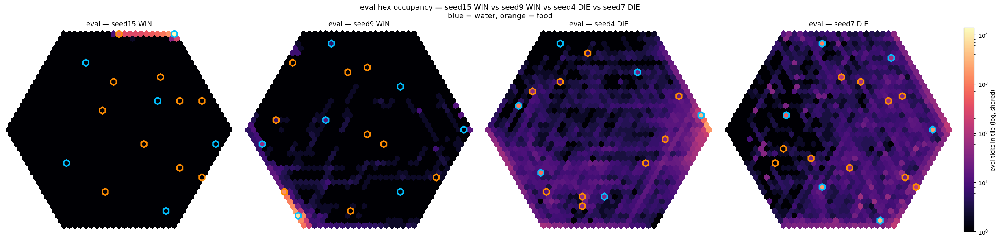

# Build Notes

## What is this?

BUILDNOTES.md serves as a compressed project arc with hypothesis ledgers where relevant.

The front page states the current result, while this file records the build path: what each prototype changed, what broke, what got superseded, and why the next prototype existed.

**How to read it.** Entries follow **Bet → Prediction → Result → Verdict**, and the prediction is
written *before* the sweep runs. Entries where the result contradicts the prediction are the
load-bearing ones and are left exactly as first written — including diagnoses later shown to be
wrong. Nothing here is retrofitted to match an outcome.

For headline numbers without the narrative, see [`RESULTS.md`](RESULTS.md). For the argument, see
[`README.md`](README.md).

---

## Contents

| section | what it settles | verdict |
|---|---|---|
| [Prototype 00 — tabular hydration](#prototype-00--tabular-hydration) | tabular Q-learning on one drive | SUPERSEDED |
| [Prototype 01 — NumPy DQN](#prototype-01--numpy-dqn) | function approximation, hand-written backprop | SUPERSEDED |
| [Prototype 01b — PyTorch port](#prototype-01b--pytorch-port) | same behaviour, same failure modes | SUPERSEDED |
| [Prototype 02 — physical embedding](#prototype-02--physical-embedding) | resources become places, not buttons | SUPERSEDED |
| [Prototype 03 — radius-5 and reward geometry](#prototype-03--radius-5-world-and-reward-geometry) | deficit ≠ surplus; comfort surface repaired | SUPERSEDED |
| [Prototype 03b — consistency](#prototype-03b--consistency-and-the-water-cult-attractor) | **52% / 38%**; exploration beats credit assignment | HEADLINE (fixed map) |
| [Prototype 04 — generalisation](#prototype-04--hypothesis-ledger) | route not rule; H1–H4 all falsified | SUPERSEDED |
| [Prototype 05 — curriculum + earned memory](#prototype-05--hypothesis-ledger) | abandoned mid-hypothesis; triggered the decomposition | SUPERSEDED |
| [Prototype 06 — feudal decomposition](#prototype-06--feudal) | 3 of 4 modules learnable; explorer is not | CURRENT |

### Prototype 06 entries

Appended newest-first as they were written, so they read in reverse. Chronological order:

| entry | subject | verdict |
|---|---|---|
| P1 | pathfinder trained out-of-sim, dropped into the stack | CONFIRMED (contract closed) |
| P1.1 | calibrating metrics against a known-bad pathfinder | CONFIRMED (found the sensitive metric) |
| P1.2 | does the pathfinder result reproduce across seeds? | FALSIFIED (1 in 3 shipped broken) |
| P1.3 / P1.4 | best-checkpoint selection; 3-seed re-run | CONFIRMED (2/3 pass the gate) |
| P2 | comfort as a consumer reward | FALSIFIED (tolerance band makes it flat) |
| P2.1 | survival reward fixes it | CONFIRMED (certified, training unstable) |
| P2.2 | is the instability buffer flooding? | FALSIFIED (my diagnosis was wrong) |
| P2.3 | consumer oscillates across a plateau | CLOSED (environment cannot resolve it) |
| P3.0 | explorer metric calibration, before training | CONFIRMED (0.362 dynamic range) |
| P3.1 | first explorer run | FALSIFIED (reward never reached the optimiser) |
| P3.2 | is the policy class binding? | FALSIFIED (Q-function anti-informative) |
| P3.4 | policy gradient | **FALSIFIED — final verdict** |

---

## Prototype 00 — tabular hydration

### Why it existed

The first version used tabular Q-learning because the state space was tiny: hydration bucket, incoming drink bucket, and action.

This made it easy to test whether delayed drink effects were learnable before adding neural networks.

### Why it was superseded

The state space needed to grow beyond one hydration axis. Later prototypes needed satiation, brightness, delayed action memory, and eventually physical position.

In a tabular Q-table, each extra discretised state axis multiplies the number of values that must be stored and explored.

If each state axis has $b$ bins and there are $d$ state dimensions, then the table grows exponentially:

$$
N_Q = |\mathcal{A}| b^d
$$

where $N_Q$ is the number of stored Q-values, $|\mathcal{A}|$ is the number of actions, $b$ is the number of bins per state axis, and $d$ is the number of state dimensions.

This becomes impractical quickly. It also means neighbouring states do not naturally share information: the agent has to separately explore similar bins instead of learning a smoother relationship across the state space.

That motivated moving to a neural Q-function.

Full folder: [`00_tabular_hydration`](prototypes/00_tabular_hydration)

## Prototype 01 — NumPy DQN

### Why the next prototype used a DQN

Moving from tabular Q-learning to a neural Q-function allowed the model to take continuous state variables directly, instead of forcing every variable into coarse bins.

This made it much easier to add extra state axes such as hydration, satiation, brightness, delayed action effects, and eventually spatial observations.

The output was still a discrete set of action values, but the action set could now be expanded more realistically. Later versions could include finer choices such as full, half, and quarter drinking/eating, plus combined drink/eat actions. In the tabular version, every new action would multiply the Q-table and require more exploration in every discretised state. In the DQN version, the model can share learned state features across all action outputs.

### Why it was written in NumPy first

The NumPy DQN had a learning purpose.

I wanted to understand the matrix shapes, dot products, manual backpropagation, replay sampling, target networks, terminal states, state representation, and reward surface design before relying on a library.

That made the fundamentals much clearer, but the implementation became too slow and awkward for the next stage. Physical embedding adds larger state vectors, action masking, local observations, and eventually multiple agents. For that, a tighter debugging and testing loop matters more than hand-written backpropagation.

So the next prototype moved to PyTorch.

Full folder: [`01_numpy_dqn_homeostasis`](prototypes/01_numpy_dqn_homeostasis)

## Prototype 01b — PyTorch port

### Why it existed

The PyTorch port was not meant to make the agent more advanced immediately.

The goal was to check whether the original NumPy DQN behaviour could be reproduced in a cleaner learning framework before using that framework for larger spatial experiments.

### What it showed

The port broadly mirrored Prototype 1’s learning pattern and final hydration/satiation control. It also preserved the same short-gap death-clustering failure mode.

That suggested the weakness belonged to the learned DQN policy rather than the hand-written NumPy implementation.

### Why it mattered

PyTorch became the better base for the next stage. Larger state vectors, action masking, local observations, memory modules, and eventually multiple agents would make hand-written NumPy backpropagation tedious and fragile.

PyTorch kept the learning code flexible while still allowing the simulation logic itself to remain explicit and inspectable.

Full folder: [`01b_pytorch_dqn_port`](prototypes/01b_pytorch_dqn_port)

## Prototype 02 — physical embedding

### Why it existed

Prototype 2 moved the agent into an actual hex world.

The agent no longer chooses drink/eat/wait directly from internal state. It has to physically move between resources while managing hydration and satiation.

Before this, the main difficulty was delayed body effects: drinking changes hydration over the next few ticks, and eating changes satiation over the next few ticks. In the physical version, the agent also has to learn timing and movement. It has to know when to leave water for food, and when to leave food for water.

The state now includes physical position, hydration, satiation, brightness, and short delayed-action memory. The action set includes drinking, eating, waiting, and movement actions.

So the task is no longer just homeostatic correction.

It is spatial homeostatic control.

### What physical space exposed

Once resources exist as locations, distance becomes part of the body-control problem.

Even before the map becomes large, the agent has to survive the gap between needing a resource and reaching it. A food -> water -> food cycle is no longer an instant correction loop. It contains travel time, failed movement, bad choices, waiting, drinking, eating, and exploration.

That means body decay and map distance are coupled. If decay is too fast relative to the travel cycle, the task stops testing control and starts testing whether the agent can survive an unfair commute.

Prototype 2 exposed this relationship, but did not fully solve it. The later radius-5 work in Prototype 3 made the decay-scaling problem unavoidable.

### What Prototype 2 revealed

Prototype 2 showed that the DQN was not completely useless in the physical world. It began to learn visible paths/corridors between the water and food locations.

But it still struggled to maintain the full food -> water -> food cycle. More training time did not automatically fix it. Different epsilon values also did not fully solve it.

The likely problems were:

* long-horizon credit assignment
* fixed exploration randomly damaging learned paths
* vanilla DQN value instability
* limited short-term memory
* no real map memory
* no proper generalisation test yet

The agent could begin to learn a route, but it did not yet reliably learn the full control loop.

Full folder: [`02_spatial_dqn`](prototypes/02_spatial_dqn)

## Prototype 03 — radius-5 world and reward geometry

### Environment change

Prototype 3 pushed the spatial task from the smaller radius-3 world into a radius-5 world.

Water moved to $(-5,0)$ and food moved to $(0,5)$. The trip between them was now long enough that any surviving policy had to overfill before travelling: top up hydration before walking to food, and top up satiation before walking back.

Travel buffers became part of the task.

### Decay normalised based on world size

When the world radius increased, the original decay rates became too harsh because the agent had to survive longer food -> water -> food cycles.

The scaling function was chosen to roughly match:

* radius 1 -> 1.5
* radius 3 -> 0.7
* radius 5 -> 0.5

with a floor so decay never disappears completely:

$$
g(R) = 0.05 + \frac{1.45}{(1 + 1.0426(R - 1))^{0.7122}}
$$

Implemented as:

```python
hydration_decay_scaling = 0.05 + 1.45 / ((1 + 1.0426 * (world_size - 1)) ** 0.7122)
satiation_decay_scaling = 0.9 * hydration_decay_scaling
```

### Comfort surface repair

The old comfort surface was isotropic around the ideal point:

$$
d^2 = (h - h^\star)^2 + (s - s^\star)^2,
\qquad
C(h,s) = 2e^{-kd^2} - 1
$$

That became wrong in the radius-5 world.

A useful buffer cost the same as a dangerous deficit. On the bigger map, that taxes exactly what the agent needs to survive the trip. The old-surface sweep showed the damage: vanilla and Double DQN collapsed the same way, one need pinned while the other fell toward death.

That shared failure was a reward problem, not a model problem.

So I split the squared distance and discounted only the over-fill component:

$$
\begin{aligned}
d^2 &=
h_{\text{under}}^2

* \lambda h_{\text{over}}^2
* s_{\text{under}}^2
* \lambda s_{\text{over}}^2, \
  \lambda &= 0.3
  \end{aligned}
  $$

keeping the same exponential mapping.

Underfill keeps full curvature, moderate overfill is cheap, and extreme overfill still decays. A travel buffer becomes affordable, but hoarding cannot be optimal. The internal-state cap widened from 2 to 3 so over-buffered states get charged by the surface instead of hiding at the clip boundary.

### Oracle check

`oracle.py` — a hand-coded controller that overfills to 1.7 and services the weaker need — confirmed the world was physically survivable:

* 0 deaths over 500k ticks
* comfort −0.608
* the surface correctly charged it for living in the over-buffer band

Under the new surface, vanilla reached comfort 0.501 where the old medians sat near zero. So the geometry fix recovered real capability.

But it stayed high-variance across seeds: median −0.03, spanning −0.69 to 0.57.

So this was a capability demonstration, not a solved benchmark.

> Open question: does the new geometry remove the one-variable collapse across all seeds without making the task trivial?

Full folder: [`03_spatial_robust`](prototypes/03_spatial_robust)

## Prototype 03b — consistency and the water-cult attractor

Full detailed record: [`03b_nstep_robust`](prototypes/03b_nstep_robust)

Prototype 3b turns the best-seed radius-5 result into a consistency question.

The problem is not:

> can one lucky seed learn the commute?

The problem is:

> how often does the training process actually find the water->food control cycle?

### Failure mode

The radius-5 vanilla agent is bimodal.

Some seeds discover the water->food limit cycle. Others fall into the water-cult attractor: camp near water, protect hydration, and never cross the comfort valley to food.

Mean comfort hides this failure. A clean cycler and a confident water-camper can look too similar in aggregate comfort, because the water-camper controls one variable well while the other drifts toward death.

That pushed the evaluation away from mean comfort alone and toward per-seed solve-rate, food-reaching gates, death counts, and path diagnostics.

### Hypothesis 1 — comfort metric

**Bet:** comfort is the objective, so optimise and read mean comfort directly.

**What happened:** the bimodal gap between cyclers and campers swamped the meaning of the mean. Mean comfort was not false, but it was too blunt. It could not reliably distinguish behavioural competence from one-variable collapse.

**Verdict:** dissolved into a measurement fix.

Use solve-rate, food-reaching gates, death counts, and path diagnostics. Mean comfort is still useful, but it cannot be the whole story.

### Hypothesis 2 — credit assignment

**Bet:** the food reward is too far away, so better credit assignment should help the agent understand the value of the full water->food cycle.

The first 3b attempt tried to reduce learning noise directly:

* Double DQN for value stability
* n-step returns for long-horizon credit assignment
* tuned death penalties
* larger $\gamma$

This did help in one sense. Some settings reduced seed spread dramatically. For example, vanilla 1-step varied from −0.69 to 0.57 comfort, while Double DQN with 10-step returns compressed into a much tighter band: 0.22 to 0.25 comfort.

So n-step and DDQN were changing the training dynamics. They made the agent less seed-chaotic.

But the thing they stabilised was not always the full control loop.

A lot of the stable runs were stable because they found a degenerate local maximum: camp at water, manage hydration perfectly, and eventually die just to repeat. They never really solved the food -> water -> food loop.

So the result was not:

> credit assignment is useless.

It was:

> credit assignment helps once useful trajectories exist, but it cannot manufacture trajectories that never enter replay.

The key issue became:

> a value function can only assign credit to trajectories that enter the training distribution.

**Verdict:** partly right, incomplete. Better value propagation was not the bottleneck by itself.

### Hypothesis 3 — exploration

**Bet:** the policy needs to experience the useful loop often enough for the value function to learn it.

So the next knob to turn was exploration.

Cranking epsilon higher was too atomic. It may make the agent discover the good loop, but it also fills the replay buffer with garbage random transitions. The training distribution changes, but not in a controlled way.

So Prototype 3b moved toward exploration mechanisms that could change the replay distribution more usefully:

* NoisyNets for state-dependent exploration
* count-based novelty for pressure away from overused regions

NoisyNets and count-based novelty worked only together.

NoisyNets gave state-dependent exploration. Novelty created pressure away from overused regions. Alone, neither was enough. On vanilla DQN, novelty was spent reinforcing the comfortable water region. With NoisyNets, the same bonus helped move the replay distribution into the food corridor.

So the mechanism was *not*:

> curiosity solves the task.

It was:

> induced exploration changes the replay distribution enough for the useful trajectory to become learnable.

**Verdict:** confirmed in combination.

### Hypothesis 4 — NoisyNet sigma collapse

**Bet:** novelty might help because NoisyNet $\sigma$ collapses toward zero, stopping discovery.

**What happened:** logged $\sigma$ rose rather than collapsed.

The likely reason is that the target remained non-stationary under drive cycles, local reward changes, and changing replay distribution. The agent was not becoming calmly certain and then freezing exploration. The instability was more complicated than that.

**Verdict:** dissolved. The premise was wrong, even if NoisyNets still helped.

### Hypothesis 5 — curriculum

**Bet:** make the good trajectory reachable often enough that the buffer contains useful examples, then slowly push the task back toward the real radius-5 problem.

This was the natural next idea after epsilon exploration looked too noisy.

But coordinate curriculum backfired. It made early resource habits easier, but those habits did not necessarily become the final radius-5 loop. In practice, curriculum often entrenched camping rather than breaking it.

Targeted respawn was more useful because it injected informative internal states without changing the final evaluation task.

**Verdict:** curriculum abandoned; targeted starts partially salvaged.

### Hypothesis 6 — replay buffer

**Bet:** food transitions are rare, so perhaps a small FIFO buffer evicts them before the agent can learn from them. A larger buffer should retain useful journeys and improve solve-rate.

The small-to-medium buffer results supported the retention hypothesis at first.

Increasing the buffer from 5k to 50k–100k improved solve-rate and reduced deaths. But a near-non-evicting 520k buffer collapsed to 0/10.

That ruled out simple FIFO eviction as the whole explanation.

If the mechanism were only eviction, more retention should keep helping. It did not.

The issue is not only that useful transitions disappear. Old transitions can become stale under a changing policy and reward distribution. The replay buffer is therefore not just memory; it is a sampling distribution, and its optimal size is a tradeoff.

**Verdict:** falsified and reframed.

50k is chosen as a survival-useful point in the tradeoff, not as a pure retention fix.

### Headline result

The best current configuration uses:

* Noisy DQN
* count-based novelty, $\beta = 0.1$
* 50k replay buffer
* 10-step returns
* comfort-v3 surface
* $\gamma = 0.99$
* 100 seeds

Headline:

* **52%** learn a clean water->food limit cycle.
* **38%** also survive that cycle under the stricter survival-aware gate.
* Median comfort among solved seeds is about **0.93**.
* 49/100 seeds finish greedy evaluation with zero deaths.

The gap between 52% and 38% separates route discovery from reliable survival: some agents learn the water->food cycle, but still execute it with enough instability to die during evaluation.

### Stopping point

At this point, more tuning on the fixed radius-5 commute has diminishing returns. It *could* improve the benchmark, but it risks turning the project into narrow, map-specific fitting.

That is where Prototype 3b stops: the fixed commute is no longer the highest-value test of the idea.

## Prototype 04 — generalisation

### Question

Can the agent learn a survival rule across layouts?

### Planned build

Prototype 4 should separate generalisation from regime shift.

The next environment is a procedurally generated static radius-20 map with different bush and lake layouts. Training and evaluation should be split across map seeds, so success cannot come from memorising one route.

### Why this comes before regime shift

The fixed radius-5 benchmark asks:

> can the agent learn this commute?

Prototype 4 asks:

> can the agent learn a survival rule across layouts?

Only after that should the project move to true regime shift: seasonal brightness, scarce food, moving resources, and reward distributions that change under the value function.

## Prototype 04 — hypothesis ledger

### Hypothesis 1 — can the 03b config learn on a procedural map?

**Bet:** oracle survives every seed, therefore the world is fair. Can the 03b headliner (noisy + novelty β=0.1, 50k buf, n10) learn here? Commute held at 9–11 (same as 03b); only change is procedural scatter + radius 20.

**Prediction:** none solve — deaths reset into fresh regions, buffer fills with uncorrelated fragments, no commute sampled densely enough. Buffer-staleness → nonzero food% + instability.

**Result:** **8% solve** [4.1–15.0% Wilson]. Falsified on count. Failure structure isn't the predicted one:

| finding | number |
|---|---|
| survival bimodal | 8 survive (≤5 deaths), 88 die (~125 med), gap empty |
| no safe camp | non-commuters die ~113× (as much as commuters) |
| cause = thirst↔hunger | corr(hyd_frac, deaths)=0.71, corr(hyd_frac, food%)=0.58 |
| death timing | short-gap cluster + long-survival tail; spiral-consistent, median (38) hides it |

Commute-attempters die of thirst in transit; water-stayers die of hunger, less. Cause axis is camp–commute.

<details><summary>winners localise on one hub, diers smear — and every win is rim-localised</summary>



| metric | win | die | corr(solved) |
|---|---|---|---|
| edge_proximity | 1.0 (unanimous) | 0.94 | 0.11 |
| dom_hub_dist | radius (all 8) | mixed | — |
| mean legal actions | 6.57 | 7.35 | −0.34 |
| tightest_cluster | 3.75 | 4.72 | −0.20 |

Masking is one ring deep: d=0…19 all have full 6 moves, only d=radius clipped (3.95, corners 3). Tightness insufficient (tight-3 seeds still die, e.g. seed 11 → 138 deaths). Rim-localisation necessary.
</details>

**Verdict:** Partial — falsified on count, mechanism informative. Deaths cluster at short post-respawn gaps (spiral-consistent, not falsified): the agent *learns* the commute but can't *sustain* it; diers stay in the short-gap cascade, winners interleave longer stable runs. Every win is rim-localised, where one-ring masking funnels it into the cycle it can't self-generate. → **H1.1: is the 8% just the seeds that found a boundary to use as a crutch?**

---

### Hypothesis 1.1 — is the 8% a boundary crutch?

**Bet:** the 8% solves aren't generalisation — every winner is rim-localised (edge_proximity=1.0, dom_hub_dist=radius, all 8), and the rim is the only ring with clipped action masks (d=radius: 3.95 moves; d≤19: full 6). The wall mechanically prevents thrashing and funnels the agent into the local cycle it can't self-commit to. Remove rim hubs → wins should collapse.

**Prediction:** ban rim hubs from water placement (interior-only candidates, MARGIN≥1) → solve rate collapses toward ~0. Confirmed if interior solve rate ≪ 8% (boundary was load-bearing); falsified if it holds ≈8% (rim-unanimity was coincidence, commitment is real); partial if it drops but doesn't vanish (wall helps but isn't the whole story). MARGIN=1 is the exact fix (only d=radius clipped); commute length unchanged, isolates the masking variable alone.

**Result:** **0/100 pass** under the strict survival-aware gate [0.0–3.7% Wilson]. No interior hub produces a surviving eval policy. The collapse is not just "no food discovered" — it is camp structure. All 100 seeds touched food at least a little, and 83/100 had a nonzero successful trip rate, so the resource relation is not completely absent. But those contacts do not become a stable control loop. The evaluation is dominated by water-leaning camps:

| finding | number |
|---|---|
| strict pass rate | **0/100** |
| eval deaths | 292 median, 282 mean, range 96–460 |
| water visit % | 40.6 median |
| food visit % | 1.65 median |
| water:food visit ratio | ~25:1 median |
| seeds with food visit <3% | 86/100 |
| drink rate while at water | 96.6% median |
| eat rate while at food | 75.0% median |
| trip success rate | 6.0% median |

So the agent still recognises the local affordances: at water it drinks, at food it usually eats. The failure is higher-level commitment — it cannot keep the water→food→water cycle alive once the rim funnel is removed. Most seeds fall back into water-biased camps that protect hydration, starve the food side, and die repeatedly.

**Verdict:** Confirmed for the survival claim; partial for the representation claim. The original 8% was not robust layout generalisation — remove the clipped-action rim and survival solve-rate drops 8/100 → 0/100. But it is not "the model only knew the wall": it retains partial resource/affordance generalisation. What it lacks is self-generated cycle stability away from the edge.

---

### Note — generator band bug (retires pre-fix procedural results)

The generator placed food in each water's 9–11 band but never checked food against *other* hubs; at WATER_R_MIN=14 the triangle floor was 14−11=3, so cross-hub pairs undercut the band — 28/30 maps had a sub-band commute (min-pair median 5, floor 9). Every procedural number above — H1's 8%, H1.1's 0/100, the v3 senses sweep — was measured on commutes shorter than 3b's 9–11. Generator now affirms min(food, water) ≥ band_min on every build (WATER_R_MIN=20 → floor = band_min). H1/H1.1 verdicts stand with greater reason; only the senses result is re-run on enforced-band maps.

---

### Hypothesis 2 — will senses help the agent?

**Bet:** H1.1 showed that removing the edge-hubs does not remove all resource understanding, but it removed the crutch that helped the agent settle in a tight food–water cycle. Adding spatial awareness — vision of r=1 surrounding tile features plus a scalar food-smell signal with an r=3 cutoff — should make the food corridor easier to recognise before the agent is already on top of it. If the bottleneck is weak local representation, senses should reduce water-camping and produce a tighter water–food cycle.

**Prediction:** strict pass-rate should rise above 0/100, or at minimum the failure should visibly change: higher food visit %, lower water:food ratio, fewer deaths, and more repeated food trips before collapse.

**Result:** Null. Three arms (no-sense / vision / smell+vision), 40 seeds each, enforced-band maps (`WATER_R_MIN=20`). Solve rate **0/40 every arm**; arms statistically indistinguishable on every axis.

| metric | no-sense | vision | smell+vision |
|---|---|---|---|
| solved | 0/40 | 0/40 | 0/40 |
| clean-solve | 27.5% (11/40) | 22.5% (9/40) | 22.5% (9/40) |
| comfort (med) | 0.403 | 0.403 | 0.404 |
| eval deaths (med) | 536 | 540 | 534.5 |
| food occ % | 0.66 | 0.57 | 0.62 |
| water:food occ | 0.33 | 0.38 | 0.37 |
| W→F success | 0.048 | 0.045 | 0.068 |
| W→F path eff | 0.750 | 0.690 | 0.769 |
| W→F perfectish | 0.111 | 0.200 | 0.250 |
| two-way floor | 0.011 | 0.017 | 0.010 |

Solve Wilson CIs all [−0, 8.8%], fully overlapping. None of the predicted direction-changes appeared: pass-rate stayed 0, food visit didn't rise (no-sense is highest), water:food frac didn't drop, deaths flat within ±6, trips flat. The one signal in the predicted direction is smell+vision perfectish-trip 0.250 vs no-sense 0.111 on W→F — consistent with scent helping the last ≤3 hexes into food, but computed over a handful of trips/seed, so noise-dominated.

**Verdict:** Falsified. Senses give no survival uplift and the failure does not shift in the predicted direction. Mechanism: the sensorium is local (vision r=1, smell r=3) and the 9–11 commute carries a ~3–5 hex dead band with no resource signal; senses sharpen the terminal approach (the perfectish-trip crumb) but cannot touch the mid-commute navigation that kills the agent. The bottleneck is not local representation — it is sustaining a crossing whose middle is unobservable to any local sense. → H3: is the wall *reaching* the crossing or *valuing* it?

---

### Hypothesis 3 — reaching vs valuing the crossing (midpoint probe)

**Bet:** clean-solve 22–27% with solved 0% means the agent *can* cross the valley sometimes but never sustains the cycle. Two causes fit: it rarely *reaches* the start of a crossing (initiation/exploration), or it *can't commit* to one even when positioned (valuing/horizon). Eval-only midpoint respawn — spawn ~4 hexes from both resources, on the line between a food and its nearest water — deletes the reaching half. If reaching is the wall, halving the approach lets it finish and survive. If valuing is the wall, a shorter approach changes nothing.

**Prediction:** deaths stay flat at the v4 rate (~0.027, ≈534/20k) from midpoint spawns; W→F survival does not rise materially. **Confirmed-valuing** if `death_rate_eval` ≈ v4 paired per-seed (std within noise). **Falsified → reaching** if `death_rate` drops materially below 0.027 across most seeds.

**Result:** Confirmed null. The midpoint probe produced **0/21 solved seeds**, Wilson 95% **[0.0%, 15.5%]**. Median deaths **536**, mean **541.1**, death-rate median **0.0268** — essentially unchanged from the senses baseline. It did produce some partial crossings: **5/21 seeds** hit the clean-crossing/no-death-cap condition, and the median seed made **4 total successful resource trips**. But those crossings did not become a stable survival rhythm: W→F success **0.043 median**, F→W success **0.015 median**, two-way route floor **0.009**. The occupancy pattern also argues against simple camping — food occupancy **0.64%**, water occupancy **0.19%**, dominant-cell occupancy **2.34%**. The agent is not sitting at a resource; it moves, occasionally crosses, then fails to convert those crossings into a repeated closed loop.

**Verdict:** Confirmed for the valuing/commitment interpretation. The failure is not mainly that the agent cannot reach the crossing start — placed near the middle of the route, survival does not improve. The bottleneck is sustaining a directed crossing through the signal-free middle of the commute. Local vision and smell sharpen the terminal approach but provide no pointer inside the dead zone, where the immediate observation is aliased: the same local state can require opposite actions depending on whether the agent is committed to food or to water. → H4: does the agent need persistent route intention?

---

### Hypothesis 4 — does a memory channel (GRU) help commit across the dead band?

**Bet:** position is fully observed via coordinates, so DRQN is *not* motivated by spatial partial observability. The bet is architectural: the MLP has no channel to carry route-commitment/intention across the scentless dead band; a GRU hidden state does. Tested as a matched comparison — `noisy_drqn_DQN` vs `noisy_DQN` control, **batch 64 in both arms** (BPTT cost forbids 512; matched-batch FF is the honest control), n-step 10 both, buffers asymmetric by necessity (DRQN 1k-episode sequence replay; FF 50k transitions — batch, not buffer, is the matched lever), 40 seeds each. Gate: path_eff ≥ 0.9 AND perfectish > 0 AND eval_deaths ≤ cap.

**Prediction:** DRQN ≥ FF on crossing quality and solve rate; a non-trivial DRQN solve rate where FF sits at zero. If memory carries intention across the band, expect higher path efficiency and the recurrent arm to be the one that survives the crossing.

**Result:** Falsified, in the informative direction — the memory arm is no better and is *worse on crossing quality*.

| median metric | DRQN | FF |
|---|---|---|
| solved (gate) | 0/40 | 0/40 |
| clean-solve (crossed, no death cap) | 25.0% (10/40) | 32.5% (13/40) |
| wf success rate | 0.043 | 0.028 |
| wf success count | 2 | 1 |
| wf path efficiency | 0.778 | **0.932** |
| wf perfect-ish trip rate | 0.250 | **0.550** |
| eval deaths | 530.5 | 532.0 |
| comfort | 0.409 | 0.406 |

Both arms 0/40 solved (Wilson upper bound 8.8%). The GRU makes *more* crossings (rate 0.043 vs 0.028, count 2 vs 1) but *scrappier* ones — roughly half the path efficiency and half the perfect-ish rate of the memoryless control. Paired by seed, FF produces the cleaner crossing on 12 seeds to DRQN's 7. Survival and comfort indistinguishable. The recurrent arm wanders into the band more often and commits less cleanly; the feedforward arm crosses rarely but decisively.

**Verdict:** Falsified. A memory channel did not buy route-commitment across the dead band — it slightly degraded crossing quality and moved solve rate not at all (both zero). Memory is not the missing piece on a fixed map because the bottleneck sits *upstream of the architecture*: the policy must deliberately seek the crossing before any channel can carry intention through it, and it does not. Corroborated by (i) the train-crossing counter — wf accumulates at a flat, exploration-rate cadence (R²≈0.99 linear, no acceleration): accidental sampling, never converted to seeking; and (ii) the Go-Explore eyeball — forcing broader sampling did not raise crossings at 1M and slightly *suppressed* the baseline's own late lock-in. Credit cannot assign to a journey the policy never commits to sampling; a hidden state cannot remember a route it never takes. Memory was redundant here for the same reason H1's route-memorisation worked: on a fixed map the task rewards latching a static route, which neither needs nor benefits from carried intention.

---

### Prototype 04 → 05 reframe

Across every config tried, solve rate is 0/40 with the bimodal camp-vs-limit-cycle failure intact; the binding constraint is directed-exploration scarcity, and no single credit-assignment intervention (n-step, DDQN, death penalty, γ, memory) has moved it. Stop optimising for a config robust across inits. Reframe the success criterion to *one weight set that generalises across maps* — each sim instance a freshly resampled world, evaluated on held-out maps with frozen weights. This is the route-vs-rule thesis stated directly: map resampling makes route-memorisation impossible by construction (kills the H1 boundary/route crutch) and forces the policy onto the invariant — cross the band by sense.

**Proto 05 candidate:** curriculum over resampled maps, band width as a non-leaking curriculum variable, gradient RL retained. (3b's coordinate curriculum failed — log as a known risk; the likely culprit is the widening handoff / forgetting at each step-up, not the principle.) **Open tension, flagged not resolved:** resampling strips the coordinate crutch and leans on the local senses H2 showed are too short-range to span the band — so Proto 05 may re-motivate a memory channel that H4 just retired, now for a non-redundant reason (carrying sensory-gradient direction across the band when absolute position is useless).

## Prototype 05 — generalisation

## Prototype 05 — hypothesis ledger

### Hypothesis 1 — does earned spatial memory buy the water→food crossing?

**Bet:** resampling killed the coordinate crutch — absolute position is now noise (water lives somewhere different every map), and H2 already showed the local senses (vision r=1, smell r=3) can't span the 3–5 hex dead band in a 9–11 commute. So the agent reaches food, fails the crossing, and retreats. The bet is observational, not architectural: give it a *memory* of where it has personally stood — displacement-to-last-seen water and food, gated blind until first touch — and the dead band stops being signal-free on the return. This is the non-redundant memory H4 retired on a fixed map: there, route-memorisation made carried position useless; here, with no fixed route to latch and senses too short to span the gap, remembering "water was that-a-way" is the only cue available mid-band. Tested as a matched two-arm sweep — `noisy_DQN` both arms (feedforward, no GRU — isolate *memory* from *recurrence-training*), senses `(smell, vision)` control vs `(smell, vision, touch_memory)`, everything else the proven substrate (n10, 50k buf, β=0.1→0, batch 512, curriculum c_min=2→c_max=9, decay-on-radius, life_cap 1000), 8 seeds each.

**Prediction:** the control sits at the water→food floor (~0.0005 success, the 2164-attempts/1-arrival pattern: leaves water, loses the trail in the band, returns). Memory lifts water→food success clearly off that floor — *successful* crossings rise, not just attempts. The sharp version, readable on the new segment-aware metric: the control's water→food failures are dominated by `returned_source` (commits to leaving, loses the band, retreats); memory shifts that mass toward `target` success. If `eat_rate_at_food` stays high in both (consumption was never the problem) but water→food success moves only in the memory arm, the wall was *reaching*, and memory is the missing channel. If memory goes in and water→food *still* floors at 0.0005, the wall is *valuing* — the policy won't commit to the crossing even handed the direction — and observability was never the bottleneck, which throws it back to the 03b/04 exploration diagnosis and motivates GRU/path-integration or a commitment intervention instead.

**Result:** Null, and the failure shape is more specific than predicted. Two arms, 8 seeds;

| metric | control (smell, vision) | memory (+touch_memory) |
|---|---|---|
| wf success (pooled) | 11 / 17,020 (0.06%) | 14 / 23,612 (0.06%) |
| wf failures `returned_source` | 99.9% | 99.9% |
| wf failures `timeout` / `death` | 0 / 0 | 0 / 0 |
| failed-trip penetration depth (med / p90) | 1 / 1 hex | 1 / 1 hex |
| failed trips reaching the band (depth ≥3) | ~0% (max 0.7%/seed) | ~0% (max 0.6%/seed) |
| fw success (pooled) | 7.2% | 9.5% |
| eat_rate_at_food (median) | 0.710 | 0.690 |

Memory does not lift water→food success off the floor — 0.06% pooled in both arms, indistinguishable. But the depth probe reframes what the floor *is*. Every failed trip ends `returned_source` (zero timeouts, zero mid-trip deaths, all 16 seeds), and the median failed trip penetrates **1 hex** — p90 also 1, with the fraction ever reaching the dead band (depth ≥3, where smell cuts out) at effectively zero. The 2–5k "departures" per seed are shell-jitter: one step off water, one step back. There is no population of aborted crossings for memory to rescue; the rare successes (1–6 per seed at best) are isolated full excursions, not the tail of many attempts. The asymmetry completes the picture: food→water succeeds at 7–13% in both arms — once at food, the agent reliably relocates water — while the outbound leg is never genuinely attempted. The single quality flash (control s4, 5/417, pe 0.9) is a five-trip fluke of the gate-gaming shape convicted in Proto 04.

**Verdict:** Falsified — the bet assumed the agent *leaves water, loses the band, and retreats*; it never leaves. The greedy policy is a water-shell oscillator whose action distribution at the boundary points back at water, so the crossing is not lost mid-band — it is never initiated. This makes observability doubly irrelevant: touch_memory (and retroactively, the smell gradient) supplies mid-band information to a policy that never stands mid-band. The triangulation from 04 closes in its strongest form: H3 removed the approach, H4 offered a channel for intention, H1 handed intention's content — and all three nulls share one mechanism, a policy that will not *depart*. The non-redundant-memory design argument stands (resampling did make the task genuinely partially observable) but partial observability was never binding. Any further intervention must act on departure itself — making a single outward decision persist long enough to become a real excursion — not on what the agent can see once out there.
### Hypothesis 2 — does temporally-persistent exploration get the agent off the water shell?

**Result:** Directional lift, mechanism falsified. Two arms, 12 seeds, segment-aware eval. `ez_zeta=0.0` (plain per-step exploration) vs `ez_zeta=2.0` (heavy-tailed εz-greedy action-repeat, μ=2, cap 18), senses fixed at `(smell, vision)`.

| metric | ez_zeta_0 (control) | ez_zeta_2 |
|---|---|---|
| wf success (pooled) | 24 / 26,486 (0.00091) | 25 / 15,639 (0.00160) |
| wf success Wilson 95% | [0.00061, 0.00135] | [0.00108, 0.00236] |
| wf success rate (median) | 0.00052 | 0.00142 |
| seeds with any wf success | 7 / 12 | 9 / 12 |
| wf departures (median trips) | 2,062 | 1,054 |
| two-way route floor (median) | 0.00023 | 0.00142 |
| failed-trip penetration depth (eval, median / p90) | 1 / 1 | 1 / 1 |
| failed trips reaching band, depth ≥3 (eval) | ~0% | ~0% |
| eat_rate@food (median) | 0.754 | 0.742 |
| fw success (pooled) | 7.8% | 6.1% |
| water-camp score (median) | 0.118 | 0.117 |

Two facts have to be held together. First, εz moved every water→food metric in the same direction: success rate up 2.7× at the median, seeds-with-a-success 7→9, the two-way route floor up 6×, and — the cleanest tell — it did this on *half* the departures (median wf trip count 2,062 → 1,054). Fewer, better-converting attempts, not more flailing. The parts of behaviour εz should not touch are untouched: eat_rate@food, camp score, dominant-cell occupancy, and fw success are all flat. The intervention acted specifically on outbound conversion, exactly where aimed.

Second, and decisively: **eval penetration depth is flat at 1 hex, both arms, every seed**, with effectively zero failed trips reaching the r=3 scent edge. The greedy policy εz produced is the same water-shell oscillator as every prior arm in this project. The pre-registered mechanism — "εz teaches the greedy policy to commit further off the shell" — is false. And the surface lift, though real, is not a solve: the Wilson intervals overlap ([0.00061, 0.00135] vs [0.00108, 0.00236]), and in absolute terms the arm moved from a ~0.0005 floor to a ~0.0014 floor. It moved the needle; the needle is still pinned near zero.

The reconciliation is in the training-time trace, not the eval metrics. During training the εz repeats penetrated hard — logged run lengths reached p90 12, net displacement 7 hexes, clearing the dead band — but eval, being greedy (ε=0, no repeats), never inherits that. So εz functioned as a **training-time sampling device, not a learned behaviour**: the heavy tail drove enough band-spanning crossings into the replay buffer to seed a modest bump in successful-trip supply, but the value function trained on that buffer still produced a non-committing greedy policy. εz changed what got *sampled*; it did not change what got *valued*.

**Verdict:** Falsified at the stated mechanism — persistence does not teach commitment — but informative at the diagnosis: The bottleneck can now be located by elimination. It is not *reaching* the band (H3, Proto 04: approach removed, no change). It is not *carrying intention* across it (H4: recurrent channel offered, no change). It is not *the content of that intention* (H1: displacement-to-food handed over, no change). And it is now not *initiating the departure* either: εz's training runs demonstrably leave the shell and cross the band — displacement 7 — and successful crossings therefore demonstrably enter the replay buffer. Every upstream candidate is eliminated. What remains is the step between a crossing being *sampled* and a crossing being *valued*: the rare successful trajectory is present in the buffer but cannot outweigh the overwhelming mass of camping transitions, so the learner never assigns the crossing enough value to reproduce it greedily. The wall is consolidation, not exploration. εz's contribution to Proto 05 is not the 2.7× — which the confidence intervals will not let us bank — but the isolation: it is the first intervention to put successful crossings into the buffer *by construction*, which converts the open question from *"can the agent reach the band?"* (answered: yes, when made to) into *"can the learner keep a crossing it has already seen?"*

### Hypothesis 3 — does forced consolidation of successful crossings teach commitment?

**Bet:** H2 isolated the wall as consolidation, not exploration. εz supplies genuine band-crossings into the training stream (logged repeat runs reach displacement 7, εz raised wf-success supply 2.7× over plain exploration), yet the greedy eval policy stayed a water-shell oscillator — penetration flat at median 1 hex, every seed, identical to every prior arm. The crossings are *sampled but not valued*: the rare successful trajectory sits in a 50k FIFO buffer and is outweighed or evicted by the camping mass before the value function learns from it. Every upstream candidate is eliminated — reaching (04-H3), carrying intention (04-H4), intention's content (H1), initiating departure (H2). What remains is the step between a crossing being produced and a crossing being valued. Intervention: a non-evicting success archive — trajectories ending in a wf arrival are copied into a persistent buffer, cleared-on-water so it holds the crossing not the camping prefix — mixed at fraction `sil_frac` into each TD batch, forcing the learner to replay crossings it has already produced. Oversampling in the standard TD loss, not a separate SIL advantage term; `fn_learn_step` untouched, one variable. Three arms, εz=2.0 fixed, `sil_frac ∈ {0.0, 0.25, 0.5}`, 24 seeds.

**Prediction:** if SIL consolidates crossings, the greedy eval policy must for the first time show failed-trip penetration lifting off the floor (median > 1 or frac≥3 rising), monotone-or-peaked in `sil_frac`. SIL that does not move penetration is falsified at the mechanism, exactly as εz was. Expected shape: peak at 0.25; at 0.5, half each batch drawn from a handful of archived crossings may collapse the policy onto imitating them — penetration rising while comfort degrades, which is overfit-to-archive confirmed, a clean secondary finding not a failure. Two nulls to distinguish first: (a) sparsity — if the archive barely fills, the null is meaningless (checked: archives filled non-trivially, SIL genuinely tested); (b) wrong-crossing — narrow-band archived crossings may lift penetration to ~4 without reaching the eval band.

**Result:** The mechanism gate fired — the first non-null of the arc. Segment-aware eval, 3 arms × 24 seeds, εz=2.0. Archives filled non-trivially (SIL genuinely tested). Failed-trip penetration — pinned at median 1 / frac≥3≈0 for every prior hypothesis — moved monotonically in dose:

| pooled metric | sil 0.0 | 0.25 | 0.5 |
|---|---|---|---|
| frac reaching band (≥3 hex) | 0.2% | 4.9% | 7.5% |
| frac reaching deep band (≥5) | 0.1% | 2.3% | 4.2% |
| failed departures (count) | 31,950 | 3,527 | 4,505 |
| wf successes (median/seed) | 2 | 5 | 6 |
| zero-success seeds | 7/24 | 1/24 | 0/24 |
| mean_comfort (median) | 0.555 | 0.547 | 0.459 |

Penetration lifted off the floor for the first time in the project, monotone in dose, on a metric computed from raw eval coordinates — immune to any archive-replay counting confound. Per-seed the tail is emphatic: sil_0.5 carries eight seeds above the control's single best frac≥3 (3.7%), topping seeds at frac≥3 of 43%, 32%, 29%. The failed-departure count collapsed (31,950→3,527 at 0.25): the agent replaces tens of thousands of one-hex shell-jitters with hundreds of committed excursions — fewer attempts, far deeper. Zero-success seeds were eliminated (7/24→0/24 at 0.5): the failure-to-launch mode is gone.

Comfort resolves the overfit branch as predicted. 0.555 → 0.547 → 0.459: flat to 0.25, a real drop at 0.5. Overlaid on penetration, this is the pre-registered archive-overfit signature — at 0.5 the policy over-consolidates on a handful of archived crossings and sheds homeostatic competence, penetration climbing while comfort falls. **0.25 is the honest optimum:** penetration up 25× off the floor, successes 2→5 median, zero-success seeds 7→1, comfort held (0.555→0.547). The failed-departure collapse at 0.25 is therefore decisiveness, not degeneracy — jitter replaced by committed excursions with competence intact; only at 0.5 does it tip degenerate. The solve gate (≥15 wf successes/seed) was approached, not cleared — sil_0.5 tops at seeds of 15, 14, 12 — so full solve is not claimed.

**Verdict:** Confirmed at the mechanism — SIL is the first and only intervention in the arc to lift eval penetration off the floor, in a clean monotone dose-response with a genuine optimum at 0.25 and pre-registered overfit at 0.5, on the confound-immune metric that falsified every predecessor. H2's diagnosis holds: the wall was consolidation. The crossings existed in experience but were washed out of the value function by the camping mass; protecting them in a non-evicting archive and forcing their replay makes the greedy policy travel the band. This converts the project's core claim from "the crossing may be structurally unvaluable under gradient TD" to **"the crossing is valuable once its rare successes are protected from eviction and forced into the value update — consolidation was the wall, and it yields."** The dose-response is well-behaved — inert too low, effective at 0.25, degenerate at 0.5 — the shape of a real mechanism, called in advance.

Full solve is not reached, and the reason is now precise and singular: **the value function can only consolidate crossings that occur, and crossings remain rare (median 5/seed at the optimum against a solve bar of 15).** The wall is no longer "can the crossing be valued" — shown, yes — but "can enough crossings be supplied to consolidate." That is the single remaining roadblock, and it is a *supply* problem, not a *valuing* problem. This is the pivot point of Proto 05: consolidation is confirmed, and what remains is crossing supply.

## Prototype 06 — feudal

Config held constant unless noted: oracle stack (orchestrator / explorer / pathfinder / consumer
all `oracle`), radius 20, band (9,11), curriculum band c_min 2 / c_max 9 / band_width 2,
life_cap 1000, sim_len 7000 / eval_len 5000, comfort surface `OVER_TOL=1.0` (tolerance band),
`OVER_W=0.02`, h_fill 1.6 / s_fill 1.3, h_crit=s_crit 0.7, **8 seeds** per cell.
`solveScore = eval timeouts / (timeouts + deaths)`.

### Reproduction check — do the standing Proto 06 numbers hold?

#### 1. god_vs_legal_check.py — the headline triple (smell 3, dm 0.7, lw 10)

| policy | eval deaths | solveScore | eval causes |
|---|---|---|---|
| GOD (`eval_god_memory`) | 0 | **1.00** | {} |
| reactive `smell_momentum` | 35 | **0.48** | hydration 29, satiation 6 |
| random | 121 | **0.17** | hydration 85, satiation 35, both 1 |

solves: god ~1.0, reactive ~0.48, random ~0.17. Reactive deaths are mixed
hydration/satiation (29 vs 6) — genuine two-resource navigation, not a food-only artifact.

#### 2. nondoomed_sweep.py (smell 3, 8 seeds)

**A) explorer comparison @ dm 0.7, leeway 10**

| explorer | mean comfort | eval deaths | solveScore | causes |
|---|---|---|---|---|
| random | 0.826 | 121 | 0.17 | hyd 85, sat 35, both 1 |
| momentum | 0.919 | 62 | 0.33 | hyd 55, sat 7 |
| smell_momentum | 0.943 | 35 | **0.48** | hyd 29, sat 6 |

Clean monotone ladder 0.17 → 0.33 → 0.48: reactive chemotaxis is a real signal above blind
momentum, which is above random. This is the floor the learned explorer must beat.

**B) decay sensitivity (smell_momentum, leeway 10)**

| decay_mult | mean comfort | eval deaths | solveScore |
|---|---|---|---|
| 0.7 | 0.943 | 35 | **0.48** |
| 0.9 | 0.924 | 60 | 0.35 |

Confirms "dm 0.7 robust, 0.9 bites thin buffers hard" (0.48 → 0.35).

**C) leeway sensitivity (smell_momentum, dm 0.7)** — how much the nondoomed filter's slack moves the number

| spawn_leeway | mean comfort | eval deaths | solveScore |
|---|---|---|---|
| 0 | 0.942 | 38 | 0.46 |
| 10 | 0.943 | 35 | 0.48 |
| 25 | 0.956 | 24 | 0.57 |

The filter is the biggest single lever on the number, as the draft flags: relaxing leeway
0 → 25 moves solveScore 0.46 → 0.57. The operating point (leeway 10 → 0.48) is defensible but
report it with the leeway stated.

#### 3. Food-isolation lineage (beside-water eval, water handed over, 8 seeds)

| smell | eval deaths | solveScore |
|---|---|---|
| 3 | 5 | **0.86** |
| 5 | 5 | 0.86 |

smell 3 reproduces 0.86 exactly. smell 5 came out 0.86 (identical deaths at n=8), vs the draft's
**0.89** — a 0.03 gap that is 2–3 deaths of seed noise at this sample size, not a real
disagreement. If you want the 0.89 to stand, re-run at ≥16 seeds; otherwise soften to "≈0.86–0.89".

#### Two claims to fix in the draft

**(a) "Smell 3 costs ~0.03 solveScore vs 5 — cheap honesty."**
True only on the *beside-water* eval (water handed over): 0.86 vs 0.86–0.89, gap ≈ 0.00–0.03.
On the *nondoomed* eval it is **not cheap**:

| smell (nondoomed, dm 0.7, lw 10) | eval deaths | solveScore |
|---|---|---|
| 3 | 35 | 0.48 |
| 5 | 13 | 0.71 |

That is a **0.23** gap, not 0.03. The reason is consistent with the whole thesis: on nondoomed
the agent must also *find water from cold*, and radius-5 scent shortens the water leg too, not
just the food leg. So the honest phrasing is: "smell 3 is nearly free when water is handed over
(~0.03), but costs ~0.23 on the full nondoomed eval — most of the cost is the water-finding leg,
which is exactly the dead-band phenomenon we are refusing to delete." This strengthens the
"keep the scentless middle" argument rather than weakening it.

**(b) "mean comfort is anti-correlated with survival."**
Not reproduced by these sweeps — and it shouldn't be, because they don't vary fills. Across
*explorers* and across *leeway*, comfort moves *with* survival (0.826 → 0.943 as deaths fall
121 → 35; 0.942 → 0.956 as deaths fall 38 → 24). The anti-correlation the draft cites is a
*fills-axis* claim under the *old* asymmetric-peak comfort (`OVER_TOL=0`, "1.3→1.9: 0.881→0.723").
Under the current tolerance-band comfort (`OVER_TOL=1.0`) that pull is gone by design. So the
"comfort is a liar" line is a historical/fills-axis statement; to show it you'd re-run a fill
sweep with `OVER_TOL=0`. As written next to these tolerance-band numbers it can read as
contradicted — scope it to "across fills, under the pre-tolerance comfort."

#### Reproduction verdict

The load-bearing Proto 06 numbers reproduce exactly (god 1.00, reactive 0.48, random 0.17,
decay 0.7 > 0.9, food-isolation ≈ 0.86). The reframe is well-supported: reactive floor 0.48,
god cap 1.00, dead band intact at smell 3, and a clean explorer ladder showing chemotaxis is
real. Two wording fixes above will make it airtight.

*NOTE TO ME LATER CUZ IMMA FORGET* timeseries needed to intergtae a gradient → smell is a tuple of 3, not a scalar. hope this helps!

## Prototype 06 — hypothesis ledger

### P4.1 — VERDICT: the orchestrator learns, and learns the water-cult attractor

**Bet.** Calibration passed decisively (P4.0) and the observation carries no aliasing, so
arbitration should be the module RL can learn. Four-way abstract head (GO_WATER / GO_FOOD /
CONSUME / EXPLORE) with exploration delegated, survival reward, fixed eval seeds,
best-checkpoint.

**Prediction.** Matches the oracle's 0.4776, possibly beats it given the crit_scale=1.5 hint.

**Result.** Falsified. `o0` scores **0.1622 [0.105, 0.242]** against the oracle's 0.4776
[0.363, 0.595] — CI-separated below. 93 eval deaths against 35.

**But it did not fail the way the explorer failed, and the difference is the finding.**

| action | share |
|---|---|
| GO_WATER | **0.537** |
| GO_FOOD | **0.061** |
| CONSUME | 0.206 |
| EXPLORE | 0.196 |

Deaths split hydration 62 / satiation 31. The policy uses all four actions — it is not
collapsed, not uniform, not random. It learned a **coherent, structured arbitration policy that
prefers water nine to one, and then dies of thirst anyway.**

**That is the water-cult attractor, reproduced under decomposition.** Prototype 03b identified it
in a monolithic DQN on a fixed radius-5 map: seeds that camp near water, protect hydration, and
never cross the comfort valley to food. Three prototypes later it reappears in a module whose
*only* job is choosing between two drives, with a continuous non-aliased observation, competent
oracle execution beneath it, and a pure survival reward.

**So the attractor is not an artifact of end-to-end learning.** It survives isolation of the
decision from everything else. Water is nearer, encountered more often, and cheaper to reach, so
a value function trained on survival converges on it — and the resulting policy dies of the drive
it over-protects, because time spent securing water is time not spent finding food.

**Verdict.** Arbitration is *learnable* — the module acquired a real policy, unlike the explorer,
which never left uniform. What it learned is the known-bad basin the project has been fighting
since 03b. The honest claim is not "the orchestrator cannot be learned" but "learning it
reproduces the pathology hand-tuning was introduced to avoid."

Training was also unstable on fixed eval seeds (solveScore 0.076 / 0.073 / 0.039 / 0.029 / 0.000
/ 0.103; CONSUME share swinging 0.10 → 0.70 → 0.21), consistent with every other module in this
prototype.

**Not attempted, and worth stating as the obvious next lever:** hydration deaths outnumber
satiation deaths 2:1, so a per-cause death penalty — or simply a larger one — would test whether
the attractor is a reward-scaling artifact or a genuine basin. The prediction is that it is a
basin: 03b already established that credit-assignment tweaks do not break it, and that the
binding constraint is the experience distribution rather than the value estimate.

**Harness bug found and fixed.** `score()` called `orch_kw.pop("_impl")` inside the seed loop on
the caller's dict, so seed 0 consumed the key and every later seed silently fell back to
`noisy_oracle` while still carrying `weights`. Mutating an argument inside a loop over it.

### P4.0 — orchestrator calibration: GO, and the hand-tuned threshold may be beatable

**Bet.** The orchestrator's observation (h, s, known flags, tile levels) is continuous and
directly informative about the decision it makes, with no perceptual aliasing — the failure mode
that killed the explorer structurally does not apply. Calibrate before training.

**Result, 8 seeds.** Two axes: `epsilon` (random legal action) and `crit_scale` (multiplier on
the critical-drive interrupt thresholds).

| epsilon | solveScore | deaths | | crit_scale | solveScore | deaths |
|---|---|---|---|---|---|---|
| 0 | 0.4776 | 35 | | 0.0 | 0.3721 | 54 |
| 0.05 | 0.4366 | 40 | | 0.5 | 0.3444 | 59 |
| 0.15 | 0.4267 | 43 | | **1.0 (baseline)** | 0.4776 | 35 |
| 0.35 | 0.2066 | 96 | | **1.5** | **0.5926** | **22** |
| 0.70 | **0.0000** | 382 | | 3.0 | 0.2347 | 75 |

**`solveScore` is monotone on the epsilon axis across a dynamic range of 0.478** — the largest of
any module (explorer 0.362, consumer 0.044). This is the most measurable module in the prototype.

The `crit_scale` axis is a clean inverted U with an **interior optimum**, and both failure modes
are the predicted ones: at 0 the interrupt never fires and hydration deaths rise 29 → 45; at 3.0
it fires constantly and `water_visit_pct` hits **80.9%** — the agent camps on the known drive
instead of exploring. `crit_scale=3.0` [0.162, 0.328] separates from the baseline
[0.363, 0.595], so the arbitration decision is demonstrably consequential.

**Bonus, not yet a result.** `crit_scale=1.5` scores 0.5926 (22 deaths) against the hand-tuned
0.4776 (35). The CIs overlap at 8 seeds so this is not established — but the hand-tuned interrupt
threshold may not sit at its optimum, which would give a learned orchestrator something real to
beat rather than merely match.

**Harness correction, recorded because changing a test after seeing its output is how thresholds
stop meaning anything.** The first version demanded that `crit_scale=0` separate from the
baseline, anchored on the recorded effect "hydration deaths 43 → 10". That figure was measured
under a *different* configuration — this baseline carries 29 hydration deaths, not 13 — so the
anchor was mis-specified against a stale number and returned NO-GO. The replacement asks whether
*any* point on the arbitration axis separates, which is the question the anchor was always trying
to ask. The PRIMARY criterion — a monotone detector with usable range — is unchanged and passed
independently of it.

**Verdict: GO.** Train with a survival-based reward (comfort is flat across the tolerance band and
cannot grade decisions made inside it — see P2), fixed eval seeds, best-checkpoint selection, and
3 seeds. Hard stop after two failed configurations.

### P3.4 — VERDICT: the explorer is not learnable on this observation contract

**Bet.** Policy gradient is the first method whose output class contains the target policy.
DQN returns a deterministic map; the reactive optimum is defined by probabilities. PG learns
`persist with probability p` as a parameter, and Monte-Carlo returns cannot suffer the
bootstrap corruption of P3.2.

**Result.** Both ends of the entropy sweep fail, in opposite directions.

| entropy_beta | final entropy H (max 1.792) | held-out solveScore |
|---|---|---|
| 0.02 | 1.71-1.76 (96% of uniform) | 0.1589 — indistinguishable from random 0.1712 |
| 0.003 | **0** | collapsed, deterministic |

No intermediate behaviour. The policy either stays uniform or collapses, with nothing in
between — which is the signature of a policy gradient carrying **no discriminating signal**.
If the advantage term contained information, some beta would let it shape the policy toward
persistence; instead the entropy coefficient alone decides the outcome.

**The crispest statement of the failure.** `momentum` scores 0.333 with NO smell at all,
against random's 0.171 — persistence alone is the largest single jump in the ladder, larger
than chemotaxis adds on top of it. The baseline persists ~75% of the time. The learned policy
at H≈1.75 persists ~1 time in 6. It never acquired the single most valuable behaviour, and
that behaviour is trivially expressible: the last action sits in the observation as a
one-hot.

**Methods exhausted, each with a separately diagnosed mechanism:**

| attempt | held-out | mechanism of failure |
|---|---|---|
| DQN, 3 seeds | 0.106 / 0.103 / 0.059 | reward diluted to 0.06 rewarded samples per batch |
| DQN + stratified sampling | ~0.10 | anti-informative Q: discovery bootstrapped into an unrelated post-travel state |
| DQN + terminal fix | 0.1037 | fix correct but not binding — no change |
| DQN + softmax eval (T sweep) | peak ≈ random | performance rose monotonically toward the UNIFORM limit; best use of Q was to ignore it |
| PG, entropy 0.02 | 0.1589 | policy stayed at 96% of uniform entropy — never became selective |
| PG, entropy 0.003 | collapsed | entropy → 0, deterministic looping |

**Verdict.** The explorer cannot be learned on this observation contract, and the reason is
structural rather than a tuning failure. `ExplorerObs` carries legality, recent actions,
smell readings and need flags — **no positional memory**. Coverage, revisit-avoidance and
frontier-seeking are therefore not representable, which confines the policy class to reactive
correlated walks with chemotaxis. That class is a five-parameter family, and a hand-tuned
heuristic already occupies it at or near its optimum: the coordinate sweep found no setting
whose Wilson interval separates from the baseline's.

**Learning has nothing to add where a five-parameter search suffices.** That is the finding.

**Specification for Proto 07.** Give the explorer state a heuristic cannot cheaply express:
visit counts, a decaying coverage trace, or an episodic novelty signal. Count-based novelty
is already convicted as a winner in 03b (β=0.1) and leaks no resource locations, so it stays
inside the honesty boundary. Only once the policy class contains something beyond a tuned
correlated walk does "can it be learned?" become a question worth asking again.

### P3.2 — the Q-function was anti-informative: discovery was never terminal

**Bet.** After the sampling fix the explorer still scored ~0.10 against a 0.4776 floor and a
0.1712 random floor. Hypothesis: the POLICY CLASS is binding — Q-learning returns a greedy
deterministic policy, and for memoryless POMDP policies the best deterministic policy can be
arbitrarily suboptimal, the optimum requiring stochasticity (Singh, Jaakkola & Jordan 1994).
Test by sampling `softmax(Q/T)` from the EXISTING weights, no retraining.

**Prediction.** Inverted-U in T, peaking above argmax and above random at an intermediate
temperature.

**Result.** Falsified. Gains appeared, but the peaks sit at the MOST UNIFORM temperature:

| tag | argmax | best | at T | random floor |
|---|---|---|---|---|
| f0 | 0.1059 | 0.1818 | **10** | 0.1712 |
| f1 | 0.1030 | 0.1553 | 1 | 0.1712 |
| f2 | 0.0591 | 0.1350 | **10** | 0.1712 |

No configuration meaningfully clears random. The "improvement" is the policy degenerating
toward uniform — i.e. the best available use of the Q-function is to ignore it. The harness
initially mis-reported f0 as a class-binding result because it tested gain-over-argmax before
testing peak-over-random; fixed to check the anchor first.

**Verdict: the Q-function is anti-informative, and the cause is a broken bootstrap.**

The explorer is dispatched only on EXPLORE_*. When it finds water the orchestrator switches
to GO_WATER -> CONSUME and only afterwards explores again, so the `next_state` stored against
the +10 discovery transition was recorded after a full travel-and-drink sequence, in a
different region, causally unrelated to the action being credited. `build_transitions` marked
`done` on death only, so every discovery bootstrapped a value from that unrelated state — and
those transitions were the ones forced into 25% of every batch. The highest-reward samples
carried the most corrupted targets, which is exactly how a Q-function ends up worse than no
Q-function.

Fix: `terminal_fn`, with `discovery_terminal()` for the explorer. Discovery ends the
explorer's task, so +10 becomes a clean terminal reward with no bootstrap. Reward and
terminality now agree on what "done" means.

**Standing lesson.** In a feudal decomposition, a module's episode boundary is NOT the
agent's. It ends when the module's sub-task ends. Getting that wrong corrupts precisely the
transitions the module is supposed to learn from, and the damage is invisible in loss curves
— it shows up only as a policy that performs worse than ignoring the network.

### P3.1 — first explorer run: the signal never reached the optimiser

**Prediction (pre-registered).** Clears the 0.4776 floor, lands ~0.55-0.65, well short of god.

**Result.** Falsified, and worse than random. Three seeds: 0.113 / 0.109 / 0.055 against the
reactive floor 0.4776 and the random floor 0.1712.

**This is NOT the "memory does not help" verdict**, and the diagnostic built for exactly this
distinction says so. `trainDisc` ran 11-54 per round — discoveries happen, the reward fires.
It never reached a gradient step. Three multiplicative dilutions, two of them self-inflicted:

1. **Natural sparsity.** ~25 discoveries against ~15,000 explorer calls per round = 0.17% of
   transitions carry reward.
2. **Uniform capping (mine).** `cap_per_round=3000` thinned ~15,000 to 3,000 uniformly,
   discarding 80% of the positives with everything else — ~5 rewarded transitions survived
   per round.
3. **Uniform replay (mine).** A 231k buffer holding a few hundred positives yields **0.06
   rewarded samples per 128-batch in expectation**. Almost every update saw step cost alone.

Sub-random scoring follows: with no signal the policy is arbitrary, and an arbitrary
DETERMINISTIC policy is worse than random. NoisyNet evaluates on mean weights, so it commits
to the same wrong direction repeatedly and loops, where random at least diffuses.

**This is the Proto 04 verdict recurring one layer up.** There: "credit cannot be assigned to
a journey never sampled." Here the journey IS sampled, then discarded before it reaches a
batch. Same wall, moved from the environment into the replay pipeline.

**Fixes, all sampling-side.** Stratified cap (every rewarded transition kept, only the
zero-reward majority thinned); separate positive/negative buffers with a guaranteed
`pos_frac=0.25` of each batch; n-step 5 -> 10, carried from the 03b headliner, since an
explore run before a discovery is far longer than five steps.

**Stated plainly because it must be auditable: this changes SAMPLING, not the task.** The
reward, the observation and the environment are untouched. The agent still crosses a 3-5 hex
scentless band from a cold start at smell 3. What changed is whether the optimiser ever sees
the events that already existed in the data. A result after this fix is still a result; a
result obtained by weakening the task would not have been.

### P3.0 — the explorer metric is calibrated and usable (run before training)

Calibrate first, train second — the rule taken from the consumer thread, applied for the
first time before a trainer existed. `noisy_oracle` explorer = `smell_momentum` + epsilon
uniform legal moves, 8 seeds, standing config.

| arm | eval deaths | solveScore | discoveries |
|---|---|---|---|
| random | 121 | 0.1712 | 136 |
| momentum | 78 | 0.2778¹ | 109 |
| smell_momentum | 35 | **0.4776** | 97 |
| noisy eps=0.15 | 45 | 0.4079 | 94 |
| noisy eps=0.4 | 81 | 0.2703 | 115 |
| noisy eps=0.7 | 103 | 0.2077 | 121 |
| noisy eps=1.0 | 153 | 0.1156 | 176 |

¹ ran at `persist_p=0.85` (factory default) against the ledger's 0.75; not comparable to the
recorded 0.33. Fixed in the harness.

**Instrument checks all pass.** Monotone in epsilon; `eps=1.0` degrades to 0.116 against the
random anchor 0.17; detection floor at eps=0.15 (14.6% effect); dynamic range 0.362.

**The contrast with the consumer is the point.** There, `solveScore` was NON-monotone under
controlled degradation and the only qualifying detector spanned 0.044. Here `solveScore`
itself is monotone across a 0.362 range — 8x. Deaths are dominated by failure to FIND
resources and the explorer is the module that finds them, so metric and module are aligned
for the first time in this prototype. A null result from the explorer will therefore be
interpretable, which was never true of the consumer.

**Discovery counts are confounded by deaths — do not read raw.** random logged 136
discoveries against smell_momentum's 97 while dying 121 times against 35, because death
clears memory and forces rediscovery. Per life the ordering inverts and is meaningful (1.12
vs 2.77). Training and eval now report `disc_per_life`.

**Green light.** Target: beat 0.4776 across 3 seeds, at smell 3, dead band 3-5 hexes, cold
start, both resources required.

### The phenomenon is parameterised by L − 2r, not by smell radius

Why smell 5 is not "two more units of smell than smell 3". Let `L` be commute length (band
9-11) and `r` the smell radius. Going water→food the agent is guided while within `r` of
water (anti-gradient — it knows where it came from) and within `r` of food, so the scentless
middle has width

  d(r) = max(0, L − 2r)

Radius is subtracted from **both ends**, so +2 on `r` removes 4 from `d`:

| | L=9 | L=10 | L=11 |
|---|---|---|---|
| r=3 | 3 | 4 | 5 |
| r=5 | 0 | 0 | 1 |

Three effects then compound.

1. **Detection area is quadratic.** Cells within `r` on a hex grid are `N(r) = 1 + 3r(r+1)`,
   so `N(3)=37` and `N(5)=91`. A 1.67x radius gives 2.46x the target area, and random-walk
   hitting time scales as domain-area / target-area.
2. **Blind traverse is diffusive.** With no gradient the agent random-walks, so expected
   crossing time for a gap of width `d` scales as `d²`, not `d`.
3. **Together**, blind-leg difficulty goes roughly as `(L − 2r)² / r²`. At L=11 that is
   25/9 ≈ 2.78 for r=3 against 1/25 = 0.04 for r=5 — a factor of ~70. At L ≤ 10 with r=5 the
   numerator is zero and the term vanishes.

**Consequence.** At r=5 with band (9,11) the dead band is 0-1 hexes: the phenomenon is not
reduced, it is deleted. The standing r=5 number (0.71 nondoomed) is therefore an upper
reference like `eval_god_memory`, NOT a second data point on the same task. Corroborated by
the split already on record: smell 3 and smell 5 tie at 0.86 on food-isolation, where water
is handed over and the blind leg is largely absent, and diverge to 0.48 vs 0.71 only on
nondoomed where water must be found from cold.

**Design rule.** To raise `r` without deleting the phenomenon, widen the band to hold `d`
fixed: smell 3 / band (9,11) and smell 5 / band (13,15) are the same problem. Note
`hex_world_cached` raises when `WATER_R_MIN < band[0] + band[1]` (currently 20), so band
(13,15) needs `WATER_R_MIN ≥ 28` and a generator smoke test on a radius-20 disc first.

**Standing config for the explorer verdict** — unchanged, and the floor every comparison is
measured against: smell 3, band (9,11), nondoomed eval with leeway 10, decay 0.7,
h_fill 1.6 / s_fill 1.3, crit 0.7, 8 seeds. The agent starts cold and must find water and
then food; the two-resource claim is evidenced by the eval death split (hydration 29 /
satiation 6), not assumed. Caveat when quoting 0.48: the nondoomed filter rejects
unsurvivable spawns but does not impose a minimum distance to water, so the number averages
over a spread of spawn difficulty rather than a uniformly hard start.

### Learned modules — decisions locked before the first trainer runs

**All four modules are RL. No imitation learning anywhere.** Cloning the oracles was
considered and dropped. It is not a privilege leak — every Proto 06 oracle is a pure
function of its own Obs contract, so the labels carry nothing the observation does not —
but it answers the wrong question. BC shows a module is *representable*; RL shows it is
*learnable*, and learnability is the only claim Proto 04 makes interesting. Proto 04's
monolithic 0/40 is the control: if decomposed modules learn under the same algorithm class
that failed end-to-end, the decomposition is what did the work. Cloning discards that
comparison.

**Training rig = dependency closure of the module's Obs.** If every field can be
synthesised without `world_v1` physics, train standalone; if any field is produced by sim
dynamics, train in-sim with oracles in the other three slots.

| module | rig | reason |
|---|---|---|
| pathfinder | standalone hex geometry | `to_goal` is the whole contract |
| eat / drink | in-sim | decay, day cycle, overfill realise over later ticks |
| orchestrator | in-sim | drives and memory-filling are sim state |
| explorer | in-sim | smell field and map |

The standalone pathfinder doubles as a contract test: trained with no access to the sim, it
must hold up inside the full stack. No change means `PathfinderObs` is closed; degradation
means it has a dependency it does not declare.

**Pathfinder reward is sparse, not shaped.** Potential-based shaping on `|to_goal|` would
be legal — the displacement is observed, so it leaks nothing, and the standing
proximity-as-reward objection concerns the whole agent being paid to approach resources it
cannot sense. Rejected anyway: it hands over the entire policy and makes the result vacuous.
Sparse arrival reward plus HER removes the difficulty through better use of the data rather
than by writing the answer into the reward.

**The pathfinder runs unmasked, so it trains unmasked.** `compose_to_queued_action` passes
the returned `HexMove` straight into `a_que` with no legality mask, and `PathfinderObs`
cannot see the rim. Off-board moves are therefore modelled as no-ops that still pay step
cost, not as illegal actions, so training and inference face the same problem. The
constraint barely binds — greedy descent toward an interior goal points inward from the rim
— but matching it removes a silent divergence.

**Judge the pathfinder on optimality, not oracle agreement.** Moves are frequently tied for
optimal and the oracle tie-breaks first-wins by construction, so agreement understates a
module that breaks ties differently. Primary metric is the fraction of displacements where
the chosen move reduces hex distance by 1; agreement is reported alongside as information.

### P1 — does a pathfinder trained outside the sim survive inside it?

**Bet.** `PathfinderObs` carries `to_goal` and nothing else, so the module should be
trainable on bare hex geometry with no drives, decay or resources. If that holds, the
observation contract is closed and the standalone rig is a legitimate way to train it.

**Prediction.** Sparse arrival reward + HER converges; exhaustive optimality ≥0.99 on the
displacements the sim actually produces; swapping it into an otherwise-all-oracle stack
leaves solveScore unchanged.

**Result.** Trained in 82s, 4000 episodes: arrival 0.990, path efficiency 0.976 on a held
eval set. In-sim it was invoked 34,697 times across 8 seeds, and solveScore was unchanged
to three decimals (0.478, 35 eval deaths, identical in both arms).

Exhaustive optimality is graded by displacement, and the gate prediction failed:

| band | n | optimality | agreement |
|---|---|---|---|
| approach (≤5) | 90 | 1.0000 | 0.7333 |
| commute (6–11) | 306 | 0.9804 | 0.6536 |
| long (12–20) | 864 | 0.9688 | 0.6898 |
| far (21–40) | 3660 | 0.9134 | 0.6541 |

Two corrections to expectation. Optimality degrades *monotonically* with displacement
rather than falling off a cliff in the unreachable tail — so the miss is not confined to
displacements the sim never generates. And oracle agreement sits near 0.66 everywhere while
optimality is far higher, confirming that most disagreement is tie-breaking, not error:
off-axis displacements have two distance-reducing moves and the oracle takes first-wins.

Observed in-sim displacement: max 31, p95 15. The gate had been set on a uniform sweep to
40, i.e. on a region the agent never enters.

**Verdict.** Contract confirmed, module unproven. The swap is clean — trained with no
access to the sim, invoked heavily, no degradation, no undeclared dependency — which is
what the standalone rig existed to establish. But solveScore cannot see pathfinder quality
in this eval: deaths are hydration 29 / satiation 6, i.e. failures to *find* water, and the
pathfinder only runs once a goal is already known. ~700 genuinely suboptimal moves changed
the death count by zero because the metric is close to orthogonal to commute execution.

The gate is left failing rather than relaxed. 0.99 was chosen before any distribution was
observed; lowering it now to produce a pass would be a post-hoc verdict. Next step is to
re-score on `wf path_efficiency` and `perfectish_trip_rate` — the Proto 04 crossing-quality
metrics, which are sensitive to this module — and retrain only if the 0.98 commute band
costs something measurable there.

**Standing caution.** Training showed a transient collapse (arrival 1.000 → 0.535 → 1.000
between episodes 2000 and 3000) with epsilon already flat at 0.05. Ordinary DQN target
chasing, benign here because the endpoint recovered, but a module whose final weights land
mid-collapse would ship silently broken. Sync the target more often than every 500 updates
on any module where the final checkpoint is the deliverable.

### P1.2 — the pathfinder result does not reproduce across seeds

**Bet.** P1/P1.1 certified `pathfinder/v1` on a sensitive, monotone metric across two evals.
But it was n=1 on training seeds, and the consumer's oscillation was only visible because
that module was run repeatedly. Retrain on two further seeds and check the result holds.

**Prediction.** All three land near 0.98 commute optimality; the module is reproducible.

**Result.** Falsified. One seed in three ships a materially degraded module.

| seed | commute | long | far | gate | final arrival | long-band errors |
|---|---|---|---|---|---|---|
| 0 (`v1`) | 0.9804 | 0.9688 | 0.9134 | FAIL | 0.990 | — |
| 1 (`s1`) | **1.0000** | **0.9954** | 0.7443 | **PASS** | 0.980 | 4 sideways, 0 backwards |
| 2 (`s2`) | 0.9771 | **0.7685** | 0.3273 | FAIL | **0.734** | 40 sideways, **160 backwards** |

The long band (12-20) is operational — measured in-sim displacement was p95 15, max 31 — so
s2's 0.7685 is a real defect, not tail noise. Error CHARACTER separates them far more sharply
than optimality does: `excess_steps_per_move` in the long band is 0.0046 for s1 against
0.4167 for s2, roughly **90x the actual cost**, because s2's errors are backwards (2 steps to
recover) while s1's are sideways (1). This is the metric added after P1.1 doing exactly the
job it was added for.

**Verdict.** Capability is present in every seed; what varies is where training stops. s2
peaked at arrival 1.000 / path_eff 1.000 around episode 2500-3000 and decayed to 0.734 by
4000 — it shipped mid-collapse. This is the exact hazard flagged in P1's standing caution
("a module whose final weights land mid-collapse would ship silently broken") which was then
backported only to the consumer trainer, not this one.

Fix applied: best-checkpoint selection on the fixed eval set, plus an instability warning
when arrival spread exceeds 0.15.

**P1.3 — the fix, on the same seed.** Re-running seed 2 with selection (`s2b`) produces an
identical training trajectory; only the saved checkpoint differs. Episode 2500 is selected
instead of 4000:

| seed 2 | commute | long | far | pooled | gate |
|---|---|---|---|---|---|
| final weights (`s2`) | 0.9771 | 0.7685 | 0.3273 | 0.4575 | FAIL |
| best weights (`s2b`) | **1.0000** | **1.0000** | **0.9880** | **0.9911** | **PASS** |

`excess_steps_per_move` is 0.0000 across every gated band — zero sideways and zero backwards
errors from approach through long. The worst seed became the best module of the four, better
than both seed 0 and seed 1.

**This settles the gate question.** The 0.99 threshold was set before any distribution was
observed and failed three runs in a row; the tempting response was to lower it to
manufacture a pass. A properly selected module scores 1.0000 on all three gated bands. The
gate was correct and the training was not — which is the argument for never relaxing a
pre-registered threshold to fit a result.

The underlying instability is unchanged (the warning still fires, arrival spread 0.215).
Selection makes the deliverable reliable; it does not make training stable.

**P1.4 — three seeds with selection.**

| seed | approach | commute | long | far | gate | long-band errors |
|---|---|---|---|---|---|---|
| 0 (`s0b`) | 1.0000 | 1.0000 | 0.9954 | 0.8943 | PASS | 4 sideways, 0 backwards |
| 1 (`s1b`) | 1.0000 | 1.0000 | 0.9850 | 0.9511 | FAIL | 13 sideways, 0 backwards |
| 2 (`s2b`) | 1.0000 | 1.0000 | 1.0000 | 0.9880 | PASS | none |

**2/3 clear the pre-registered gate.** All three are perfect on approach and commute; the
only variation is the long band, where seed 1 misses 0.99 by 0.004.

Shipped module: `pathfinder/s2b` — 1.0000 on every gated band, `excess_steps_per_move`
0.0000 throughout, 0.9880 on the ungated far band.

**Note on the gate, recorded now so it is pre-registered rather than fitted.** Seed 1's
thirteen long-band errors are all sideways, costing 0.0150 excess steps per move, against
0.4167 for the genuinely broken final-weights `s2`. A 28x difference in real cost that a
per-band optimality threshold scores identically as "FAIL" — the gate is keyed on error
rate, which P1.1 already convicted in favour of error character. Seed 0 makes the same point
from the other side: it PASSES while carrying 144 backwards errors in the far band
(excess/mv 0.1451) against seed 1's 49 (0.0623).

The right gate is therefore `excess_steps_per_move` per band, not optimality per band. That
criterion is adopted for the ORCHESTRATOR and EXPLORER rungs, whose results do not yet
exist. It is deliberately NOT applied retroactively to promote `s1b`: noticing a better
metric after a threshold fails is how thresholds stop meaning anything, and the earlier
refusal to relax 0.99 is what made the 1.0000 result legible.

**Verdict.** Pathfinder solved and reproducible. Capability was present in every seed from
the start; the variable was where training stopped. The remaining instability is a property
of the trainer, not the module.

**What this does and does not overturn.** `pathfinder/v1` remains validly certified — its
sensitivity result was measured on held-out seeds and stands. What is withdrawn is the
stronger claim that the pathfinder is RELIABLY learnable: at 1-in-3 failure, a single
training run is not evidence. Any module certified from one seed should be read as a lower
bound on variance, not as a result.

### P1.1 — calibrating the metrics against a known-bad pathfinder

**Bet.** P1's null is uninterpretable alone: no metric moved, which supports "module is
fine" and "metric is blind" equally. Adding a deliberately degraded pathfinder
(`noisy_oracle`: greedy descent, but a uniformly random step with probability epsilon)
gives a dose-response curve, and the smallest epsilon a metric can resolve is that metric's
detection floor. The learned module is then placed against the floor rather than against
nothing.

**Prediction.** At least one trip metric moves monotonically with epsilon; solveScore does
not; the learned module lands below the floor of the sensitive metric.

**Result.** 8 seeds, epsilon 0 / 0.02 / 0.06 / 0.12 / 0.25, both evals.

`water_to_food_perfectish_trip_rate` is the sensitive metric — monotone, and near-identical
on two structurally different evals:

| eps | ~optimality | wf_perfect (nondoomed) | wf_perfect (beside_water) |
|---|---|---|---|
| 0 | 1.000 | 1.0000 | 0.9944 |
| 0.02 | 0.983 | 0.9145 | 0.9155 |
| 0.06 | 0.950 | 0.7331 | 0.7571 |
| 0.12 | 0.900 | 0.5136 | 0.5389 |
| 0.25 | 0.792 | 0.2144 | 0.2405 |
| learned v1 | 0.980 (commute band) | **0.9935** | **0.9943** |

**solveScore is confirmed blind, and blind in a way a threshold alone would have missed.**
It is non-monotone in a controlled degradation — nondoomed runs 0.4776 → 0.4706 → 0.4103 →
0.5246 → 0.4638, i.e. a knowably worse pathfinder scored *higher* than the oracle. Any
"detection floor" computed from a non-monotone series is an artifact, so the harness now
gates floors on monotonicity before reporting them. Corollary: the apparent 7.5% learned
deviation on beside_water solveScore is 3 deaths of seed noise at n=8, not a result.
`path_efficiency` is monotone but heavily quantised (1.00 / 0.90 / 0.75 — small-integer
ratios), so it is usable but too coarse to certify at this resolution.

**Verdict.** Pathfinder certified, and the optimality metric partially discredited. The
learned module deviates 0.0–0.7% on the sensitive metric against a floor at eps≤0.02 whose
own effect is ~8.5% — an order of magnitude inside it, on both evals.

The interesting part is the discrepancy. At 0.9804 commute optimality the module sits beside
eps=0.02 (0.983), so a naive reading predicts wf_perfect ≈ 0.915. It scores 0.9935 — roughly
**12× less damage than its optimality number predicts**. The cause is error *character*, not
error *rate*: a non-optimal hex move either holds distance (costs 1 step) or opens it (costs
2), and uniform random noise is ~1/6 reversals while the learned module's errors are
evidently the cheap kind. Optimality rate weights both equally and therefore overstates
damage. `excess_steps_per_move` (sideways 1, backwards 2) is added to the diff test as the
quantity that actually predicts in-sim cost.

Standing consequence: **a module's error rate does not determine its cost; the error
distribution does.** Calibrate against a known-bad control before reading any null, and do
not report a detection floor for a metric that has not been shown to be monotone in the
degradation.

### P2 — comfort cannot train a consumer, because the tolerance band made it flat

**Bet.** The consumer's job is landing a drive in the safe band without gross overfill, so
discounted comfort over the absorption window (`a_que`, 11 ticks) should be the right local
signal — it avoids the instantaneous-comfort trap that would reward slamming 1.0.

**Prediction.** Converges to something near oracle behaviour; if it fails, the failure is
underfilling, because death is only penalised implicitly through the truncated bootstrap.

**Result.** Failure mode predicted correctly, magnitude worse than expected. The drink head
underfilled to `meanFrac 0.644` (oracle gap ~0.3) and took **48 eval deaths against the
oracle's 35** — outside the range of every degraded control:

| arm | eval deaths | solveScore |
|---|---|---|
| oracle | 35 | 0.478 |
| noisy epsilon=0.25 (wildest) | 41 | 0.438 |
| **learned v1 (comfort reward)** | **48** | **0.392** |

The learned consumer is worse than an oracle that plays a uniformly random fill a quarter
of the time.

Sensitivity sweep (sigma 0.05/0.15/0.35, epsilon 0.02/0.08/0.25, 8 seeds): almost every
candidate metric is NON-MONOTONE in the degradation and therefore cannot rank consumers at
all — solveScore, mean comfort, and all four drive percentiles. The single qualifying
detector is `drink_rate_at_water`, monotone on both axes. Its floor effect is 4.4% (sigma
0.05) and the learned module deviates 5.6%, i.e. the deviation EXCEEDS the smallest
detectable effect. Detectably worse, not indistinguishable.

**Verdict.** The reward was wrong, and wrong for a reason this repo had already written
down. `OVER_TOL = 1.0` makes comfort **flat from ideal to ideal+1.0**, so filling to 1.0,
1.6 or 2.0 scores identically. The signal is near-constant in the very decision the module
is making. Underfilling is locally free and is punished only far outside any
absorption-length window, when decay eats the buffer and the agent dies. The flatness is a
deliberate honesty property ("safe is safe, no lean-running pull") — it is what makes
comfort a fair monitoring readout, and it is exactly what disqualifies it as a training
target. The standing line "comfort and death_rate are not tuning targets" already covered
this; building a reward on comfort ignored it.

Replacement (`consumer_reward`): ticks bought until the next consume — the module's actual
causal effect — plus comfort over a longer window as a gross-overfill guard rail only, minus
an explicit death penalty rather than relying on the truncated bootstrap.

**Second finding, methodological.** The v1 eval used `seed = 10_000 + round`, so every
checkpoint met a different map and the curve (deaths 3, 2, 2, 7, 4, 9, 3) mixed learning
with map variation — a random walk read as a training curve. This is the same flaw caught
and fixed in the pathfinder rig and then reintroduced here. Eval seeds are now a fixed
pooled set, held apart from training seeds. **Any eval that resamples its world between
checkpoints is measuring the world, not the policy.**

### P2.1 — survival reward fixes the consumer; the training does not converge

**Bet.** P2's failure was the reward, not the module: comfort is flat across the safe zone,
so it cannot grade a fill decision. Replacing it with ticks-bought + explicit death penalty
+ comfort as a gross-overfill guard rail should recover oracle-level behaviour.

**Prediction.** meanFrac rises off 0.64, deaths fall from 48 toward the oracle's 35, and the
`drinkRate` deviation drops inside the detection floor.

**Result.** Confirmed on every count.

| drink arm | eval deaths | solveScore | drinkRate dev | verdict |
|---|---|---|---|---|
| oracle | 35 | 0.478 | — | — |
| learned, comfort reward (P2) | 48 | 0.392 | 5.6% | worse than eps=0.25 noise |
| learned, survival reward | **37** | **0.464** | **1.2%** | CERTIFIED (sigma floor 4.4%) |

Inside the floor on both degradation axes — comfortably on sigma (4.4% vs 1.2%), marginally
on epsilon (2.9% vs 1.2%, ratio 2.4 against an arbitrary 3x bar).

**Verdict.** Reward diagnosis confirmed; module certified; **training not converged.** On a
FIXED eval set, meanFrac ran 0.724 / 0.952 / 0.703 / 0.958 / 0.975 / 0.481 across rounds.
Fixed seeds mean that is policy oscillation, not map variation. The shipped checkpoint was
simply round 60's snapshot of that oscillation, so the certification above attaches to an
arbitrary point on a wandering policy and a different seed would have shipped a different
module.

Likely cause: `death_penalty=20.0` against `ticks_bought ~0.2-2` and `comfort ~0.94`. The
death term dominates whenever it fires and fires rarely, giving high-variance targets.

Two responses, and the distinction matters. Best-checkpoint selection on the eval already
being computed is correct regardless and now ships the best observed policy rather than the
most recent — but it **masks instability rather than curing it**, so the trainer now prints
an explicit warning when meanFrac spread exceeds 0.25. Curing it means lowering the death
penalty or the learning rate.

**Standing consequence.** Every module from here needs best-checkpoint selection and a
convergence check on a fixed eval set. "Final-round weights" is not a deliverable unless the
curve is flat, and the pathfinder's own transient collapse (arrival 1.000 -> 0.535 -> 1.000)
was the first warning of this.

**Housekeeping.** The P2 failure run and this one were both saved as `drink/v1`, so the
manifest entry for the comfort-reward failure was overwritten. Its numbers survive here;
the checkpoint does not. Use a fresh tag per run when the previous one is a recorded result.

### P2.2 — the consumer oscillation is buffer flooding, not reward scale

**Bet.** P2.1's oscillation looked like reward variance: `death_penalty=20` dominates
`ticks_bought ~0.2-2` and `comfort ~0.94` whenever it fires, and it fires rarely. Lowering
it should reduce target variance and settle the policy.

**Prediction.** meanFrac spread falls below 0.25 at `death_penalty=5`.

**Result.** Backfired. Spread rose 0.494 -> **0.827**, and eval deaths trended upward across
rounds (19, 20, 19, 31, 30, 28) rather than converging. The direction is informative: a
smaller death penalty makes underfilling *cheaper*, so the penalty was suppressing the
degenerate policy, not causing the variance.

**Verdict.** Wrong mechanism. The oscillation is bistable between two degenerate policies —
fill-nothing (meanFrac 0.157) and fill-everything (0.984) — and the coupling that sustains
it is **buffer composition**, visible in the call counts. The consumer is invoked once per
consume, so a fill-nothing policy must drink constantly: round 50 emitted **13,882
transitions against a typical ~2,500**. One degenerate round therefore contributes ~5x the
data of a healthy one, dominates the replay buffer, and trains the next round toward itself.
Positive feedback through the data distribution, which no reward reshaping can damp.

Fix: cap each round's contribution (`cap_per_round`, default 2500, sampled without
replacement so the round's own distribution survives). Buffer composition then reflects
rounds rather than how chatty a policy happens to be.

**Generalises to any module whose call frequency is policy-dependent.** The explorer is the
next case and a worse one: a poor explorer wanders and emits far more decisions than a
competent one, so an unbounded buffer is biased toward failure by construction.

**On shipping an unconverged module.** `drink/v1` remains usable and the certification
stands, because selection and certification used disjoint seed sets — best-checkpoint picks
on 10001-10004, the sensitivity sweep scores on 0-7. The held-out result (37 deaths vs
oracle 35, drinkRate deviation 1.2% inside a 4.4% floor) is therefore not selection bias.
What cannot be relied on is the PROCESS: a different training seed would ship different
weights. Acceptable for exploitation plumbing, not for a module carrying a claim.

### P2.3 — the consumer oscillates across a plateau: fill fraction barely matters

**Bet (P2.2).** Buffer flooding. A degenerate fill-nothing policy drinks constantly, emits
far more transitions, and dominates the replay buffer.

**Result.** Refuted, and the evidence for it was a misreading. The call counts quoted as
training contributions were EVAL call counts (pooled over four eval seeds). Actual buffer
growth is ~900/round, steady, so the 2500 cap never bound. Capping changed nothing: spread
0.674 against 0.494 uncapped.

**What is actually happening.** meanFrac swings 0.278-0.952 across rounds while eval deaths
stay inside 17-25. A policy filling 0.28 and one filling 0.95 produce the same outcome. The
sensitivity sweep says it independently: `sigma=0.35` is enormous fill noise and costs three
deaths (38 vs oracle 35).

The cause is architectural. `OracleOrchestrator` re-issues CONSUME **every tick** while the
agent is on a useful tile below target, and `DRINK_AMOUNT = 0.15` means a full 1.0 fill adds
only ~0.19 hydration — reaching target always takes several consecutive drinks. So **fill
fraction is a rate, not a level**: a consumer returning 0.3 simply drinks four more times and
arrives at the same hydration a tick later. The orchestrator's retry loop absorbs the
consumer's timidity, and only a consumer returning ~0 for all inputs can actually fail.

Consequences:

- The Q-values across the 21 bins are near-flat because most bins genuinely score the same.
  The argmax is then decided by noise and can flip wholesale between rounds. The policy is
  not wandering away from a solution; it is wandering across a plateau.
- `ticks_bought` was a poor reward term for exactly this reason: consecutive CONSUME ticks
  are one apart, so it contributes 1/50 regardless of action for nearly every transition.
  Discriminating signal exists only on the last drink of a visit and is swamped.

**Verdict.** Closed, not solved — there is nothing here to solve. The graded consumer is
largely redundant under an orchestrator that retries, and the environment is insensitive to
its output over most of the action range. `drink/v1` is certified out-of-sample and is kept;
further tuning has no upside because the objective does not distinguish the policies being
tuned between.

**Pre-registered, for the orchestrator and all-learned rungs.** The consumer's irrelevance is
CONDITIONAL on the oracle orchestrator re-issuing CONSUME every tick. A learned orchestrator
need not do that. If it issues CONSUME once and moves on, fill fraction stops being a rate
and becomes a level again, and a consumer certified as harmless here becomes capable of
starving the agent. Prediction: pairing `drink/v1` with a learned orchestrator that consumes
non-repeatedly will degrade survival more than either module does alone. That is the first
real interaction to look for at rung 5, and it means the consumer's certification does not
transfer across an orchestrator swap.

**The wider point for the remaining modules.** A module can only be shown to matter if the
environment is sensitive to it. Before training the orchestrator or the explorer, check that
degrading it moves something — `pathfinder_sensitivity` and `consumer_sensitivity` already
do this, and running the noisy control BEFORE the trainer would have saved this entire
sub-thread. Calibrate first, train second.

### Consumer training is data-starved on eat, and not on drink

Measured while probing the in-sim rig, not sought: a 1200-tick oracle-stack run produced
**279 drink dispatches and 0 eat dispatches**, with `eat_rate_at_food` 0.0. The agent finds
water quickly and never reaches food at that horizon. Consistent with the Proto 04 water:food
visit ratio (~25:1) and with the standing death split (hydration 29 / satiation 6) — finding
food is the hard half, which is the phenomenon Proto 06 exists to study.

Direct consequence for the consumer rung: **the two consumers cannot be trained the same
way.** Drink gets ample on-policy data from the standing nondoomed config; eat is close to
starved there and needs the beside-water (food-isolation) config, where water is handed over
and food encounters are the point. Training both under one config would silently give the eat
head a few dozen samples and a confident-looking loss curve.

Second-order: any probe or test that exercises "the consumer" must state WHICH slot it
covered. A run that touches drink 279 times and eat zero times will pass a naive check while
certifying nothing about half the machinery.

### Infrastructure notes

**Weights: blobs gitignored, manifest committed.** `results/weights/<kind>/<tag>.pt` stores
arch, obs_fields, train config, seed, git sha and achieved metric — never a bare
`state_dict`. `MANIFEST.json` carries the same record without the binary, so a checkpoint is
regenerable from the committed trainer and checkable against it. Modules receive a string
tag, never a live net: sweeps spawn workers on Windows and torch objects do not survive
that pickle.