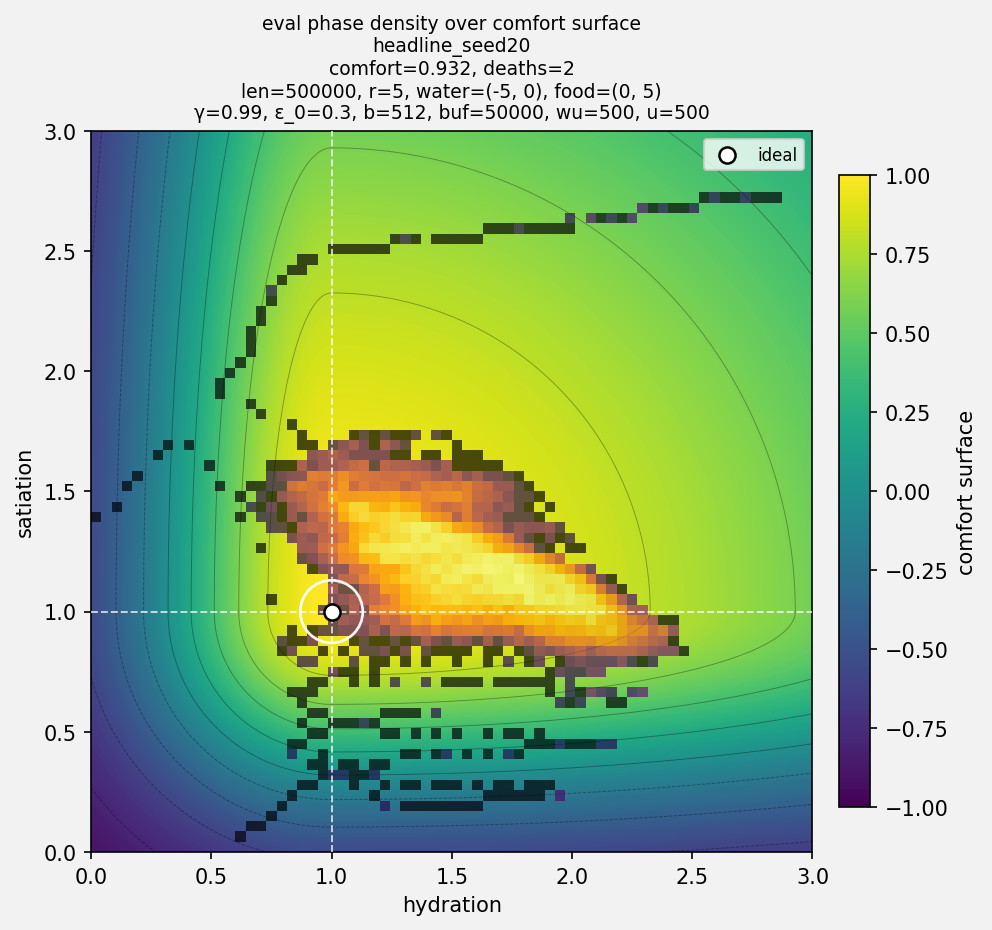

# Homeostatic Agents

Reinforcement-learning agents that regulate internal state under spatial constraints.

**Current experiment:** [`03b_nstep_robust`](prototypes/03b_nstep_robust) · **Hypothesis ledger:** [`BUILDNOTES.md`](BUILDNOTES.md)

The core control problem is:

$$
\text{keep } x_t \text{ near } x^\star \text{ while the environment pushes } x_t \text{ away.}
$$

Each prototype keeps the same underlying problem but makes the environment less forgiving. Early versions were abstract homeostatic control tasks. Later versions move the corrective actions into physical space: water and food are *no longer buttons*, but locations. The agent must learn when to act, where the corrective action is available, and how to survive the delay between needing a resource and reaching it.

The current world is a radius-5 hex grid. Water sits at `(-5, 0)`, food at `(0, 5)`, hydration and satiation decay every tick, and the agent observes only local state. Regulation is therefore both a control problem and a spatial credit-assignment problem.

The current agent is a PyTorch DQN variant with local observations, action masking, experience replay, target networks, masked Bellman targets, 10-step returns, NoisyNet exploration, count-based novelty, and greedy evaluation after training.

## Main question

A controller that survives one fixed map may have learned a route, *not a rule*.

The project is now centred on a sharper question:

> when does value-based reinforcement learning stop working as the environment becomes less stationary, less forgiving, and less tied to one fixed layout?

Prototype 3b is the first point where this becomes visible. Changing the Bellman estimator helped, but it did not reliably break the attractor. The sharper bottleneck was the training distribution.

## Current result: Prototype 3b

On the radius-5 commute, vanilla DQN is bimodal.

Some seeds discover the water→food limit cycle. Others fall into the **water-cult attractor**: they camp near water, protect hydration, and never cross the comfort valley to food. Mean comfort hides this failure because one internal variable can remain well-controlled while the policy is *still* behaviourally wrong.

Mean comfort still helps, but the cleaner benchmark is seed-level behaviour:

$$
\mathbb{E}[C(x_t)]
$$

does not answer the behavioural question by itself:

> how many seeds actually learn the water→food cycle?

The best current configuration uses Noisy DQN, count-based novelty, a 50k replay buffer, 10-step returns, comfort-v3, and $\gamma = 0.99$.

Across 100 seeds:

* **52%** learn a clean water→food limit cycle.
* **38%** also survive that cycle under the stricter ≤5 eval-death gate.
* Median comfort among solved seeds is about **0.93**.
* 49/100 seeds finish greedy evaluation with zero deaths.

The gap between 52% and 38% separates route discovery from reliable survival: some agents learn the water→food cycle, but still execute it with enough instability to die during evaluation.

  
   
  <em>Physical-space occupancy over training and greedy evaluation. Early training is diffuse; by evaluation, the learned policy concentrates on the water–food corridor. Blue outline = water, orange outline = food.</em>

  
   
  <em>Internal-state density over the comfort surface during greedy evaluation. The solved policy forms a noisy limit cycle around the comfort basin instead of collapsing onto a single-resource attractor.</em>

## What changed in 3b

### Comfort surface

Prototype 3 showed that the old comfort surface was too blunt for a spatial task. In the radius-5 world, the agent often needs to carry a temporary surplus of hydration or satiation while travelling across the map. Being above the setpoint is therefore not the same kind of error as being below it.

The repaired surface separates dangerous deficit from strategic surplus:

$$
D_{\text{deficit}} =
(h^\star - h)*+^2 + (s^\star - s)*+^2,
\qquad
D_{\text{surplus}} =
(h - h^\star)*+^2 + (s - s^\star)*+^2
$$

$$
d^2 =
w_{\text{deficit}}D_{\text{deficit}}
+
w_{\text{surplus}}D_{\text{surplus}},
\qquad
C(h,s) = 2e^{-3d^2} - 1
$$

where $(x)_+ = \max(x, 0)$.

Historically, this continues the reward-geometry repair that began in Prototype 3. Prototype 3 exposed the problem; Prototype 3b refined that surface into part of the consistency benchmark.

### Credit assignment

The next hypothesis was that the food reward was too far away, so better credit assignment should help the agent understand the value of the full water→food cycle.

That was partly right, but incomplete.

Double DQN, longer n-step returns, tuned death penalties, and larger $\gamma$ changed how value was propagated through the trajectory. In principle, this should make the delayed value of reaching food easier to learn. But it did not reliably break the water-cult attractor. Longer n-step returns often made the learned behaviour more stable, but stability alone was not enough: the policy could still stabilise around water-camping.

The key issue was:

> a value function can only assign credit to trajectories that enter the training distribution.

The credit-assignment tools were not useless. They helped once useful trajectories existed. But they could not manufacture those trajectories by themselves.

The next knob to turn was exploration.

NoisyNets and count-based novelty worked only together. NoisyNets gave state-dependent exploration; novelty created pressure away from overused regions. Alone, neither was enough. On vanilla DQN, novelty was spent reinforcing the comfortable water region. With NoisyNets, the same bonus helped move the replay distribution into the food corridor.

So the mechanism was *not*:

> curiosity solves the task.

It was:

> induced exploration changes the replay distribution enough for the useful trajectory to become learnable.

### Replay buffer result

The proposed explanation was FIFO forgetting: food transitions are rare, so perhaps a small buffer evicts them before the agent learns from them.

The small-to-medium buffer results supported the retention hypothesis at first.

Increasing the buffer from 5k to 50k–100k improved solve-rate and reduced deaths. But a near-non-evicting 520k buffer collapsed to 0/10.

That ruled out simple FIFO eviction as the whole explanation.

The issue is *not only* that useful transitions disappear. Old transitions can become stale under a changing policy and reward distribution. The replay buffer is therefore *not just memory*; it is a sampling distribution, and its optimal size is a tradeoff.

At this point, more tuning on the fixed radius-5 commute has diminishing returns. It *could* improve the benchmark, but it risks turning the project into narrow, map-specific fitting.

That makes the next benchmark a transfer test rather than another radius-5 tuning pass.

## Project map

| Prototype                                                         | Focus                                                                              | Status     |
| ----------------------------------------------------------------- | ---------------------------------------------------------------------------------- | ---------- |
| [`00_tabular_hydration`](prototypes/00_tabular_hydration)         | Tabular Q-learning on one-axis hydration with delayed drink effects                | Superseded |
| [`01_numpy_dqn_homeostasis`](prototypes/01_numpy_dqn_homeostasis) | From-scratch NumPy DQN with manual backprop for homeostatic control                | Superseded |
| [`01b_pytorch_dqn_port`](prototypes/01b_pytorch_dqn_port)         | PyTorch port; reproduced the same behaviour and failure modes                      | Superseded |
| [`02_spatial_dqn`](prototypes/02_spatial_dqn)                     | Hex world, local observation, movement, and action masks                           | Superseded |
| [`03_spatial_robust`](prototypes/03_spatial_robust)               | Radius-5 exposed the failure of the old reward/metric setup                        | Superseded |
| [`03b_nstep_robust`](prototypes/03b_nstep_robust)                 | Consistency: exploration vs. the water-cult attractor                              | Current    |
| `04_generalisation` *(planned)*                                   | Procedurally generated static `r=20` maps; can the policy transfer across layouts? | Next       |
| `05_regime_shift` *(planned)*                                     | Seasonal brightness, scarce food, and non-stationary reward distributions          | Planned    |

## Repository guide

| File / folder                                                | Role                                                         |
| ------------------------------------------------------------ | ------------------------------------------------------------ |
| [`BUILDNOTES.md`](BUILDNOTES.md)                             | Compressed project arc and hypothesis ledger                 |
| [`prototypes/03b_nstep_robust`](prototypes/03b_nstep_robust) | Current prototype: setup, sweeps, solve gates, failure modes |
| [`results/best_figures`](results/best_figures)               | Headline plots used in this README                           |
| `prototypes/*/results`                                       | Per-prototype sweep outputs and diagnostics                  |

## Next: Prototype 4

Prototype 4 should separate generalisation from regime shift.

The fixed radius-5 benchmark asks:

> can the agent learn this commute?

Prototype 4 asks:

> can the agent learn a survival rule across layouts?

The next environment is a procedurally generated static radius-20 map with different bush and lake layouts. Training and evaluation should be split across map seeds, so success cannot come from memorising one route.

A simple ε-greedy DQN can stay as a baseline here. If it fails on unseen layouts, the failure gives the next comparison a clean target:

> what state representation, memory mechanism, exploration process, or training distribution is needed for spatial homeostatic control to generalise?

After that, the project can move to true regime shift: seasonal brightness, scarce food, moving resources, and reward distributions that change under the value function.
