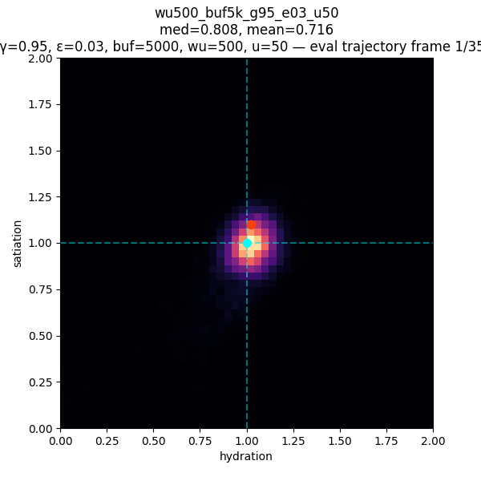
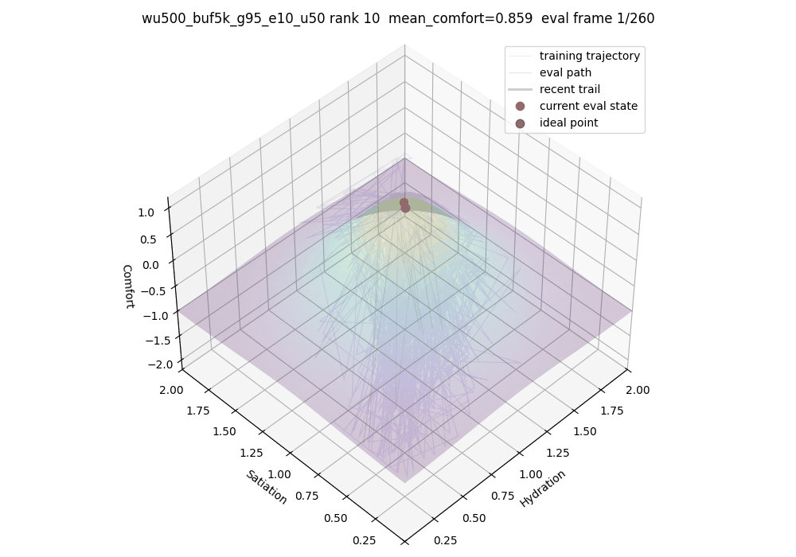
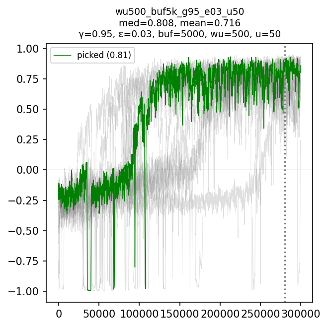

# Homeostatic Agents

A reinforcement-learning simulation project about agents learning to regulate internal needs.

The project is built around a simple idea: create a small survival environment, then train an agent to solve the control problem inside it.

The current environment contains hydration, satiation, daylight-driven decay, delayed action effects, comfort, and death. 

The current agent is a handwritten NumPy DQN model that learns how to act inside that system through replay learning, target networks, and death penalties.

The current focus is to build increasingly strict prototypes and see what breaks as the agent’s world becomes more realistic, while building toward an emergent simulation with a shared neural policy.

## Current state

The current environment is a two-axis homeostasis problem, with delayed action effects and cyclic-daylight-driven decay:

- hydration (internal state to balance)
- satiation (internal state to balance)
- brightness-driven decay (external factor and input)
- delayed drink/eat effects (environment-level dynamics)

The best current model is a handwritten NumPy DQN-style controller that can effectively maintain homeostatic behavior:

- memory of incoming drink/eat effects (internal state representation)
- replay sampling
- target network updates
- terminal death states
- evaluation-only rollouts

The model learns to keep its internal state near the ideal comfort region instead of drifting into dehydration, starvation, or unstable oscillation.

### Best current result

*This plot shows where the agent spends time during evaluation. The tighter cluster around the ideal point suggests the learned policy is controlling its internal state toward a stable cluster.*

*This plot shows how comfort scales with hydration and satiation*

*The rolling comfort curve shows learning across seeded runs.*

*After training, exploration is disabled and the learned policy controls hydration and satiation using only its learned action values.*

## Prototype path

| Prototype | Focus | Status |
|---|---|---|
| `00_tabular_hydration` | Tabular Q-learning for one-axis hydration control with delayed drink effects | Superseded |
| `01_numpy_dqn_homeostasis` | Neural Q-function for hydration + satiation control | Current best non-spatial model |
| `02_pytorch_spatial_homeostasis` | Physical hex-world with food, water, local observations, and action masks | Next |

## What this project is trying to build toward

The next step is physical embedding.

In the current model, drinking and eating are abstract actions that are always available. In the next prototype, food and water will exist as locations in a small hex-grid world. The agent will have to move, observe local surroundings, and choose from valid actions.

That means:

- drinking should only be valid near water
- eating should only be valid near food
- movement depends on neighbouring cells
- action masks become necessary
- the model will move from handwritten NumPy to PyTorch for faster testing and cleaner debugging

*The goal for the next version is simple:*
> Can an agent learn a physical survival loop between food and water while still regulating its internal state?
