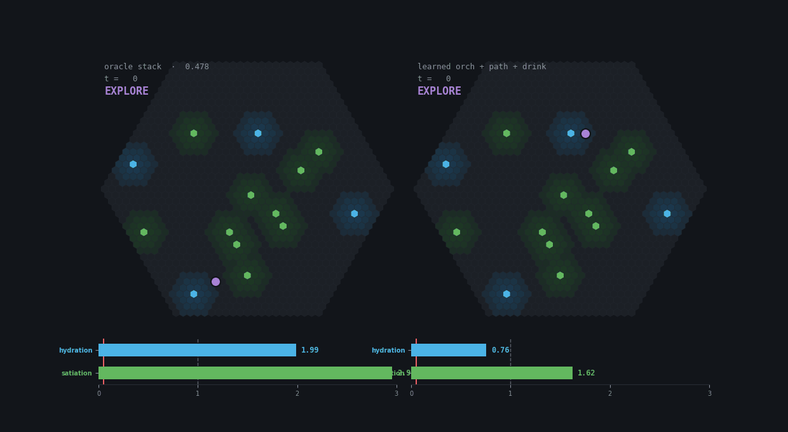
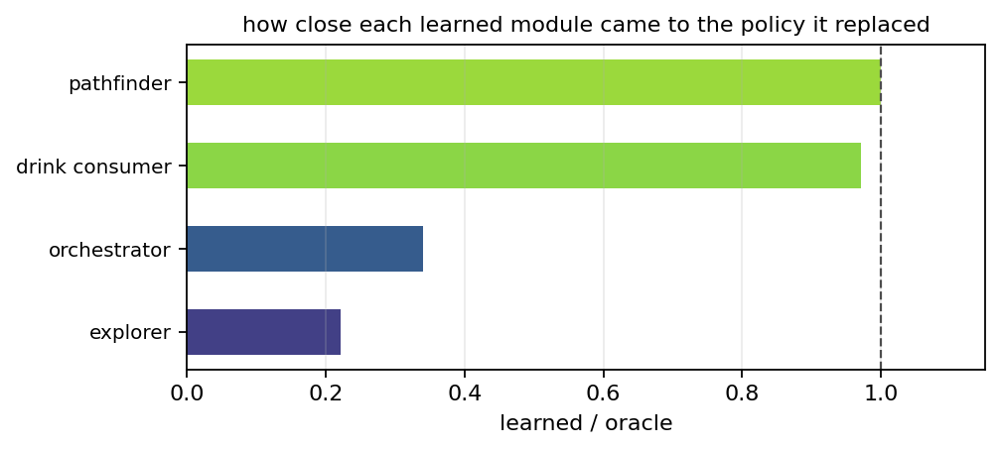
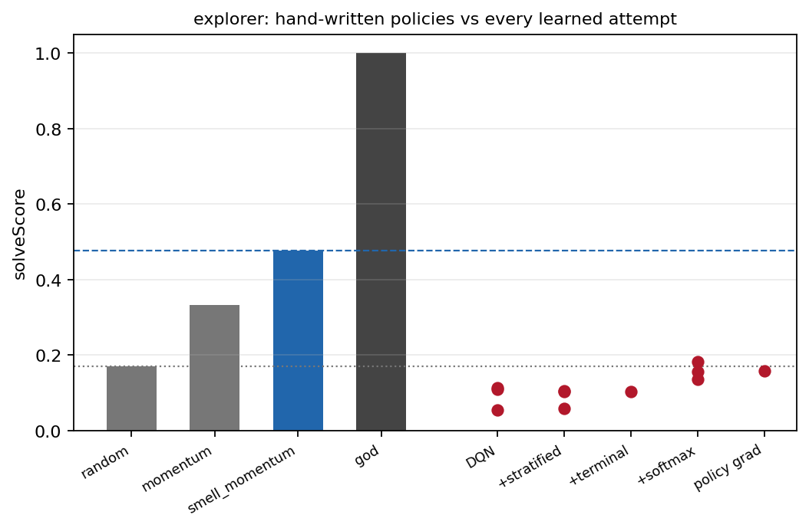

# Homeostatic Agents

Reinforcement-learning agents that regulate internal state under spatial constraints — and a
six-prototype investigation into **where value-based RL stops working** as the environment
becomes less stationary and less forgiving.

<p align="center">
  
</p>

<p align="center">
  <sub><em>360 ticks of one life. Blue is water, green is food, and the pale halos show how far
  each can be smelled — radius 3. The two bars are the drives the agent has to keep off the red
  line, and the only way to do that is to walk back and forth between the resources. The grey
  space between the halos is the <strong>dead band</strong>: the middle of the commute, where
  neither resource can be detected. That gap is what the whole project turned out to be about.
  <br><br>
  Hand-written reactive stack (solveScore 0.48), seed 1
</p>

---

**Results index:** [`RESULTS.md`](RESULTS.md) · **Hypothesis ledger:** [`BUILDNOTES.md`](BUILDNOTES.md) · **Re-run it:** [`REPRODUCE.md`](REPRODUCE.md) · **Latest work:** [`06_feudal`](prototypes/06_feudal)

---

## The Main Idea

An agent must keep hydration and satiation near their setpoints, but water and food are
*places*, not buttons — so regulation becomes a spatial credit-assignment problem. On a fixed
map, DQN solves it: 52% of seeds learn the water→food cycle and 38% survive it. On procedurally
resampled maps that same approach collapses to 0%, and six prototypes of work isolate the cause
to a single mechanism — the agent cannot commit to crossing a region where no sensory signal
exists.

---

## The Arc

**It worked.** Prototype 3b, fixed radius-5 map: **52%** of 100 seeds learn a clean water→food
limit cycle, **38%** also survive it under a strict evaluation gate. Getting there required
repairing the reward geometry, then discovering that exploration — not credit assignment — was
the binding constraint.

**Then it stopped working.** Prototype 04 asked whether that policy learned *a route* or *a
rule*. Carried onto procedurally generated maps, the survival rate is **0%** once a boundary
artifact propping it up is removed. Four hypotheses (senses, reachability, memory, a shorter
approach) were each falsified in turn, narrowing the failure to one mechanism: the agent cannot
self-commit to a directed crossing of the **dead band** — a 3–5 hex stretch mid-commute where
neither resource is detectable.

**Then I decomposed it.** Prototype 06 splits the agent into four modules — orchestrator,
pathfinder, consumer, explorer — and learns each separately. Navigation becomes provably optimal.
Exploration turns out not to be learnable at all on its observation contract. And arbitration —
the module that chooses between the two drives — *does* learn a coherent policy, then converges
on the same **water-cult attractor** Prototype 3b identified three prototypes earlier. The
pathology survives isolation. So it isn't something end-to-end learning caused — it's in the
task.

Watching it move, rather than reading its action shares, then showed the arbitration failure
was really two failures. It cannot hold an intention for longer than a single tick, and it
never finishes building its map. Forcing it to commit recovers a third of the gap; paying it
to commit collapses it into standing still.

<p>
  
  <br>
  <sub><em>Each learned module as a fraction of the hand-written policy it replaced. The
  pathfinder matches it exactly; the explorer never left random.</em></sub>
</p>

---

## What broke it

The explorer is the module that must cross the dead band. Five methods were tried; none reached
even the random-walk floor.

<p>
  
  <br>
  <sub><em>Hand-written policies span 0.17–1.00. Every learned policy — three DQN seeds, stratified
  replay, a terminal-condition fix, stochastic evaluation, and policy gradient — sits at ~0.10.</em></sub>
</p>

**The mechanism.** The explorer's observation contract carries legality, recent actions, smell
readings and need flags — but **no positional memory**. Coverage, revisit-avoidance and
frontier-seeking are therefore not representable. That confines the learnable policy class to
*reactive correlated walks with chemotaxis*: a five-parameter family that a hand-tuned heuristic
already occupies at or near its optimum. A parameter sweep found no setting whose confidence
interval separates from the baseline's.

**Learning has nothing to add where a five-parameter search suffices.**

This is a bounded claim, and the boundary matters: the explorer is not learnable *on this
observation contract*. Prototype 07's specification follows directly — give it visit counts, a
decaying coverage trace, or episodic novelty, so the policy class contains something a tuned
heuristic cannot reach.

---

## What did work: the pathfinder

This belongs next to the negative result, because it is the same algorithm.

The pathfinder was trained **entirely outside the simulation**, on bare hex geometry with no
drives, decay or resources, using sparse arrival rewards and hindsight experience replay. Dropped
into the full agent it was invoked 34,859 times for a **+0.000** change in survival, at
**1.0000 optimality** across every operational distance band.

It isn't a copy of the oracle — agreement is only 0.56, because the two break ties differently.
It got there on its own, from arrival rewards.

The claim this supports: the algorithm class that solved **0/40** end-to-end in Prototype 04
recovers optimal navigation once decomposition hands it an observed goal. **The decomposition is
the finding**, not the pathfinder.

---

## Why the sensory radius is not a free parameter

The dead band has a width, and it is not linear in the sensing radius.

For commute length $`L`$ and smell radius $`r`$, the agent is guided while within $`r`$ of water (an
anti-gradient — it knows where it came from) and within $`r`$ of food. The scentless middle is

```math
d(r) = \max(0,\; L - 2r)
```

Radius is subtracted from **both ends**, so $`+2`$ on $`r`$ removes $`4`$ from $`d`$. At band $`(9,11)`$:
$`r=3`$ gives $`d \in \{3,4,5\}`$; $`r=5`$ gives $`d \in \{0,0,1\}`$.

Two further effects compound. Detection area on a hex grid is $`N(r) = 1 + 3r(r+1)`$, quadratic in
$`r`$, and mean hitting time for a random walk scales as domain area over target area. And in the
blind region the walk is unbiased, so expected crossing time for a gap of width $`d`$ scales as
$`d^2`$, not $`d`$. Together:

```math
\mathcal{D} \;\propto\; \frac{(L-2r)^2}{r^2}
```

At $`L=11`$ that is $`25/9 \approx 2.78`$ for $`r=3`$ against $`1/25 = 0.04`$ for $`r=5`$ — a factor of ~70.
At $`L \le 10`$ with $`r=5`$ the numerator is zero.

**So $`r=5`$ does not make the task easier; it removes the task.** The phenomenon is parameterised by
$`L - 2r`$, not by $`r`$, which means smell 5 with band $`(13,15)`$ would be the *same* problem. The
project holds $`r=3`$ deliberately, and the cost of doing so is itself diagnostic: smell 3 and smell 5
tie at 0.86 on an evaluation where water is handed over, and diverge to 0.48 vs 0.71 only when
water must be found from cold.

## What counts as cheating

The word has a precise meaning here, and the distinction drove most of the design decisions.

**An intervention is cheating if it changes what the agent *knows*, rather than how it *learns*.**

| intervention | verdict | why |
|---|---|---|
| scent as an **observation** | legal | changes the observation space — a different POMDP, but the agent still has to act on the signal |
| scent as a **reward** | **cheating** | the navigation is then performed by the reward function's gradient, not by the agent. The thing being claimed is exactly the thing being supplied |
| oracle with pre-populated coordinates | cheating (except as a plumbing smoke test) | the agent never earned the knowledge; the privilege does not survive the oracle→learned swap |
| a learned module importing the true physics | **cheating** | it reads the consume dynamics instead of estimating them. `world_v1` is the greppable boundary and a probe enforces it |
| stratified replay sampling | legal | changes which existing transitions the optimiser sees. No new information enters |
| raising the sensory radius | legal but **changes the problem** | see above — it deletes the dead band rather than easing it, so results are not comparable across $`r`$ |

The operational test: *what privilege evaporates when an oracle is replaced by a learned module?*
Anything that would be impossible to replace without handing the agent privileged information fails.

Biological plausibility is not the standard here — but it happens to coincide with it at one point
worth noting. Real chemotaxis is scent-as-observation: an organism senses a gradient and acts on it;
it is not paid for proximity. The honest engineering boundary and the biologically real mechanism
turn out to be the same line.

## Engineering

Roughly 5,000 lines across six prototypes. Most of the work went into checking the results
rather than producing them.

**Module contract.** A frozen interface (`contract_v1.py`) defines four modules — orchestrator,
pathfinder, consumer, explorer — each with an oracle implementation and a learned implementation
sharing one signature. Swapping any single module is a one-string change to a `ModuleSpec`, which
is what makes per-module attribution possible at all.

**Checkpointing.** Weights carry architecture, observation-field list, training config, seed, git
SHA and achieved metric — never a bare `state_dict`. Modules receive a *string tag* and load inside
the worker, because sweeps spawn processes on Windows and live torch objects do not survive the
pickle. Loading asserts the observation encoding matches what the module was trained on; a stale net
fed a reshaped observation is the worst available failure mode because it fails silently.

**Sweep harness.** Process-parallel with resumable checkpointing, atomic pickle writes, segment-aware
evaluation metrics (each evaluation slice scored against its own map's coordinates before pooling),
and Wilson intervals throughout.

**Probe suite.** Nine invariants asserted before any result is read — privilege boundary, checkpoint
round-trip, registry integrity, determinism, action-scheme shim correctness, dispatch-record
correctness, and the record-to-tick join the training rigs depend on. Every one guards a failure that
would otherwise be silent.

**Calibration instruments.** Each module has a deliberately degraded twin (`noisy_oracle`) used to
establish what a metric can actually detect *before* a learned module is trained against it. It's
easy to skip. Skipping it would have cost me two conclusions.

## Project map

| Prototype | Focus | Status |
|---|---|---|
| [`00_tabular_hydration`](prototypes/00_tabular_hydration) | Tabular Q-learning, one-axis hydration, delayed effects | Superseded |
| [`01_numpy_dqn_homeostasis`](prototypes/01_numpy_dqn_homeostasis) | From-scratch NumPy DQN with manual backprop | Superseded |
| [`01b_pytorch_dqn_port`](prototypes/01b_pytorch_dqn_port) | PyTorch port; reproduced behaviour and failure modes | Superseded |
| [`02_spatial_dqn`](prototypes/02_spatial_dqn) | Hex world, local observation, movement, action masks | Superseded |
| [`03_spatial_robust`](prototypes/03_spatial_robust) | Radius-5 exposed the old reward/metric setup as unfit | Superseded |
| [`03b_nstep_robust`](prototypes/03b_nstep_robust) | **52% / 38%** on the fixed commute; exploration beats credit assignment | Headline (fixed map) |
| [`04_generalisation`](prototypes/04_generalisation) | Procedural r=20 maps — route or rule? H1–H4 all falsified | Superseded |
| [`05_generalisation`](prototypes/05_generalisation) | Curriculum + earned-memory attempt; abandoned mid-hypothesis | Superseded |
| [`06_feudal`](prototypes/06_feudal) | **Feudal decomposition — which modules can RL learn?** | Current |

---

## The central question

> When does value-based reinforcement learning stop working as the environment becomes less
> stationary, less forgiving, and less tied to one fixed layout?

Each prototype keeps the same control problem and makes the environment less forgiving. Early
versions were abstract homeostatic control. Later versions move corrective actions into physical
space: water and food become locations, and the agent must learn *when* to act, *where* the
action is available, and how to survive the delay between needing a resource and reaching it.

### Prototype 3b, briefly

On the fixed radius-5 commute, DQN is bimodal. Some seeds discover the water→food limit cycle;
others fall into the **water-cult attractor** — camping near water, protecting hydration, never
crossing to food. Mean comfort hides this, because one internal variable can stay well-controlled
while the policy is behaviourally wrong. Seed-level solve-rate is the honest metric.

Three findings, in the order they were established:

1. **Reward geometry first.** Deficit and surplus are not symmetric errors — an agent crossing a
   map needs to carry a surplus. Separating them was a precondition for anything else working.
2. **Credit assignment was not the bottleneck.** Double DQN, longer n-step returns, tuned death
   penalties and larger γ all changed how value propagated, and none reliably broke the attractor.
   *A value function can only assign credit to trajectories that enter the training distribution.*
3. **Exploration was.** NoisyNets and count-based novelty worked only in combination — novelty
   alone reinforced the comfortable water region; with NoisyNets it moved the replay distribution
   into the food corridor. The mechanism is not "curiosity solves the task" but "induced
   exploration changes the replay distribution enough for the useful trajectory to become
   learnable."

A near-non-evicting 520k replay buffer collapsing to 0/10 ruled out simple FIFO forgetting: the
buffer is a **sampling distribution**, not just memory, and its optimal size is a trade-off
against staleness under a non-stationary policy.

---

## Method notes

The experimental apparatus is a deliberate part of this project, and several conclusions came
from it rather than from any single run.

- **Calibrate before training.** A null result only means something if you have already shown the
  metric can produce a non-null one. Every module has a deliberately degraded control
  (`noisy_oracle`) used to establish a detection floor *first*. The explorer's metric spans 0.362;
  the consumer's spans 0.044 — which is why the consumer's certification means less than it looks.
- **A non-monotone metric cannot rank policies.** Under controlled degradation, `solveScore`
  scored a knowably worse consumer *higher*. Any detection floor computed from it is an artifact.
- **Error character dominates error rate.** Two pathfinders differing by 0.02 in optimality
  differed **90×** in expected excess steps, because one's mistakes were sideways and the other's
  were reversals.
- **A module's episode boundary is not the agent's.** It ends when the sub-task ends;
  bootstrapping past it corrupts exactly the transitions the module should learn from.
- **Never evaluate on a resampled world.** Fixed evaluation seeds, disjoint from certification
  seeds — otherwise the curve measures the world, not the policy.
- **Never relax a pre-registered threshold.** The pathfinder's 0.99 gate failed three runs before
  a properly selected checkpoint scored 1.0000. The gate was right; the training was not.

Predictions are written into [`BUILDNOTES.md`](BUILDNOTES.md) **before** each sweep runs, in
Bet → Prediction → Result → Verdict form. The entries where the result contradicts the prediction
are the load-bearing ones and are left exactly as written.

---

## Techniques used, and where they come from

None of these are mine. The project is an investigation, not a method paper, and this table is
here so a reader can tell at a glance what was borrowed and what was actually measured.

| technique | used in | source |
|---|---|---|
| Tabular Q-learning | 00 | [Watkins & Dayan 1992](https://link.springer.com/article/10.1007/BF00992698) |
| DQN, replay, target networks | 01 → 06 | [Mnih et al. 2015](https://www.nature.com/articles/nature14236) |
| Double DQN | 03b, 04, 06 | [van Hasselt, Guez & Silver 2016](https://arxiv.org/abs/1509.06461) |
| n-step returns | 03b → 06 | [Sutton & Barto 2018, ch. 7](http://incompleteideas.net/book/the-book-2nd.html) |
| NoisyNets | 03b, 04, 06 | [Fortunato et al. 2018](https://arxiv.org/abs/1706.10295) |
| Count-based novelty | 03b | [Bellemare et al. 2016](https://arxiv.org/abs/1606.01868), [Tang et al. 2017](https://arxiv.org/abs/1611.04717) |
| Replay as a sampling distribution (the 520k collapse) | 03b | [Fedus et al. 2020](https://arxiv.org/abs/2007.06700) |
| DRQN / recurrent value functions | 04, 05 | [Hausknecht & Stone 2015](https://arxiv.org/abs/1507.06527) |
| Hindsight experience replay | 06 pathfinder | [Andrychowicz et al. 2017](https://arxiv.org/abs/1707.01495) |
| Temporally-extended (εz-greedy) exploration | 05 H2 | [Dabney, Ostrovski & Barreto 2021](https://arxiv.org/abs/2006.01782) |
| Self-imitation from a success archive | 05 H3 | [Oh et al. 2018](https://arxiv.org/abs/1806.05635) |
| Go-Explore (tried, eyeballed, dropped) | 04 | [Ecoffet et al. 2021](https://www.nature.com/articles/s41586-020-03157-9) |
| REINFORCE / policy gradient with a baseline | 06 explorer | [Williams 1992](https://link.springer.com/article/10.1007/BF00992696) |
| Entropy regularisation | 06 explorer | [Mnih et al. 2016](https://arxiv.org/abs/1602.01783) |
| Feudal decomposition | 06 | [Dayan & Hinton 1992](https://proceedings.neurips.cc/paper/1992/hash/d14220ee66aeec73c49038385428ec4c-Abstract.html), [Vezhnevets et al. 2017](https://arxiv.org/abs/1703.01161) |
| Options / temporal abstraction | 06 | [Sutton, Precup & Singh 1999](https://doi.org/10.1016/S0004-3702(99)00052-1) |
| Option collapse into primitive actions | 06 P4.2–P4.4 | [Bacon, Harb & Precup 2017](https://arxiv.org/abs/1609.05140) |
| Deliberation cost on option switching | 06 P4.4 | [Harb, Bacon, Klissarov & Precup 2018](https://arxiv.org/abs/1709.04571) |
| Learned termination — surveyed, not used | — | [Harutyunyan et al. 2019](http://proceedings.mlr.press/v89/harutyunyan19a/harutyunyan19a.pdf) |
| Duration heads / action repetition — surveyed, not used | — | [Sharma et al. 2017](https://arxiv.org/abs/1702.06054), [Biedenkapp et al. 2021](https://arxiv.org/abs/2106.05262) |
| Action persistence, policy inertia — surveyed, not used | — | [Metelli et al. 2020](https://arxiv.org/abs/2002.06836), [Chen et al. 2021](https://arxiv.org/abs/2103.02287) |
| Stochastic optima for memoryless POMDP policies | 06 P3.2 | [Singh, Jaakkola & Jordan 1994](https://doi.org/10.1016/B978-1-55860-335-6.50042-8) |
| Potential-based shaping (considered, rejected) | 06 pathfinder | [Ng, Harada & Russell 1999](https://people.eecs.berkeley.edu/~pabbeel/cs287-fa09/readings/NgHaradaRussell-shaping-ICML1999.pdf) |
| Curriculum over task difficulty | 03b, 05, 06 | [Bengio et al. 2009](https://dl.acm.org/doi/10.1145/1553374.1553380) |
| Wilson score intervals | everywhere | [Wilson 1927](https://doi.org/10.1080/01621459.1927.10502953) |

Two things this project is downstream of but did not cite while building, which is a gap rather
than a boast:

- **Homeostatic RL** — [Keramati & Gutkin 2014](https://elifesciences.org/articles/04811) derive
  a reward function from drive-reduction and prove when it coincides with utility maximisation.
  That is the same setup as prototypes 00–02, arrived at independently and worse.
- **Run-and-tumble chemotaxis** — the `smell_momentum` explorer is a rediscovery of bacterial
  chemotaxis ([Berg & Brown 1972](https://www.nature.com/articles/239500a0)): persist while the
  gradient improves, tumble when it drops.
- **Option collapse** — the orchestrator's failure (P4.2–P4.4) is the documented pathology of
  the Option-Critic line: options degenerating into primitive actions because the termination
  objective switches on value noise. It was diagnosed here from a rendered trajectory rather
  than from the literature, which is the cost of the missing reading list above.

---

## Repository layout

```
prototypes/<NN>_<name>/     one prototype: code, README (hypothesis ledger), results/
  06_feudal/
    model_modules/          contract, oracle impls, learned impls, checkpointing
    training/               rigs and per-module trainers
    tests/                  probes, calibration harnesses, acceptance gates
    figures/                figure generation
BUILDNOTES.md               the lab notebook — chronological, predictions before results
RESULTS.md                  every headline number in one place
```

**Stack:** Python, NumPy, PyTorch. DQN family (vanilla / double / n-step / NoisyNet / DRQN),
hindsight experience replay, policy gradient with a value baseline, count-based novelty,
process-parallel sweep harness with resumable checkpointing.
