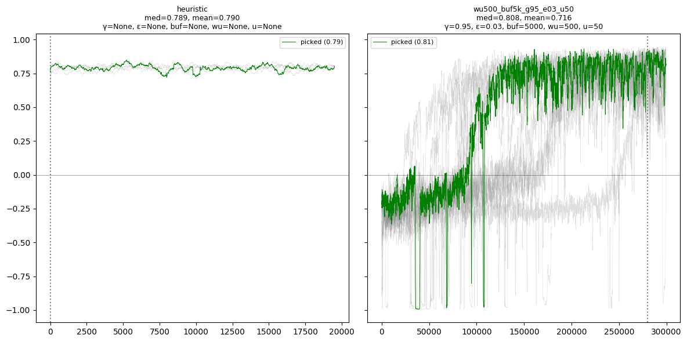
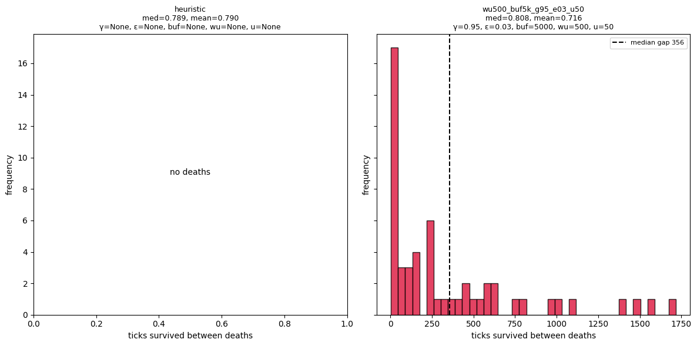
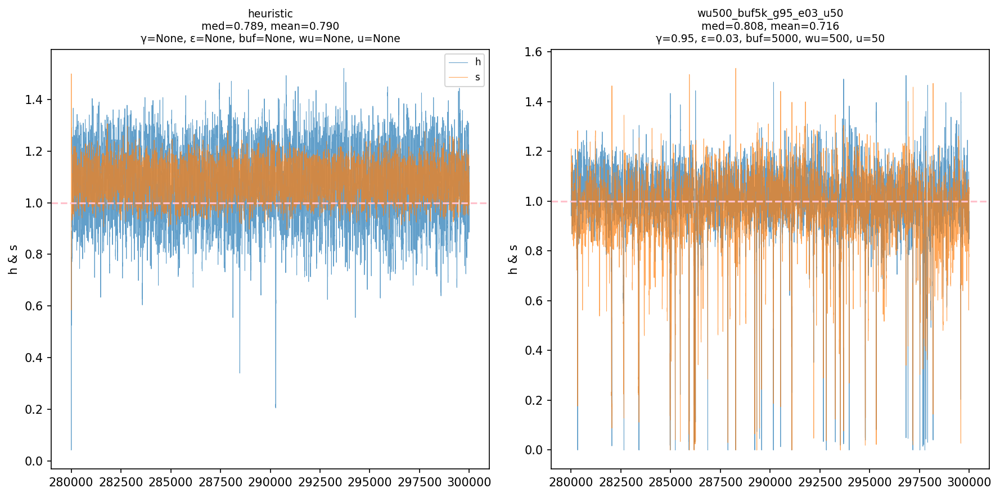

# Prototype 1: Handwritten NumPy DQN

The prototype's environment is a two-axis homeostasis problem, with delayed action effects and cyclic daylight-driven decay:

- hydration (internal state to balance)
- satiation (internal state to balance)
- brightness-driven decay (external factor and input)
- delayed drink/eat effects (environment-level dynamics)

The model is a DQN controller that can effectively maintain homeostatic behavior:

- manual NumPy forward/backward passes for a small ReLU Q-network
- state augmentation with recent drink/eat action-effect history to handle delayed dynamics
- replay sampling with a warmup period
- target network updates
- terminal-state handling with masked Bellman targets
- final greedy-policy window with epsilon-greedy exploration disabled

The model learns to keep its internal state near the ideal comfort region instead of drifting into dehydration, starvation, or unstable oscillation.

### Best results

  
   
  <em>Final greedy-policy evaluation phase density. The learned policy keeps hydration and satiation clustered near the ideal point.</em>

 

  
   
  <em>Gaussian comfort surface with evaluation trajectory. Comfort peaks around the target hydration/satiation region.</em>

 

  
   
  <em>Rolling comfort across seeded runs. The highlighted run shows the representative learning behaviour.</em>

 

  
   
  <em>Death-gap distribution during evaluation. Short-gap clustering reveals a post-reset death-spiral failure mode in the learned DQN policy.</em>

 

  
   
  <em>Evaluation window with exploration disabled, showing that the final DQN policy learns noisy but functional control of hydration and satiation.</em>

 

#### Hyperparameter sweep summary:

| finding | config | result |
|---|---|---|
| Best median + fewest deaths | `wu500_buf5k_g95_e20_u50` | median comfort `0.833`, median eval deaths `35.5` |
| Best mean | `wu500_buf5k_g95_e05_u50` | mean comfort `0.810` |
| Lowest seed-to-seed std | `wu500_buf30k_g95_e10_u50` | seed std `0.022` |
| Only collapsed seed | `wu500_buf5k_g99_e10_u50` | `1/10` collapsed seeds |

Full 19-configuration sweep, 10 seeds each

| config | γ | ε | buf | wu | u | median | mean | seed std | eval deaths | collapses | comment |
|---|---|---|---|---|---|---|---|---|---|---|---|
| wu500_buf5k_g95_e20_u50 | 0.95 | 0.2 | 5000 | 500 | 50 | **0.833** | 0.793 | 0.069 | **35.5** | 0/10 | **- highest median, lowest deaths** |
| wu500_buf5k_g95_e05_u50 | 0.95 | 0.05 | 5000 | 500 | 50 | 0.827 | **0.810** | 0.052 | 61.0 | 0/10 | **- best mean**|
| wu500_buf10k_g95_e10_u50 | 0.95 | 0.1 | 10000 | 500 | 50 | 0.815 | 0.768 | 0.118 | 53.5 | 0/10 | |
| wu500_buf5k_g95_e03_u50 | 0.95 | 0.03 | 5000 | 500 | 50 | 0.808 | 0.716 | 0.152 | 60.5 | 0/10 | |
| wu500_buf30k_g95_e10_u50 | 0.95 | 0.1 | 30000 | 500 | 50 | 0.799 | 0.806 | **0.022** | 50.5 | 0/10 |**- lowest seed-to-seed std**|
| wu1000_buf5k_g95_e10_u50 | 0.95 | 0.1 | 5000 | 1000 | 50 | 0.797 | 0.763 | 0.109 | 81.5 | 0/10 | |
| wu500_buf5k_g95_e10_u100 | 0.95 | 0.1 | 5000 | 500 | 100 | 0.796 | 0.753 | 0.069 | 66.0 | 0/10 | |
| wu500_buf5k_g95_e10_u250 | 0.95 | 0.1 | 5000 | 500 | 250 | 0.793 | 0.781 | 0.048 | 57.0 | 0/10 | |
| wu0_buf5k_g95_e10_u50 | 0.95 | 0.1 | 5000 | 0 | 50 | 0.792 | 0.767 | 0.084 | 76.5 | 0/10 | |
| wu500_buf5k_g95_e15_u50 | 0.95 | 0.15 | 5000 | 500 | 50 | 0.788 | 0.775 | 0.062 | 71.0 | 0/10 | |
| wu500_buf5k_g95_e10_u25 | 0.95 | 0.1 | 5000 | 500 | 25 | 0.783 | 0.769 | 0.071 | 77.5 | 0/10 | |
| wu500_buf5k_g95_e10_u50 | 0.95 | 0.1 | 5000 | 500 | 50 | 0.776 | 0.777 | 0.052 | 68.5 | 0/10 | |
| wu250_buf5k_g95_e10_u50 | 0.95 | 0.1 | 5000 | 250 | 50 | 0.768 | 0.759 | 0.100 | 81.0 | 0/10 | |
| wu500_buf3k_g95_e10_u50 | 0.95 | 0.1 | 3000 | 500 | 50 | 0.767 | 0.756 | 0.054 | 84.5 | 0/10 | |
| wu2000_buf5k_g95_e10_u50 | 0.95 | 0.1 | 5000 | 2000 | 50 | 0.759 | 0.746 | 0.079 | 82.5 | 0/10 | |
| wu500_buf5k_g925_e10_u50 | 0.925 | 0.1 | 5000 | 500 | 50 | 0.730 | 0.706 | 0.085 | 120.5 | 0/10 | |
| wu500_buf5k_g975_e10_u50 | 0.975 | 0.1 | 5000 | 500 | 50 | 0.698 | 0.672 | 0.138 | 75.0 | 0/10 | |
| wu500_buf5k_g90_e10_u50 | 0.9 | 0.1 | 5000 | 500 | 50 | 0.654 | 0.675 | 0.085 | 147.0 | 0/10 | |
| wu500_buf5k_g99_e10_u50 | 0.99 | 0.1 | 5000 | 500 | 50 | 0.185 | 0.110 | 0.315 | 173.0 | 1/10 | **-only crash of sweep** |

 
Overall, the best-performing region was around γ = 0.95, buffer = 5k, warmup = 500, and relatively high exploration. ε = 0.20 achieved the best median comfort and fewest evaluation deaths, while ε = 0.05 achieved the best mean comfort with slightly more seed-to-seed spread. A larger replay buffer of 30k gave the lowest seed-to-seed standard deviation, but did not improve peak performance and increased learning time considerably. Very high discounting, γ = 0.99, was unstable and produced the only collapsed seed.

## What this prototype is trying to build toward

The next step is physical embedding.

In the current model, drinking and eating are abstract actions that are always available. In the next prototype, food and water will exist as locations in a small hex-grid world. The agent will have to move, observe local surroundings, and choose from valid actions.

That means:

- drinking should only be valid near water
- eating should only be valid near food
- movement depends on neighbouring cells
- action masks become necessary
- the model moves from handwritten NumPy to PyTorch for faster testing and cleaner debugging
