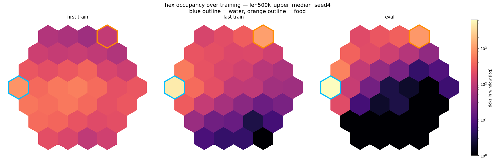
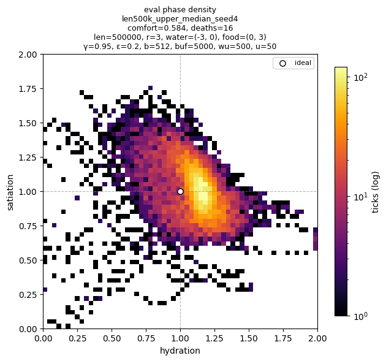
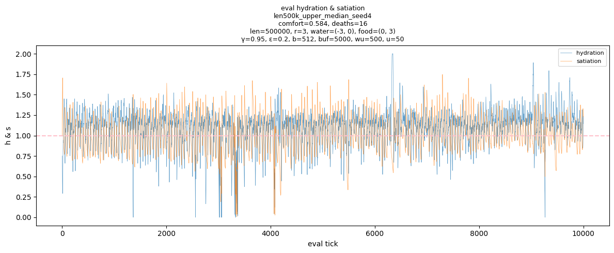
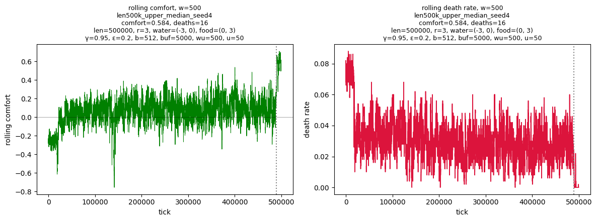
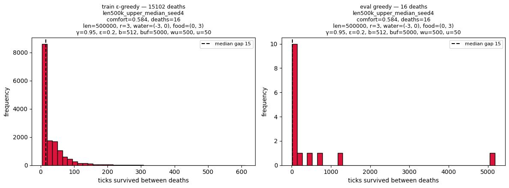

# Prototype 2

The world is a hex grid. Water and food sit at fixed locations, hydration and satiation decay over time, and the agent only sees its local surroundings. Regulation is no longer free: the agent has to physically move between resources to keep $x$ near $x^\star$, so staying alive becomes a spatial problem as much as a control one.

The agent is a PyTorch DQN with local observations and action masking. It learns a movement-and-consumption policy that keeps it alive across long episodes, choosing only from the actions the environment marks valid at each step.

### Environment

- a hex world with radius $r = 3$
- fixed water and food cells: $\text{water} = (-3, 0)$, $\text{food} = (0, 3)$
- an internal state $x = (h, s)$, where $h$ is hydration and $s$ is satiation
- a setpoint $x^\star = (1, 1)$, where comfort is highest
- internal decay each tick, driven by the environment
- death when $\min(h, s) \le 0$
- partial observability: the agent sees a local neighbourhood and its own internal state, not the whole map
- delayed effects: drinking and eating do not behave like instant abstract buttons; action effects pass through the environment dynamics before fully affecting state
- action masking: for the observed/input state $z$, only a subset $\mathcal{A}(z) \subseteq \mathcal{A}$ is valid

Valid actions depend on the physical world:

- drink only when water is accessible
- eat only when food is accessible
- move only into existing neighbouring hexes

This makes the problem a partially observed spatial control task, not just a two-variable balancing problem.

The observation is augmented with recent drink, eat, and movement history so the DQN can account for delayed effects.

### Agent

The agent is a DQN in PyTorch.

It approximates the action-value function:

$$Q(z, a)$$

where $z$ is the input state observed by the controller.

At evaluation time, the agent selects the highest-valued valid action:

$$\arg\max_{a \in \mathcal{A}(z)} Q(z, a)$$

The training target is the masked Bellman target:

$$y = r + \gamma \max_{a' \in \mathcal{A}(z')} Q_{\theta^-}(z', a')$$

where $\theta^-$ is the target network. Terminal states are masked out of the bootstrap, so $y = r$ when $z'$ is terminal.

The training setup includes:

- experience replay
- replay warmup
- target network updates
- $\varepsilon$-greedy exploration during training
- final greedy evaluation with exploration disabled ($\varepsilon = 0$)
- action masking in both training and evaluation

The learned policy commutes between water and food, drinking and eating in turn, instead of starving, dehydrating, or wandering into unused regions of the map.

## Best result

The figures below show a representative run from the 500k-step spatial prototype.

This is the upper-median run from the current best training-length region.

**Representative run:** `len500k_seed4`

Config:

- map radius: $r = 3$
- water: $(-3, 0)$
- food: $(0, 3)$
- discount factor: $\gamma = 0.95$
- exploration: $\varepsilon = 0.2$
- batch size: $512$
- replay buffer: $5000$
- warmup: $500$
- target update interval: $50$
- training length: $500{,}000$ ticks

Representative result:

- mean comfort: $\approx 0.584$
- evaluation deaths: $16$

  
   
  <em>Hex occupancy across three windows — first training window, last training window, and greedy evaluation — on a log colour scale. Water is outlined in blue, food in orange. Early occupancy is diffuse across the whole map; by evaluation it has collapsed onto the water-food corridor, and the lower-right region is essentially abandoned.</em>

 

The occupancy plot is the clearest spatial result.

At the start of training, the agent visits a broad region of the map. By the end of training and during evaluation, occupancy collapses into a much more useful route between the two resources.

This shows that the policy is not only learning *when* to drink and eat. It is learning *where* the corrective actions are available.

  
   
  <em>Evaluation phase density over the hydration-satiation plane. The learned policy spends most of its time near the ideal state (h, s) = (1, 1), with a noisy but clear attractor around the comfort region.</em>

 

The phase-density plot shows the internal-state behaviour during evaluation.

The policy does not hold the agent exactly at $x^\star$. Instead, it forms a noisy stable region around the setpoint. That is expected: the agent is operating under decay, movement constraints, delayed action effects, and limited local observation.

The density leans toward higher hydration. This is useful rather than mysterious. Water and food are not symmetric in the transition dynamics, so the learned route favours frequent water correction and less frequent food correction.

  
   
  <em>Hydration and satiation during greedy evaluation. Both variables stay near the ideal line with bounded noise, although sharp dips still occur.</em>

 

The evaluation trace shows noisy but functional regulation.

Hydration and satiation repeatedly drift away from the target and are then corrected by the learned policy. The important result is not perfect flat control. The important result is repeated recovery.

The remaining sharp dips are also useful: they show that the task is not solved yet, and that the next prototype should focus on robustness rather than adding social complexity too early.

  
   
  <em>Rolling comfort and rolling death rate during training. The dotted line marks the final greedy evaluation window. Comfort climbs out of the early failure regime, while death rate falls as the learned policy stabilises.</em>

 

The training curves show the transition from unstable exploration to learned regulation.

Early training has poor comfort and frequent deaths. Later training is still noisy, but the policy reaches a much better operating region. In the final greedy window, exploration is disabled, so the learned policy is tested directly.

  
   
  <em>Ticks survived between deaths during training and evaluation. The learned policy survives much longer than early training behaviour, but clustered short gaps still reveal post-reset failure cycles.</em>

 

The death-gap distribution shows the main remaining failure mode.

The agent has learned a useful food-water loop, but it does not always recover from bad reset states or sharp internal-state drops. Some deaths still occur close together, suggesting short post-reset failure cycles.

So the next improvement is not just “make the default route better”.

The next improvement is:

> make recovery behaviour more robust.

## Interpretation

Comfort here, approximately $0.58$, is lower than the earlier non-spatial prototype because the problem is now stricter.

In the non-spatial version, `drink` and `eat` were abstract actions. The agent could regulate directly.

In the spatial version, corrective actions require movement. The agent pays a travel cost in time and decay before it can restore hydration or satiation. It cannot hold both axes exactly at $x^\star$ all the time because access to food and water is physically separated.

That is the point of Prototype 2.

The controller is no longer solving only:

> keep internal variables near their setpoints.

It is solving:

> keep internal variables near their setpoints while moving through a constrained world where corrective actions are only available at specific places.

The current result is therefore a real step up in difficulty, even though the raw comfort score is lower than Prototype 1.

## What Prototype 2 demonstrates

Prototype 2 demonstrates that the project has moved from abstract homeostatic control into spatial control.

The current DQN can:

- learn a repeated food-water movement loop
- concentrate movement around useful resource locations
- keep hydration and satiation near the target region for much of evaluation
- reduce the early high-death training regime
- produce interpretable diagnostics in both state space and physical space

It cannot yet:

- eliminate deaths
- reliably recover from bad reset states
- maintain perfectly stable comfort
- generalise across larger or shifted maps
- handle obstacles or seasonal scarcity
- handle multi-agent interaction
- prove superiority over a strong hand-coded heuristic
