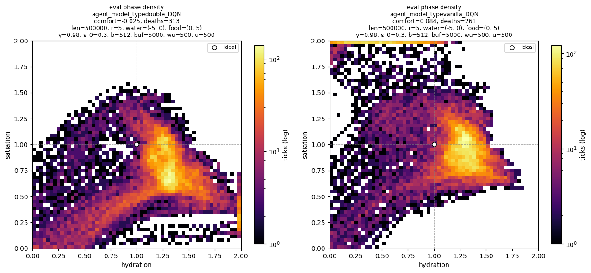
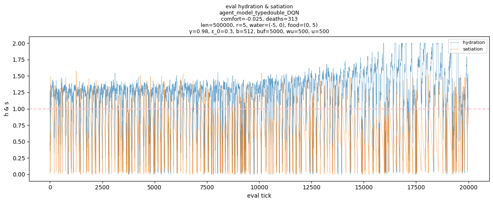
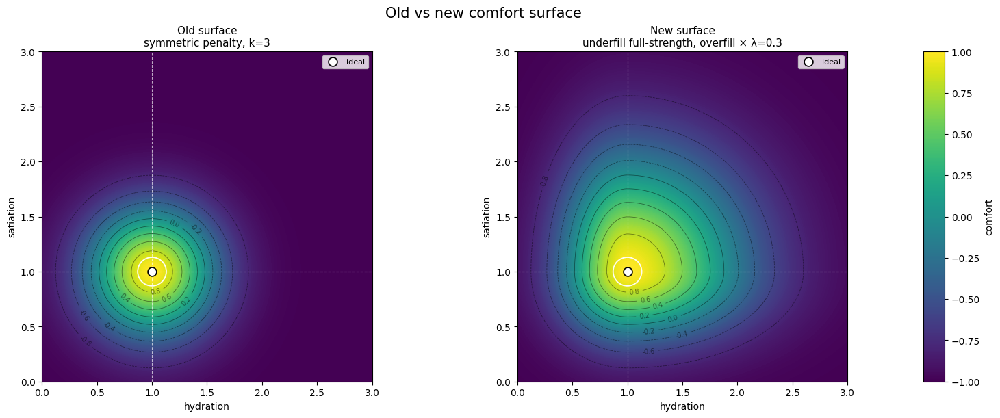
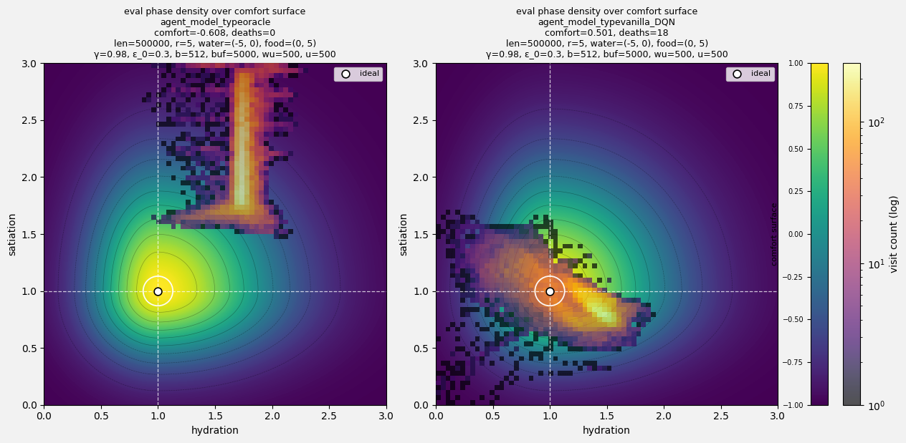

# Prototype 3 — changing the comfort surface

This is not a results page. It is a record of an MDP change made mid-prototype, and the evidence that forced it. The learner did not change here; the reward did.

## Why the old surface stopped making sense

The world grew from radius 3 to radius 5, with water at (−5, 0) and food at (0, 5). The food–water trip is now long enough that a good policy has to **leave a resource overfilled** — extra hydration before walking to food, extra satiation before walking back. Travel buffers stopped being a quirk and became part of any surviving policy.

The old comfort surface was isotropic around the ideal point:

$$d^2 = (h - {h^*})^2 + (s - {s^*})^2, \qquad C(h, s) = 2e^{-k d^2} - 1$$

Direction of error doesn't matter: a unit of useful buffer costs exactly as much as a unit of dangerous deficit. That was fine when `eat` and `drink` were one or two moves away and every deviation really was a mistake. On the larger map it punishes the thing the agent must do to survive the journey.

## The symptom

The old-surface sweep (vanilla vs Double DQN, radius 5) produced a consistent warning sign in both variants: structured but unhealthy internal-state behaviour, where one need is pinned and the other repeatedly falls toward death.

<p>
  
  <br>
  <sub><em>Phase density under the old surface. The point is not which DQN variant wins — both show the same collapse pattern.</em></sub>
</p>

<p>
  
  <br>
  <sub><em>Evaluation trace under the old surface: hydration maintained, satiation repeatedly crashing.</em></sub>
</p>

Because both variants showed it, this isn't a vanilla-vs-double conclusion. The suspicion is on the reward:

> the old surface taxes useful travel buffers at full price, so the cheapest learned policy can be "protect one variable, let the other fall."

<details>
<summary>Old-surface sweep tables</summary>

| config                      |   n |   median comfort |   comfort std |   median deaths | median death rate   | median water visit   | median food visit   | median trip success   |   median path efficiency | median perfect-ish trips   |
|:----------------------------|----:|-----------------:|--------------:|----------------:|:--------------------|:---------------------|:--------------------|:----------------------|-------------------------:|:---------------------------|
| agent_model_typedouble_DQN  |   5 |           -0.025 |         0.179 |             336 | 1.7%                | 58.9%                | 1.0%                | 0.9%                  |                    0.769 | 0.0%                       |
| agent_model_typevanilla_DQN |   5 |            0.084 |         0.277 |             261 | 1.3%                | 62.3%                | 15.7%               | 14.4%                 |                    1     | 83.1%                      |

| config                      |   seed |   comfort |   reward |   deaths | death rate   | water visit   | food visit   | drink@water   | eat@food   |   trips | trip success   | path eff.   | perfect-ish trips   |
|:----------------------------|-------:|----------:|---------:|---------:|:-------------|:--------------|:-------------|:--------------|:-----------|--------:|:---------------|:------------|:--------------------|
| agent_model_typedouble_DQN  |      0 |     0.127 |    0.028 |      395 | 2.0%         | 38.2%         | 4.1%         | 62.5%         | 86.2%      |    2694 | 3.6%           | 1.000       | 79.2%               |
| agent_model_typedouble_DQN  |      1 |     0.089 |    0.005 |      336 | 1.7%         | 57.5%         | 0.1%         | 78.5%         | 63.6%      |    2090 | 0.1%           | 0.769       | 0.0%                |
| agent_model_typedouble_DQN  |      2 |    -0.025 |   -0.103 |      313 | 1.6%         | 68.1%         | 0.1%         | 66.2%         | 27.8%      |     552 | 0.9%           | 0.556       | 0.0%                |
| agent_model_typedouble_DQN  |      3 |    -0.33  |   -0.385 |      218 | 1.1%         | 81.5%         | 3.6%         | 83.2%         | 89.9%      |     129 | 10.1%          | 0.833       | 38.5%               |
| agent_model_typedouble_DQN  |      4 |    -0.034 |   -0.123 |      355 | 1.8%         | 58.9%         | 1.0%         | 74.9%         | 52.3%      |    2190 | 0.8%           | 0.625       | 0.0%                |
| agent_model_typevanilla_DQN |      0 |     0.084 |    0.018 |      261 | 1.3%         | 48.2%         | 15.8%        | 74.4%         | 89.1%      |     733 | 24.7%          | 1.000       | 74.6%               |
| agent_model_typevanilla_DQN |      1 |     0.138 |    0.056 |      327 | 1.6%         | 33.4%         | 22.7%        | 60.8%         | 89.2%      |    2605 | 6.5%           | 1.000       | 90.0%               |
| agent_model_typevanilla_DQN |      2 |    -0.467 |   -0.518 |      206 | 1.0%         | 66.8%         | 4.7%         | 94.3%         | 46.4%      |     638 | 14.4%          | 1.000       | 79.3%               |
| agent_model_typevanilla_DQN |      3 |    -0.303 |   -0.354 |      202 | 1.0%         | 86.6%         | 0.0%         | 77.6%         |            |    1051 | 0.0%           |             |                     |
| agent_model_typevanilla_DQN |      4 |     0.101 |    0.035 |      263 | 1.3%         | 62.3%         | 15.7%        | 72.1%         | 84.2%      |     806 | 18.0%          | 1.000       | 86.9%               |

</details>

## The change

The squared distance is split into under- and over-components, and only the over-component is discounted:

$$d^2 = h_\text{under}^2 + \lambda\, h_\text{over}^2 + s_\text{under}^2 + \lambda\, s_\text{over}^2, \qquad \lambda = 0.3$$

with the same exponential mapping $C = 2e^{-3 d^2} - 1$. In the sim this is exactly:

```python
d2 = h_under**2 + lam * h_over**2 + s_under**2 + lam * s_over**2
return 2 * np.exp(-3 * d2) - 1
```

Three properties, by construction:

- **underfill keeps full curvature** — low hydration or satiation still gets sharply worse approaching death;
- **moderate overfill is cheap but not free** — the gradient shrinks by λ, so a travel buffer is affordable;
- **extreme overfill still decays exponentially** — hoarding forever cannot be the optimal policy.

The internal-state cap was also widened from 2 to 3. Over-buffered states should appear on the phase plot and be paid for by the surface, not hidden at a clip boundary.

<p>
  
  <br>
  <sub><em>Old vs new surface. Same ideal point, same exponential falloff; the new geometry is asymmetric about it — steep below, lenient above.</em></sub>
</p>

## Sanity check: is the world even survivable?

Before blaming any learner under the new surface, the radius-5 world needed a fairness check. `oracle.py` is a hand-coded controller with no comfort objective at all — it deliberately overfills to 1.7 and services whichever need is weaker:

```python
if coord == self.water_coord and h < self.fill_h:
    return drink_full
if coord == self.food_coord and s < self.fill_s:
    return eat_full
if s <= h:
    return self.move_towards(coord, self.food_coord, action_mask)
return self.move_towards(coord, self.water_coord, action_mask)
```

It is a survivability check, not a baseline to beat on comfort.

**Result: 0 deaths over 500k ticks.** The map is physically fair. Its comfort is −0.608, which is the surface working as intended: the oracle lives permanently in the over-buffer band and is charged for it.

## Phase density over the new surface

<p>
  
  <br>
  <sub><em>Eval phase density drawn on the new comfort surface. Oracle (left): comfort −0.608, 0 deaths — all mass parked in the over-buffer column, exactly as coded. Vanilla DQN (right): comfort 0.501, 18 deaths — mass hugging the ridge near ideal, leaking below s = 1.</em></sub>
</p>

Reading the right panel against the surface: the agent has found the high-comfort ridge but its excursions are mostly on the under-satiation side, the side the surface punishes hardest. That is the visible room for improvement, and it is now a policy problem rather than a reward artefact.


<details>
<summary>New-surface 5-seed runs (oracle vs vanilla)</summary>

| config                      |   seed |   comfort |   deaths | death rate   | water visit   | food visit   | eat@food   | trip success   | path eff.   | perfect-ish trips   |
|:----------------------------|-------:|----------:|---------:|:-------------|:--------------|:-------------|:-----------|:---------------|:------------|:--------------------|
| agent_model_typeoracle      |      0 |    -0.608 |        0 | 0.0%         | 84.4%         | 2.2%         | 66.5%      | 41.0%          | 1.000       | 100.0%              |
| agent_model_typeoracle      |      1 |    -0.610 |        0 | 0.0%         | 84.5%         | 2.1%         | 70.7%      | 37.6%          | 1.000       | 100.0%              |
| agent_model_typeoracle      |      2 |    -0.612 |        0 | 0.0%         | 84.8%         | 2.2%         | 67.8%      | 39.3%          | 1.000       | 100.0%              |
| agent_model_typeoracle      |      3 |    -0.611 |        0 | 0.0%         | 84.7%         | 2.2%         | 67.1%      | 40.4%          | 1.000       | 100.0%              |
| agent_model_typeoracle      |      4 |    -0.607 |        0 | 0.0%         | 84.5%         | 2.2%         | 66.7%      | 41.1%          | 1.000       | 100.0%              |
| agent_model_typevanilla_DQN |      0 |    -0.118 |      975 | 4.9%         | 4.8%          | 24.5%        | 65.9%      | 47.4%          | 1.000       | 94.4%               |
| agent_model_typevanilla_DQN |      1 |    -0.030 |      210 | 1.1%         | 72.5%         | 9.3%         | 32.0%      | 94.9%          | 0.909       | 67.6%               |
| agent_model_typevanilla_DQN |      2 |     0.566 |      148 | 0.7%         | 52.5%         | 6.9%         | 75.7%      | 16.3%          | 1.000       | 98.9%               |
| agent_model_typevanilla_DQN |      3 |     0.501 |       18 | 0.1%         | 63.4%         | 11.5%        | 68.6%      | 63.6%          | 1.000       | 100.0%              |
| agent_model_typevanilla_DQN |      4 |    -0.690 |      198 | 1.0%         | 90.4%         | 0.2%         | 84.2%      | 0.0%           |             |                     |

</details>

## Where this lands

- The collapse pattern under the old surface had a reward-geometry component, not just a learning one — vanilla under the new surface reaches comfort 0.501 where the old-surface medians were near zero or negative.
- The panel shows the best-balanced seed (seed 3 — fewest deaths at high comfort). Across the 5-seed sweep vanilla is still high-variance (median comfort −0.03, spanning −0.69 to 0.57), so the figure is just a capability demonstration — making it consistent is Prototype 3b's job.
- The vanilla-vs-double comparison is deferred until it can be run cleanly on the fixed new surface.
<br>
Open question for the next sweep:

> does the new comfort geometry remove the one-variable collapse across seeds, without making the task trivial?
