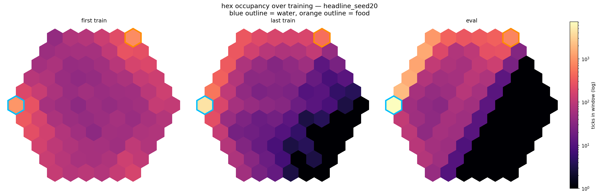

# Prototype 03b — consistency: exploration vs. the water-cult attractor

Prototype 3 repaired the reward geometry and showed that a single seed could reach positive comfort on the radius-5 commute. But that was not enough. A best seed is not a solved benchmark.

Prototype 03b asks a narrower question:

> can the radius-5 water→food control cycle be learned consistently across seeds?

Current answer: partly. The strongest current configuration learns the clean route in **52/100 seeds**, but only **38/100** also survive it under a stricter eval-death gate.

The result moved when the training distribution changed: NoisyNet exploration, count-based novelty, and a replay buffer size that retained useful trajectories without becoming stale.

## One-line result

Noisy DQN + count-based novelty + 50k replay + 10-step returns reaches a clean water→food cycle in **52%** of seeds on the fixed radius-5 commute.

The remaining failures are structured, not random:

* some seeds never leave the water-cult attractor
* some learn the route but still bleed out during evaluation
* some reach food but with messy, inefficient circuits

## Setup

### World

The environment is a radius-5 hex grid.

* Water: `(-5, 0)`
* Food: `(0, 5)`
* Shortest one-way trip: roughly 10 moves
* Food → water → food loop: at least 20 moves before waiting, mistakes, drinking, eating, or exploration

This makes the task long-horizon enough that the agent cannot solve it by treating drink/eat as instant correction buttons. Water and food are locations. The policy has to decide when to leave a resource before the other internal variable becomes urgent.

### Internal state

The agent regulates two internal variables:

$$
x_t = (h_t, s_t)
$$

where:

* $h_t$ is hydration
* $s_t$ is satiation

The target internal state is:

$$
x^\star = (1, 1)
$$

Every tick, hydration and satiation decay. Death occurs when either variable falls to zero or below:

$$
\min(h_t, s_t) \le 0
$$

The agent observes local state, not a full global map. Movement actions are masked at the edge of the hex world, so the Bellman target also has to respect valid actions.

### Fixed substrate config

The main substrate config was held fixed unless explicitly swept:

| Parameter           | Value                  |
| ------------------- | ---------------------- |
| World radius        | 5                      |
| Water               | `(-5, 0)`              |
| Food                | `(0, 5)`               |
| Discount            | $\gamma = 0.99$        |
| Return length       | $n = 10$               |
| Replay batch        | 512                    |
| Replay warmup       | 500                    |
| Target update       | 500                    |
| Learn every         | 20                     |
| Training length     | 500k ticks             |
| Greedy evaluation   | 20k ticks              |
| Comfort surface     | comfort-v3             |
| Overfill weight     | $\text{over}_w = 0.02$ |
| Underfill weight    | $\text{under}_w = 0.5$ |
| Death penalty scale | $k = 0.5$              |

## Comfort-v3 surface

The original comfort surface treated every deviation from the ideal point as the same kind of error:

$$
d^2 = (h - h^\star)^2 + (s - s^\star)^2
$$

$$
C(h,s) = 2e^{-kd^2} - 1
$$

That was too blunt for a spatial commute.

On a small abstract task, being above the ideal and being below the ideal can be punished symmetrically. In the radius-5 world, that breaks down. The agent often needs to overfill hydration before travelling to food, or overfill satiation before travelling back to water.

So Prototype 3b keeps the same basic idea — comfort falls as internal state moves away from the target — but splits the error into two channels.

### Step 1: separate deficit from surplus

The comfort surface first splits each internal variable into below-target and above-target components.

For hydration:

$$
h_{\text{deficit}} = (h^\star - h)*+,
\qquad
h*{\text{surplus}} = (h - h^\star)_+
$$

For satiation:

$$
s_{\text{deficit}} = (s^\star - s)*+,
\qquad
s*{\text{surplus}} = (s - s^\star)_+
$$

where:

$$
(a)_+ = \max(a, 0)
$$

This gives the reward surface two separate error channels: one for dangerous deficit, and one for temporary surplus used as a travel buffer.

### Step 2: combine each side into a weighted distance

The deficit distance is:

$$
D_{\text{deficit}} =
(h^\star - h)*+^2 + (s^\star - s)*+^2
$$

The surplus distance is:

$$
D_{\text{surplus}} =
(h - h^\star)*+^2 + (s - s^\star)*+^2
$$

Then the total squared distance is:

$$
d^2 =
w_{\text{deficit}}D_{\text{deficit}}
+
w_{\text{surplus}}D_{\text{surplus}}
$$

In this prototype, underfill is still punished more than surplus:

$$
w_{\text{deficit}} > w_{\text{surplus}}
$$

The purpose is not to make surplus free. It is to make a temporary travel buffer affordable. Extreme surplus still increases $d^2$ and lowers comfort.

### Step 3: map distance back to comfort

The final comfort is:

$$
C(h,s) = 2e^{-3d^2} - 1
$$

This maps internal state onto approximately:

$$
C(h,s) \in [-1, 1]
$$

At the ideal point:

$$
h = h^\star,\qquad s = s^\star
$$

so:

$$
D_{\text{deficit}} = 0,\qquad D_{\text{surplus}} = 0,\qquad d^2 = 0
$$

and therefore:

$$
C(h,s) = 2e^0 - 1 = 1
$$

As the weighted distance grows, $e^{-3d^2}$ shrinks toward zero, so comfort falls toward $-1$.

The geometric change is the important part: the comfort basin is no longer symmetric around the ideal point. The low side remains dangerous; the high side allows strategic buffer.

## Death penalty scaling

Death is not just another low-comfort tick. It terminates the current survival attempt and causes a respawn.

A fixed death penalty becomes hard to compare across different $\gamma$ values. The discounted value of a constant future penalty has scale:

$$
1 + \gamma + \gamma^2 + \cdots = \frac{1}{1 - \gamma}
$$

So a death penalty can be scaled as:

$$
D_{\text{death}} = \frac{k}{1 - \gamma}
$$

This makes the penalty comparable to a discounted stream of bad future outcomes. With:

$$
\gamma = 0.99,\qquad k = 0.5
$$

the death penalty scale is:

$$
D_{\text{death}} = \frac{0.5}{1 - 0.99} = 50
$$

This does not solve the task by itself. It prevents a death from being treated like a small local mistake when the real consequence is a broken trajectory.

## Bellman target and action masking

The DQN estimates an action-value function:

$$
Q_\theta(s_t, a_t)
$$

For ordinary one-step Q-learning, the target is:

$$
y_t =
r_t
+
\gamma \max_{a'} Q_{\theta^-}(s_{t+1}, a')
$$

where $\theta^-$ is the target network.

But in the hex world, not every movement action is valid from every tile. Invalid actions must not appear inside the max. So the target becomes:

$$
y_t =
r_t
+
\gamma \max_{a' \in \mathcal{A}*{\text{valid}}(s*{t+1})}
Q_{\theta^-}(s_{t+1}, a')
$$

If the transition ends in death, there is no bootstrap term:

$$
y_t = r_t
$$

This prevents the model from assigning future value after terminal states.

## 10-step returns

One-step targets are often too local for this task. Food may be valuable, but the value is delayed by a long walk. So Prototype 3b uses n-step returns.

For $n = 10$, the return is:

$$
G_t^{(10)} =
r_t
+
\gamma r_{t+1}
+
\gamma^2 r_{t+2}
+
\cdots
+
\gamma^9 r_{t+9}
+
\gamma^{10}
\max_{a' \in \mathcal{A}*{\text{valid}}(s*{t+10})}
Q_{\theta^-}(s_{t+10}, a')
$$

More generally:

$$
G_t^{(n)} =
\sum_{i=0}^{n-1} \gamma^i r_{t+i}
+
\gamma^n
\max_{a' \in \mathcal{A}*{\text{valid}}(s*{t+n})}
Q_{\theta^-}(s_{t+n}, a')
$$

If death occurs before the $n$th step, the return is truncated and there is no bootstrap term:

$$
G_t^{(\tau)} =
\sum_{i=0}^{\tau} \gamma^i r_{t+i}
$$

where $\tau$ is the terminal step.

A 10-step journey needs value to travel across several actions, not just one. Longer n-step returns helped propagate value, but if the replay buffer does not contain useful water→food trajectories, there is still nothing good to propagate.

## Respawn distribution

Respawn after death is not a clean refill to the exact ideal point.

Instead, the reset samples around the ideal internal state, roughly on an annulus with radius between 0.1 and 2.9, rejecting out-of-bounds and both-doomed draws.

The expected respawn is near the ideal, but individual resets can be harsh. That matters because repeated bad post-reset states can cause death spirals. Evaluation death counts therefore measure more than just whether the agent once found the route; they also measure whether it can keep executing the loop after perturbations.

## Failure mode: the water cult

Vanilla DQN on the radius-5 map is bimodal.

Some seeds discover the water→food limit cycle. Others camp at water. The water tile gives immediate control over hydration, so it is the easiest local comfort source. The policy learns to protect hydration, but never crosses the valley to food.

This is the **water-cult attractor**.

The behaviour is wrong, but mean comfort can make it look less wrong than it is. A water-camper can keep one internal variable close to ideal for much of its life while the other slowly collapses. A single average comfort number can hide the behavioural difference between:

* a policy that cycles water→food→water
* a policy that camps at water until death

So the benchmark has to look at seed-level behaviour, not just average comfort.

## Solve gates

### Comfort gate

The loose solve gate is:

$$
\text{mean comfort} \ge 0.7
$$

and:

$$
\text{food fraction during eval} \ge 0.01
$$

The food fraction condition prevents a high-comfort water-camper from being counted as solved. A policy cannot fake time on the food tile without actually travelling there.

### Survival-aware gate

The stricter gate adds path and death constraints:

$$
\text{path efficiency} \ge 0.9
$$

$$
\text{perfectish trip rate} > 0
$$

$$
\text{eval deaths} \le k
$$

This separates route discovery from reliable execution. Some seeds find the water→food cycle, but still die enough during greedy evaluation that they are not yet robust controllers.

## What did not work

### Comfort-surface tuning

The first suspicion was that the reward surface still had the wrong shape.

Sweeping the functional form and under/over weights changed the reported comfort numbers, but did not solve the behaviour. The agent could report different median comfort values while still failing the water→food cycle.

Exponential vs quadratic, and under/over weight grid

| surface     | over_w | median comfort | food-visit % | solved |
| ----------- | -----: | -------------: | -----------: | -----: |
| exponential |    0.3 |          −0.03 |          9.3 |     0% |
| exponential |    0.1 |          −0.16 |         21.6 |     0% |
| quadratic   |    0.1 |           0.56 |         10.9 |     0% |
| quadratic   |    0.3 |           0.50 |          0.1 |     0% |

The wider grid:

$$
\text{under} \in {1.0, 1.5, 2.0}
$$

$$
\text{over} \in {0.1, 0.2, 0.3}
$$

spanned median comfort from about −0.40 to −0.03, but still produced 0% solved.

After the gross reward geometry was fixed in Prototype 3, the remaining bimodality did not behave like a comfort-surface-only problem.

### Credit assignment

The next hypothesis was that the food reward was too far away.

A one-way trip is roughly 10 moves, so the agent has to value a delayed correction. Double DQN, longer n-step returns, larger $\gamma$, and tuned death penalties should help with that.

They did change training.

Vanilla / Double DQN × n-step

| config       | median comfort | comfort std | food-visit % | eat@food | solved |
| ------------ | -------------: | ----------: | -----------: | -------: | -----: |
| vanilla n=1  |          −0.03 |        0.51 |          9.3 |     0.69 |     0% |
| vanilla n=10 |           0.27 |    **0.05** |     **0.03** | **0.00** |     0% |
| double n=10  |           0.24 |    **0.01** |     **0.01** | **0.00** |     0% |

The n=10 rows are the key result. Comfort variance collapses, but food-visit also collapses. The agent becomes more consistent, but not more correct. It stabilises around water-camping.

So the credit-assignment tools were not useless. They made the learning process less seed-chaotic. But they stabilised whatever trajectories dominated replay. If the buffer mostly contains water-cult behaviour, better value propagation can make the water cult more reliable.

The failure is not simply:

> the agent cannot propagate distant value.

It is closer to:

> the agent cannot assign credit to a trajectory that almost never enters the training distribution.

Double DQN was not the missing piece either. Its more conservative estimates may even remove the accidental optimism that sometimes pushes vanilla DQN down the rarely visited food corridor.

### Curriculum

A coordinate curriculum seemed natural: start the agent near easier versions of the route, then anneal back to the full radius-5 commute.

That backfired.

The curriculum improved early reachability, but it also let the agent form local resource habits under low pressure. Those habits did not reliably transfer into the final radius-5 loop. In practice, the curriculum often entrenched camping instead of breaking it.

The rough result was:

$$
6/10 \rightarrow 1/10
$$

So coordinate curriculum was abandoned.

The salvageable version was targeted respawn during training only. It injects informative internal states without changing the final greedy evaluation task.

## What worked: induced exploration

The knob that moved the result was exploration.

Not random epsilon exploration by itself. Cranking epsilon higher is too blunt: it can discover good loops, but it also fills replay with garbage random transitions.

The useful version was induced exploration that changed where the replay distribution went.

### NoisyNets

Prototype 3b uses NoisyNet layers instead of ε-greedy exploration.

A noisy linear layer replaces fixed weights with sampled weights:

$$
W = \mu_W + \sigma_W \odot \epsilon_W
$$

$$
b = \mu_b + \sigma_b \odot \epsilon_b
$$

The forward pass becomes:

$$
y = Wx + b
$$

so the Q-values depend on sampled parameter noise during training.

For factorized Gaussian noise, the weight noise can be written as an outer product:

$$
\epsilon_W = f(\epsilon_{\text{out}})f(\epsilon_{\text{in}})^\top
$$

where:

$$
f(z) = \operatorname{sign}(z)\sqrt{|z|}
$$

This makes the exploration state-dependent. The policy does not just take random actions with probability $\epsilon$. Instead, the value function itself is perturbed, so the same state can produce coherent exploratory preferences.

During evaluation, the network switches to deterministic $\mu$ weights. That means the greedy-eval result is not being propped up by exploration noise.

The best initial noise scale was:

$$
\sigma_0 = 0.5
$$

Larger values such as 0.8 and 1.1 degraded performance.

A side-result: logged $\sigma$ rose over training rather than collapsing to zero. That dissolved an earlier hypothesis that novelty was mainly rescuing a collapsing NoisyNet. The target kept changing under drive cycles, local reward structure, and replay distribution, so the network kept demanding noise.

### Count-based novelty

Count-based novelty adds a bonus for visiting less-used tiles.

Let $N_t(q)$ be the lifetime visit count for tile $q$ during training. The novelty bonus is:

$$
r_{\text{novelty}}(q_t) = \frac{\beta}{\sqrt{N_t(q_t)}}
$$

The reward used for learning becomes:

$$
r'*t = r_t + r*{\text{novelty}}(q_t)
$$

with the novelty term gated to the training window.

The square root makes the bonus decay sublinearly. A new tile gets a large bonus, but the bonus does not stay large forever. The first few visits are encouraged; permanent wandering is not.

In this prototype:

$$
\beta = 0.1
$$

worked better than:

$$
\beta = 0.05
$$

Novelty alone did not solve the task. On vanilla DQN, the bonus was often spent reinforcing the comfortable water region. With NoisyNets, the same bonus helped move the replay distribution into the food corridor.

Novelty × NoisyNet

| config             |   solved | note                     |
| ------------------ | -------: | ------------------------ |
| novelty, vanilla   |       0% | bonus reinforces camping |
| noisy, no novelty  | baseline | insufficient alone       |
| noisy + novelty    |     best | +3 on matched seeds      |
| β = 0.1, 50 seeds  |      36% | chosen                   |
| β = 0.05, 50 seeds |      16% | weaker                   |

The mechanism is not:

> curiosity solves the task.

It is:

> induced exploration changes the replay distribution enough for useful trajectories to become learnable.

## Replay buffer falsification

Food transitions are rare, so the natural explanation was FIFO forgetting.

The prediction was simple:

> if useful food journeys are being evicted, a larger buffer should retain them and improve solve-rate.

Small-to-medium buffers supported that at first.

Buffer size × exploration

| buffer                  | exploration                 |  solved | deaths, median |
| ----------------------- | --------------------------- | ------: | -------------: |
| 5k                      | noisy + novelty             |     10% |            7.5 |
| 50k                     | noisy + novelty             | **50%** |          **0** |
| 100k                    | noisy + novelty             | **60%** |              0 |
| 5k                      | vanilla / noisy, no novelty |     20% |           9–17 |
| 50k                     | vanilla / noisy, no novelty |     40% |         3.5–74 |
| 520k, near non-evicting | vanilla / noisy             |  **0%** |           high |

Increasing from 5k to 50k–100k improved solve-rate and reduced deaths. But the near-non-evicting 520k buffer collapsed to 0/10.

That ruled out simple FIFO eviction as the whole explanation.

If forgetting were only eviction, more retention should keep helping. It did not. Old transitions can become stale under a changing policy and reward distribution. The replay buffer is therefore not just memory; it is a sampling distribution.

The 50k buffer is not “the buffer that remembers everything.” It is a tradeoff point:

* large enough to retain useful food-corridor transitions
* small enough not to drown current learning in stale behaviour

## Headline result

The best current configuration is:

* Noisy DQN
* count-based novelty with $\beta = 0.1$
* 50k replay buffer
* 10-step returns
* comfort-v3 surface
* $\gamma = 0.99$
* 100 seeds

Across 100 seeds:

* **52%** learn a clean water→food limit cycle
* **38%** survive that cycle under the stricter ≤5 eval-death gate
* median comfort among solved seeds is about **0.93**
* 49/100 seeds finish greedy evaluation with zero deaths

The 52% and 38% rates measure different things. The first is route discovery. The second is reliable survival while executing the route.

The clean-solve rate changes as the allowed death cap changes:

| Eval-death cap | Clean-solve rate |
| -------------: | ---------------: |
|              0 |              26% |
|             ≤5 |              38% |
|            ≤10 |              42% |
|      unlimited |              52% |

So the same policy family can learn the route before it learns to execute that route safely.

### Wilson interval for the 38% survival-aware rate

For a binomial estimate with:

$$
n = 100
$$

and:

$$
k = 38
$$

the observed proportion is:

$$
\hat{p} = \frac{38}{100} = 0.38
$$

The 95% Wilson interval uses:

$$
z = 1.96
$$

and:

$$
\frac{
\hat{p} + \frac{z^2}{2n}
\pm
z\sqrt{
\frac{\hat{p}(1-\hat{p})}{n}
+
\frac{z^2}{4n^2}
}
}
{
1 + \frac{z^2}{n}
}
$$

For 38/100, this gives approximately:

$$
[0.291,\ 0.478]
$$

or:

$$
[29.1%,\ 47.8%]
$$

That is the interval reported for the stricter survival-aware rate.

## Failure-mode decomposition

Among the unsolved seeds, the failures are not all the same.

Unsolved seed decomposition

| mode                              | count | meaning                               |
| --------------------------------- | ----: | ------------------------------------- |
| water-cult campers                |    16 | food % < 1; never really reaches food |
| clean cyclers that bled out       |    11 | solves navigation, not survival       |
| messy / inefficient food reachers |    35 | partial policy with sloppy circuits   |

This decomposition separates failure modes that mean comfort alone collapses together: never reaching food, reaching food but dying, and reaching food through inefficient circuits.

## Figures

  
   
  <em>Headline seed, greedy evaluation: internal-state density over the comfort surface. The solved policy forms a noisy loop around the comfort basin rather than collapsing onto one resource.</em>

 

  
   
  <em>Hex occupancy — first training, last training, greedy evaluation. The water→food corridor emerges by evaluation.</em>

## How to read the result

Prototype 03b does not show that the task is solved in a general sense. It shows that the fixed radius-5 commute has a real attractor structure.

The water cult has a mechanism:

1. early seeds find immediate comfort at water
2. the replay buffer fills with water-cult transitions
3. value learning becomes accurate on the wrong behaviour
4. food trajectories remain too rare to dominate learning

Changing the Bellman estimator can make this more stable, but not necessarily better.

NoisyNets plus novelty change the replay distribution enough for more seeds to cross into the food corridor. The buffer experiment then shows the next limitation: retaining everything is not enough, because old transitions can become stale.

## Stopping point

Further tuning on this fixed commute may improve the 52% / 38% numbers, but it risks fitting one map.

Prototype 03b leaves a concrete mechanism to test next:

> performance depends on the interaction between exploration, replay distribution, and non-stationary internal reward, not value estimation alone.

The next prototype tests whether that mechanism still holds when the agent has to learn a transferable survival rule rather than one radius-5 route.
