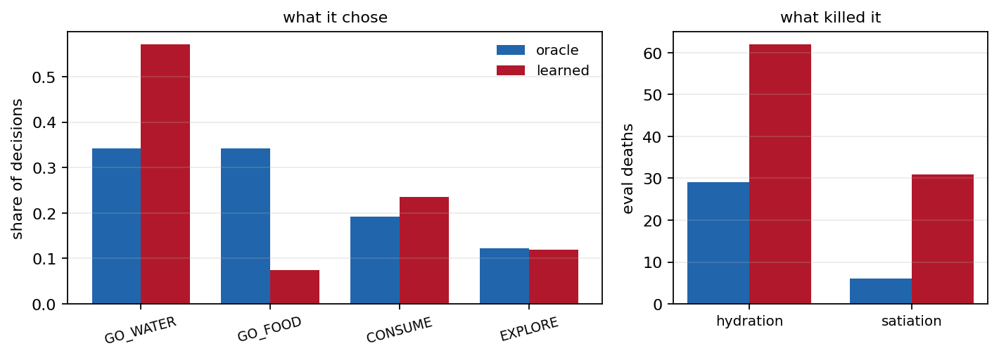
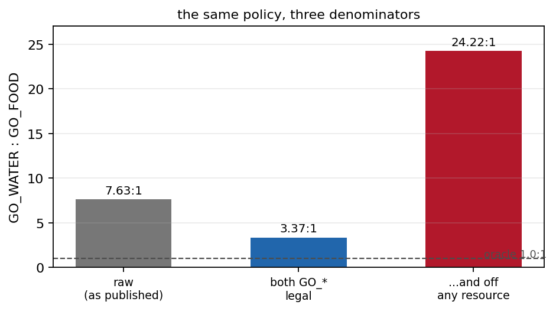
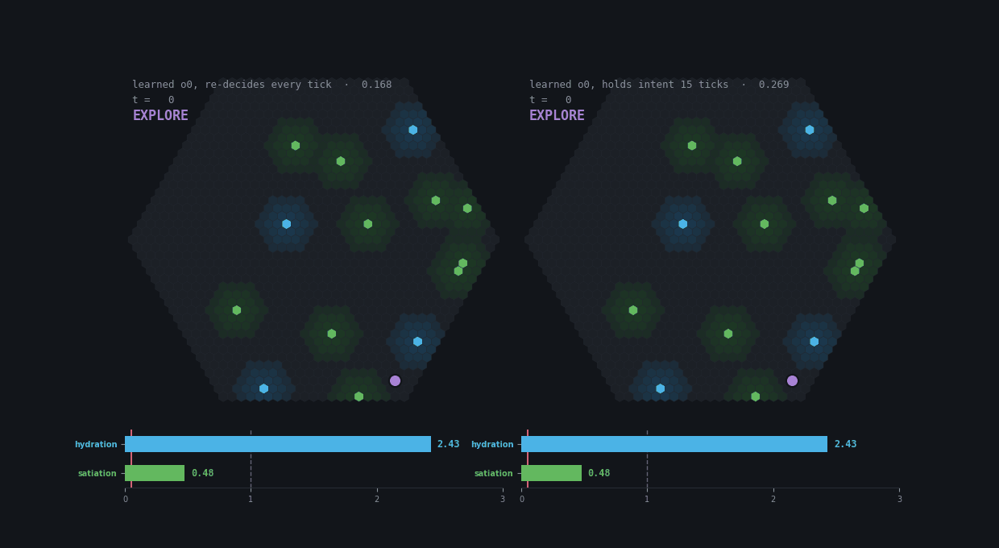
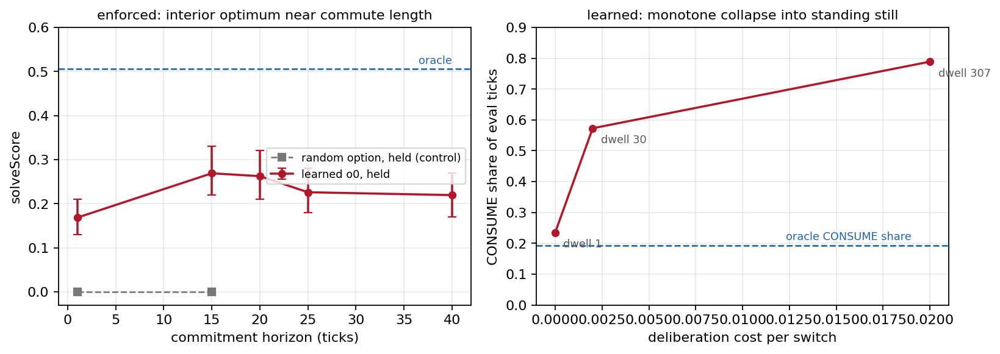
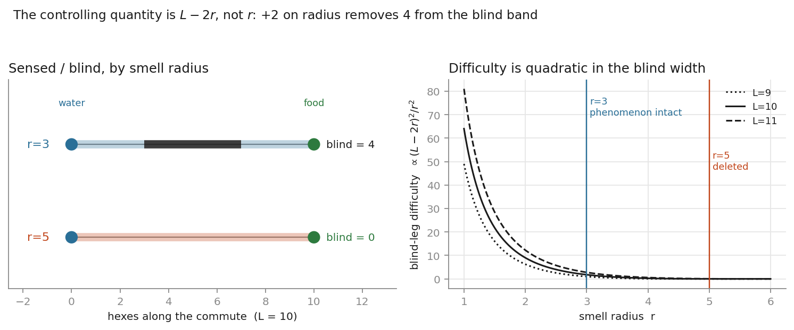
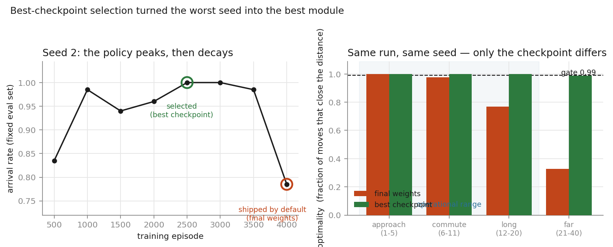
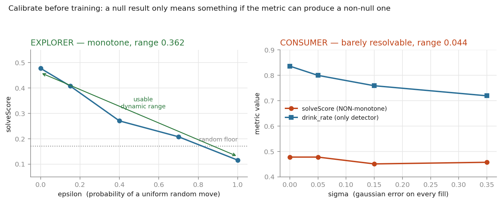
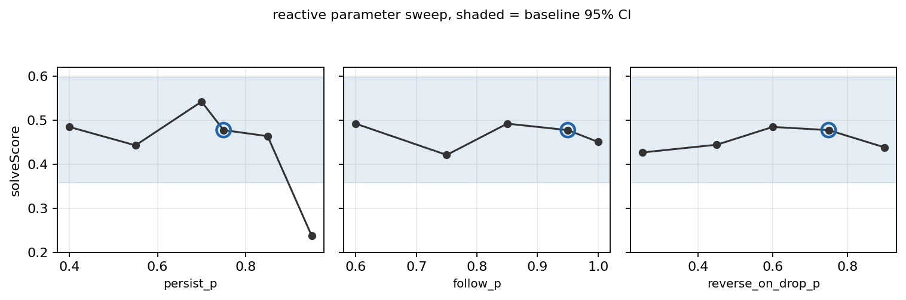

# Prototype 06 — feudal decomposition: which modules are learnable?

Prototype 04 isolated the failure of end-to-end RL on this world to one mechanism: the agent
cannot self-commit to a directed crossing of the signal-free middle of the commute. Not
representation, not reaching, not architecture — directed exploration. Prototype 06 stops
asking whether one monolithic policy can survive and asks a sharper question:

> decompose the agent into orchestrator / pathfinder / consumer / explorer, learn each
> module separately, and find out **which ones RL can actually learn**.

## One-line result

**Both modules that were trained end-to-end are learnable; the explorer is not, and the reason is
structural.**
The pathfinder is recovered to optimality by the same algorithm class that solved 0/40
end-to-end in Proto 04 — decomposition, not architecture, is what made it tractable. The
consumer is learnable but turns out to be *invisible to the environment*. The explorer
resists five separate methods, because its observation contract confines it to a policy
class a five-parameter heuristic already occupies optimally.

| module | verdict | evidence |
|---|---|---|
| pathfinder | **solved** | 1.0000 optimality on every operational band, 3-seed reproducible, +0.000 solveScore delta in-sim over 34,859 invocations |
| drink consumer | **learnable, but unmeasurable** | certified out-of-sample (37 deaths vs oracle 35); environment cannot resolve it |
| eat consumer | **untrained** — starved by construction | 0 dispatches in 1200 nondoomed ticks; finding food is the phenomenon |
| orchestrator | **learns — and cannot hold an intention** | 0.1622 vs oracle 0.4776; median GO_FOOD run length 1.0 against 10.0 |
| explorer | **not learnable on this contract** | 5 methods, all at or below the random floor |

The two failures are not the same failure. The explorer never left uniform random — it acquired
no policy at all. The orchestrator acquired a **coherent, structured** policy and converged on the
pathological one: the water-cult attractor that Prototype 03b identified in a monolithic DQN on a
fixed map. It survives decomposition, isolation of the decision, a continuous non-aliased
observation, oracle execution beneath it, and a pure survival reward. **The attractor is a
property of the task, not of end-to-end learning.**

  
   
  <em>The oracle arbitrates at exactly 1:1 between the two drives. The learned policy
  chooses water 7.6:1 — and dies of thirst at twice the rate. Both numbers are kept as first
  measured, and both mislead. P4.2 shows GO_FOOD is masked illegal most of the time, so half
  that ratio is availability rather than preference.</em>

  
   
  <em>The same policy under three denominators. Conditioning on GO_FOOD actually being
  legal more than halves the apparent preference; conditioning further on the agent standing
  on neither resource sends it to 24:1, because most GO_FOOD is emitted on the water tile and
  abandoned one tick later. The oracle is 1.0:1 under all three.</em>

  

  <em>The same weights on the same map, differing only in how often the argmax is
  consulted. Left, as trained: it picks GO_FOOD on the water tile, takes one step, and turns
  back — median run length 1.0. Right, with the option held for 15 ticks: it crosses. Nothing
  was retrained between these two panels. Hand-picked seed; the numbers are below.</em>

  
   
  <em>Left: the same weights, re-evaluated with an option horizon imposed at inference.
  An interior optimum near commute length, CI-separated from the uncommitted control, and a
  random option held for the same horizon scores zero — so it is commitment to <em>these</em>
  choices that matters, not persistence itself. Right: replacing the imposed horizon with a
  learned one. A switching cost cannot tell following through from standing still, and the
  policy takes the second.</em>

  
   
  <em>Learned performance as a fraction of the oracle each module replaced.</em>

## The reframe from Proto 04

**Route→rule is settled; the wall is exploration, so stop testing survival and test finding.**

Two changes make the question answerable:

**The oracle is no longer god.** Proto 05's oracle knew coordinates and navigated perfectly,
which proves only that the world is survivable by a perfect-knowledge agent. Proto 06's
oracle is a perfect pathfinder and consumer with a *legal reactive* explorer. The legal
optimum is bracketed, not pinned: god 1.00 (illegal) > legal best > reactive 0.48.

**Honest eval: nondoomed spawn filter.** Any spawn where even perfect water-first play cannot
secure both resources within the expected-decay clocks is rejected, so a death is a policy
failure rather than a death trap. `solveScore = timeouts / (timeouts + deaths)`, and it is
only meaningful with the leeway stated (operating point: 10).

**Smell held at 3.** The blind band width is `d = L − 2r` for commute length `L` and smell
radius `r`. At band (9,11) and r=3 that is 3–5 hexes. At r=5 it is 0–1: radius 5 does not
reduce the phenomenon, it deletes it. Detection area is quadratic in `r`, blind traverse is
diffusive so cost scales as `d²`, and the compound difficulty goes roughly as
`(L − 2r)² / r²` — a factor of ~70 between r=3 and r=5 at L=11. The invariant is `L − 2r`,
not `r`, so smell 5 with band (13,15) would be the *same* problem.

  
   
  <em>Left: sensed and blind stretches of a 10-hex commute at r=3 and r=5 — radius is
  subtracted from both ends, so +2 removes 4. Right: blind-leg difficulty, quadratic in the blind
  width and inverse-quadratic in detection area.</em>

## The explorer ladder

Standing config, 8 seeds: smell 3, band (9,11), nondoomed with leeway 10, decay 0.7,
h_fill 1.6 / s_fill 1.3, crit 0.7. Cold start — the agent must find water, then food.

| policy | eval deaths | solveScore |
|---|---|---|
| GOD navigation (Proto-05 oracle power) | 0 | 1.00 |
| legal reactive (`smell_momentum`) | 35 | **0.4776** |
| momentum, no scent | 62 | 0.3333 |
| random | 121 | 0.1712 |

GOD taking zero deaths shows the world is fair. Random at 0.17 shows the task is not trivial.
The reactive explorer's deaths split hydration 29 / satiation 6 — genuine two-resource
navigation, not a food-only artifact.

  
   
  <em>The reference frame, and every learned attempt against it.</em>

## Verdict per module

### Pathfinder — solved, and the result belongs to the decomposition

Trained **entirely outside the sim** on bare hex geometry (no drives, no decay, no
resources), because `PathfinderObs` carries `to_goal` and nothing else. Sparse arrival reward
plus HER; no shaping, no cloning.

Dropped into the full stack it was invoked 34,859 times for a **+0.000** solveScore delta.
Exhaustive check over all 4,920 displacements: **1.0000 optimality** on approach, commute and
long bands, `excess_steps_per_move` 0.0000 throughout.

It is *not* a copy of the oracle — agreement is only 0.56, because off-axis displacements have
two equally optimal moves and the two policies tie-break differently. **Independently
optimal**, from arrival rewards alone.

The claim this supports: the same algorithm class that solved **0/40** monolithically in
Proto 04 recovers optimal navigation once the decomposition hands it an observed goal. Proto
04 is the control that gives the number meaning.

Reproducibility required work. One seed in three shipped a module that had *collapsed* late in
training (arrival 1.000 → 0.734, long-band optimality 0.7685). Best-checkpoint selection on a
fixed eval set recovered the same seed to a perfect gate — capability was present in every
seed; the variable was where training stopped.

  
   
  <em>Same run, same seed, different checkpoint. The final-weights module fails the gate at
  0.7685 on an operational band; the selected one is perfect across all three.</em>

### Consumer — learnable, and invisible

The drink consumer is certified out-of-sample: 37 eval deaths against the oracle's 35, with
`drink_rate_at_water` deviating 1.2% against a 4.4% detection floor.

The more useful finding is that **the environment cannot resolve consumer quality**. A
calibrated degradation sweep found `solveScore` *non-monotone* — a knowably worse consumer
scored higher — and the one qualifying detector spanned only 0.044. Fill fraction turns out to
be a **rate, not a level**: `OracleOrchestrator` re-issues CONSUME every tick while the agent
is on a useful tile below target, and `DRINK_AMOUNT = 0.15` means reaching target always takes
several drinks. A timid consumer simply drinks more times and arrives anyway.

So the graded-consume design decision — made so that "stop at ideal" would be the real skill —
is defeated by the orchestrator's retry loop. Recorded as a corrected assumption.

  
   
  <em>Why the explorer's null is interpretable and the consumer's certification is not worth
  much: one metric ranks policies across a 0.362 range, the other spans 0.044 and is non-monotone
  on the headline measure.</em>

### Explorer — not learnable on this contract

Five methods, each failing for a separately diagnosed reason:

| attempt | held-out solveScore | mechanism |
|---|---|---|
| DQN, 3 seeds | 0.106 / 0.103 / 0.059 | reward diluted to 0.06 rewarded samples per batch |
| DQN + stratified sampling | ~0.10 | discovery bootstrapped into an unrelated post-travel state |
| DQN + terminal fix | 0.1037 | fix correct, not binding |
| DQN + softmax eval | peak ≈ random | performance rose toward the UNIFORM limit — best use of Q was to ignore it |
| PG, entropy 0.02 | 0.1589 | policy stayed at 96% of uniform entropy |
| PG, entropy 0.003 | collapsed | entropy → 0, deterministic looping |

Both ends of the entropy sweep fail in opposite directions with nothing in between, which is
what a policy gradient carrying no discriminating signal looks like.

**The mechanism.** `ExplorerObs` carries legality, recent actions, smell readings and need
flags — **no positional memory**. Coverage, revisit-avoidance and frontier-seeking are not
representable. The policy class is therefore reactive correlated walks with chemotaxis: a
five-parameter family (`persist_p`, `follow_p`, `reverse_on_drop_p`, `trend_eps`,
`avoid_reverse`) that a hand-tuned heuristic already occupies at or near its optimum — a
coordinate sweep found no setting whose Wilson interval separates from the baseline's.

  
   
  <em>The whole reactive parameter surface sits inside one confidence band. The apparent best
  (persist_p=0.7 → 0.5424) does not separate from the baseline's 0.4776 at these seed counts —
  taking the max of ~20 noisy configurations buys ~2 sd for free.</em>

The sharpest evidence: `momentum` scores 0.333 with **no smell at all**, so persistence is the
largest single jump in the ladder. The baseline persists ~75% of the time. The learned policy
persists ~1 time in 6, despite the last action sitting in its observation as a one-hot. It
never acquired the most valuable available behaviour.

**Learning has nothing to add where a five-parameter search suffices.**

## Method notes worth carrying forward

- **Calibrate before training.** A null result is uninterpretable unless the metric has been
  shown capable of a non-null one. A deliberately degraded control (`noisy_oracle` for each
  module) establishes the detection floor first. Skipping this cost four consumer runs.
- **A metric that is non-monotone under controlled degradation cannot rank policies.** Report
  no detection floor for it.
- **Error character dominates error rate.** Two pathfinders differing 0.02 in optimality
  differed 90× in `excess_steps_per_move`, because one's errors were sideways and the other's
  were reversals.
- **A module's episode boundary is not the agent's.** It ends when the sub-task ends.
  Bootstrapping past it corrupts exactly the transitions the module should learn from.
- **Never eval on a resampled world.** Fixed eval seeds, disjoint from certification seeds.
- **Never relax a pre-registered threshold.** The 0.99 pathfinder gate failed three runs
  before a properly selected module scored 1.0000. The gate was right; the training was not.

## Stopping point

The decomposition works for exploitation and does not rescue exploration. That is the result.

The orchestrator thread closes one layer down from where it started. What looked like a
preference for water turned out to be two things: an option that terminates every tick, and
a map that never gets finished. Imposing commitment recovers about a third of the gap and is
confirmed against a random control. Paying for commitment recovers none of it, because the
cheapest way to stop switching is to stop moving. The remaining two thirds is acquisition,
and nothing here has touched it.

**What would have to change, stated as a specification rather than a plan.** The explorer needs
state a heuristic cannot cheaply express: visit counts, a decaying coverage trace, or episodic
novelty. Count-based novelty is already convicted as a winner in 03b (β=0.1) and leaks no
resource locations, so it stays inside the honesty boundary. Only once the policy class contains
something beyond a tuned correlated walk does "can it be learned?" become a question worth asking
again.

The orchestrator's next lever is separate and cheaper: hydration deaths outnumber satiation
deaths 2:1, so a per-cause death penalty would test whether the water-cult attractor is a
reward-scaling artifact or a genuine basin. 03b's evidence suggests a basin — credit-assignment
tweaks never broke it there either.

**The project stops here.** Both are specifications for whoever picks this up, including a later
version of the author; neither is scheduled.
